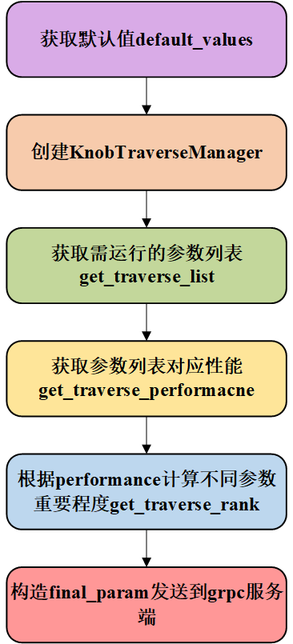
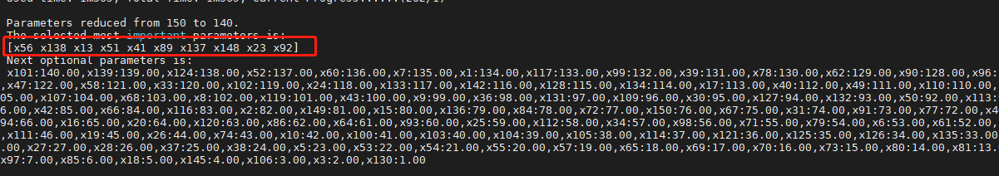
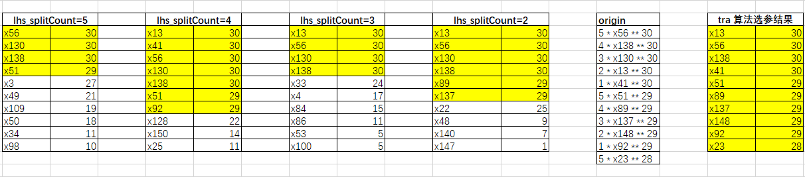

# Traverse遍历算法思路以及实现流程


## 一、算法思路


该算法核心思想是通过迭代调整参数的值并选出能使评价指标最优的参数。对于每一次迭代，我们选定一个参数，并将其他参数设置为默认值。被选中的参数值分别设置为范围内的最大、最小值（对于连续型（scope）的参数）或随机选取与默认值相异的其他参数值（对于离散型（options）的参数），并将改变参数后运行benchmark得到的“评价指标值”存储在一个map中（该map以参数作为key，“评价指标值”作为value）。

参数遍历完成后，按“评价指标值”对map进行升序排序，得到排序队列1。为了尽可能避免负载运行波动对选参造成的影响，我们会进一步针对每一个参数计算一个“评价指标差值”，构造出一个降序的排序队列2。然后将两个排序队列中各参数的排名相加，并根据排名之和进行升序排序可得排序队列3。最后根据排序队列3的排名，我们构造出A-Tune选参控制流程所需的参数排名rank，并由grpc服务端选出feature_filter_count个重要参数（feature_filter_count由用户设置）用于下一步参数调优。

其中，排序队列2的构造过程中，“评价指标差值”的计算又分为两种情况：（1）针对连续型（scope）的参数，我们取参数为最大值时的“评价指标值”与参数为最小值时的“评价指标值”作差；（2）针对离散型（options）的参数，我们会对参数改变前后的对应所有的“评价指标值”中选出最大值和最小值，并将这两者的“评价指标值”作差。

经测试，该算法在参数值x与评价指标f(x)之间存在单调性的场景下能够较好地选出与评价指标最密切的参数。


## 二、实现流程以及代码整合


### 2.1 Traverse算法执行流程

Traverse算法流程如图1，Traverse算法主要由get_traverse_list()，get_traverse_performance() 和get_traverse_rank()这三个功能函数组成，通过这三个函数来控制待选择参数的变化以及重要参数的排序，最终实现重要参数的选择。




_图1 Traverse算法执行流程_


此外，Traverse算法的配置文件是按照A-tune中的lhs算法对应的配置算法进行开发的，“feature_filter_cycle”值必须为1，用于确保Traverse算法正确执行，“feature_filter_count”则是用于控制用户希望选出的参数个数。值得需要注意的是，Traverse算法会根据参数及其默认值来确定选参过程中benchmark需要运行的次数。下面展示了Traverse算法client配置文件一个样例：

```yaml
project: "key_parameters_select_variant"
engine : "gbrt"
iterations : 30
random_starts : 10
feature_filter_engine: "traverse" # the parameter filter is traverse
feature_filter_cycle: 1           # the value of this variable must be '1'
feature_filter_count: 10          # this variable is used to control the number of parameters you want to select

benchmark : "python3 key_parameters_select_variant/key_parameters_select_variant.py"
evaluations :
  -
    name: "y"
    info:
        get: "echo '$out' | grep 'y' | awk '{print $3}'"
        type: "negative"
        weight: 100

```


### 2.2 Traverse算法在key_parameters_select_variance实验结果

为了验证算法有效性，我们首先基于key_parameters_select样例生成一个有150个变量的变种样例key_parameters_select_variance（已加入examples）。其目标函数如图2所示，这里参数的重要程度由系数和幂次控制，系数越高幂次越大参数越重要。使用Traverse算法选出的重要参数结果如图3所示，而图4为Traverse算法和lhs算法选参对比结果，黄色区域是算法选中的重要参数，从该图可见，lhs算法并不能很好地选出所有重要参数，而Traverse算法对于这种简单的线性模型能够有效地选出重要参数。这里值得注意的是Traverse算法并没有选出x130，这是因为x130的初始值为5，而在本样例参数范围最大值也为5，Traverse算法会认定这个参数已经不需要再作调整（也就是说该参数对目标函数贡献已达到最大），因此Traverse算法在计算该参数的rank权重时会赋予一个较低的权重给它，降低grpc服务端选出该参数作为重要参数之一的概率。


																															_图2 目标函数_


																															_图3 选参结果_


     																										*图4 lhs和Traverse选参结果对比*


## 加密算法场景下的能效优化


在这里我们基于A-Tune对我们的加密算法Benchmark进行了测试以及调优，该Benchmark是基于chauffeur框架进行开发的，我们将AES、MD5以及RSApublic三种加密算法加入chauffeur框架中，并对我们的鲲鹏920服务器进行性能测试并获取对应的性能值；此外，我们还通过Redfish来从iBMC上获取测试阶段服务器的能耗，用于计算能效值。这里附上调整BIOS加上Traverse算法参数选择调优后能效提升结果：

​																										_表1 加密算法场景下的能效提升_

|               |   Initial   |        |                   | After BIOS + Traverse |        |                   |   Improvement   |            |                       |
| ------------- | :---------: | :----: | :---------------: | :-------------------: | :----: | :---------------: | :-------------: | :--------: | :-------------------: |
|               | performance | energy | Energy Efficiency |      performance      | energy | Energy Efficiency | performance Imp | energy Imp | Energy Efficiency Imp |
| **AES**       |             |        |                   |                       |        |                   |                 |            |                       |
| 2min          | 4078878.894 | 51054  |    1.251667464    |      4889893.874      | 51690  |    1.057078156    |     19.88%      |   -1.25%   |      **15.55%**       |
| 2min          | 4202016.379 | 51546  |    1.226696789    |      4885501.384      | 52284  |    1.070186986    |     16.27%      |   -1.43%   |      **12.76%**       |
| 1min          | 4433848.546 | 27210  |    0.61368808     |      4883779.184      | 27456  |    0.56218758     |     10.15%      |   -0.90%   |       **8.39%**       |
| 1min          | 4343200.075 | 27216  |    0.626634729    |      4887129.262      | 27360  |    0.559837863    |     12.52%      |   -0.53%   |      **10.66%**       |
| **MD5**       |             |        |                   |                       |        |                   |                 |            |                       |
| 2min          | 6081656.119 | 52668  |    0.866014108    |      6299873.282      | 52242  |    0.829254775    |      3.59%      |   0.81%    |       **4.24%**       |
| 2min          | 6009836.461 | 52746  |    0.877661153    |      6276881.379      | 52494  |    0.836307026    |      4.44%      |   0.48%    |       **4.71%**       |
| 1min          | 6119354.49  | 27678  |    0.452302609    |      6309606.254      | 27420  |    0.434575454    |      3.11%      |   0.93%    |       **3.92%**       |
| 1min          | 6101173.283 | 27690  |    0.453847133    |      6293558.64       | 27318  |    0.43406285     |      3.15%      |   1.34%    |       **4.36%**       |
| **RSAPublic** |             |        |                   |                       |        |                   |                 |            |                       |
| 2min          | 637835.938  | 53088  |    8.323143435    |      690664.332       | 52578  |    7.612670521    |      8.28%      |   0.96%    |       **8.54%**       |
| 2min          | 638500.522  | 52974  |    8.29662595     |      692657.704       | 52698  |    7.608086894    |      8.48%      |   0.52%    |       **8.30%**       |
| 1min          | 641659.552  | 27726  |    4.320982975    |      689586.785       | 27642  |    4.008487489    |      7.47%      |   0.30%    |       **7.23%**       |
| 1min          | 642905.639  | 27876  |    4.33593957     |      693574.483       | 27546  |    3.971599399    |      7.88%      |   1.18%    |       **8.40%**       |


---

**NOTE**:

**This work is developed by the Lab of Professor Weiwei Lin (linww@scut.edu.cn), School of Computer Science and Engineering, South China University of Technology.**

 Authors: 

 HuKangli email: conli_who@foxmail.com;

 LiJunqi email: 2506534280@qq.com;

 LiYurui email: liyurui1995@163.com;


