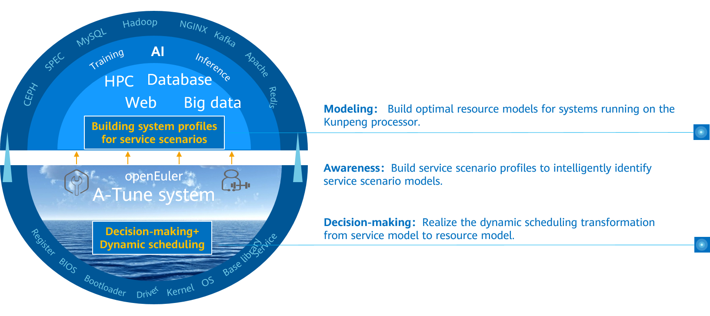
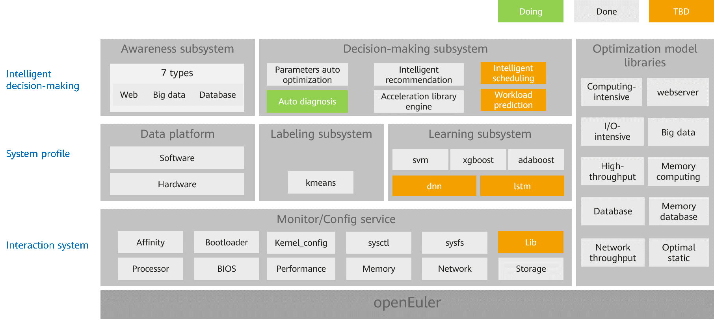
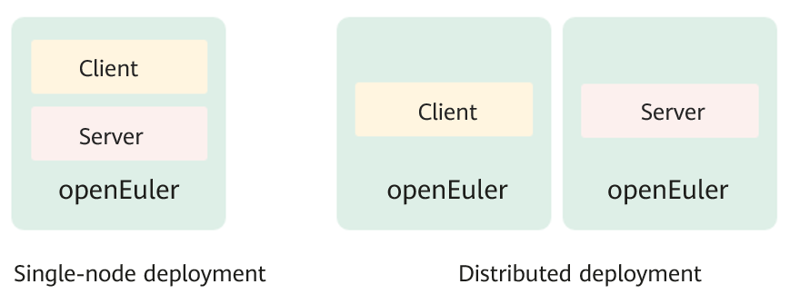
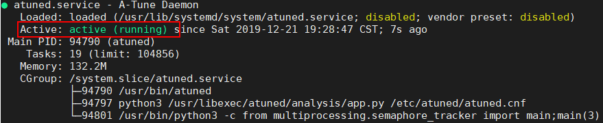
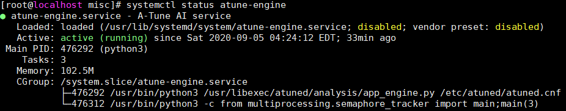

# A-Tune User Guide

English | [简体中文](./A-Tune用户指南.md)

# Legal Statement

**Copyright © openEuler 2020. All rights reserved.**

Your replication, use, modification, and distribution of this document are governed by the Creative Commons License Attribution-ShareAlike 4.0 International Public License (CC BY-SA 4.0). You can visit https://creativecommons.org/licenses/by-sa/4.0/ to view a human-readable summary of (and not a substitute for) CC BY-SA 4.0. For the complete CC BY-SA 4.0, visit https://creativecommons.org/licenses/by-sa/4.0/legalcode.

**Trademarks and Permissions**

A-Tune and openEuler are trademarks of Huawei Technologies Co., Ltd. All other trademarks and trade names mentioned in this document are the property of their respective holders.

**Disclaimer**

This document is used only as a guide. Unless otherwise specified by applicable laws or agreed by both parties in written form, all statements, information, and recommendations in this document are provided "AS IS" without warranties, guarantees or representations of any kind, including but not limited to non-infringement, timeliness, and specific purposes.

# Preface

## Overview

This document describes how to install and use A-Tune, which is a performance self-optimization software for openEuler.

## Intended Audience

This document is intended for developers, open-source enthusiasts, and partners who use the openEuler system and want to know and use A-Tune. You need to have basic knowledge of the Linux OS.

# 1 Getting to Know A-Tune

## 1.1 Introduction

An operating system (OS) is basic software that connects applications and hardware. It is critical for users to adjust OS and application configurations and make full use of software and hardware capabilities to achieve optimal service performance. However, numerous workload types and varied applications run on the OS, and the requirements on resources are different. Currently, the application environment composed of hardware and software involves more than 7000 configuration objects. As the service complexity and optimization objects increase, the time cost for optimization increases exponentially. As a result, optimization efficiency decreases sharply. Optimization becomes complex and brings great challenges to users.

Second, as infrastructure software, the OS provides a large number of software and hardware management capabilities. The capability required varies in different scenarios. Therefore, capabilities need to be enabled or disabled depending on scenarios, and a combination of capabilities will maximize the optimal performance of applications.

In addition, the actual business embraces hundreds and thousands of scenarios, and each scenario involves a wide variety of hardware configurations for computing, network, and storage. The lab cannot list all applications, business scenarios, and hardware combinations.

To address the preceding challenges, openEuler launches A-Tune.

A-Tune is an AI-based engine that optimizes system performance. It uses AI technologies to precisely profile business scenarios, discover and infer business characteristics, so as to make intelligent decisions, match with the optimal system parameter configuration combination, and give recommendations, ensuring the optimal business running status.



## 1.2 Architecture

The following figure shows the A-Tune core technical architecture, which consists of intelligent decision-making, system profile, and interaction system.

l  Intelligent decision-making layer: consists of the awareness and decision-making subsystems, which implements intelligent awareness of applications and system optimization decision-making, respectively.

l  System profile layer: consists of the feature engineering and two-layer classification model. The feature engineering is used to automatically select service features, and the two-layer classification model is used to learn and classify service models.

l  Interaction system layer: monitors and configures various system resources and executes optimization policies.



## 1.3 Supported Features and Service Models

**Supported Features**

Table 1-1 describes the main features supported by A-Tune, feature maturity, and usage suggestions.

**Table 1-1** Feature maturity

| Feature                                                    | Maturity | Usage Suggestion |
| ---------------------------------------------------------- | -------- | ---------------- |
| Auto optimization of 50 applications in 14 workload types  | Tested   | Pilot            |
| User-defined profile and service  models                   | Tested   | Pilot            |
| Automatic parameter optimization                           | Tested   | Pilot            |

**Supported Service Models**

Based on the workload characteristics of applications, A-Tune classifies services into 14 types. For details about the bottleneck of each type and the applications supported by A-Tune, see Table 1-2.

**Table 1-2** Supported workload types and applications

<a name="table2819164611311"></a>
<table>
    <thead align="left">
        <tr id="row49114466133">
            <th class="cellrowborder" valign="top" width="22.12%" id="mcps1.2.5.1.1">
                <p id="p09116467130"><a name="p09116467130"></a><a name="p09116467130"></a><strong
                        id="b15640174472810"><a name="b15640174472810"></a><a name="b15640174472810"></a>Service
                        category</strong></p>
            </th>
            <th class="cellrowborder" valign="top" width="12.959999999999999%" id="mcps1.2.5.1.2">
                <p id="p953251510111"><a name="p953251510111"></a><a name="p953251510111"></a><strong
                        id="b155287539280"><a name="b155287539280"></a><a name="b155287539280"></a>Type</strong></p>
            </th>
            <th class="cellrowborder" valign="top" width="37.269999999999996%" id="mcps1.2.5.1.3">
                <p id="p169111846181310"><a name="p169111846181310"></a><a name="p169111846181310"></a><strong
                        id="b1378654312217"><a name="b1378654312217"></a><a
                        name="b1378654312217"></a>Bottleneck</strong></p>
            </th>
            <th class="cellrowborder" valign="top" width="27.650000000000002%" id="mcps1.2.5.1.4">
                <p id="p1591144617135"><a name="p1591144617135"></a><a name="p1591144617135"></a><strong
                        id="b1191411502021"><a name="b1191411502021"></a><a name="b1191411502021"></a>Supported
                        Application</strong></p>
            </th>
        </tr>
    </thead>
    <tbody>
        <tr id="row17911114651318">
            <td class="cellrowborder" valign="top" width="22.12%" headers="mcps1.2.5.1.1 ">
                <p id="p1791124631317"><a name="p1791124631317"></a><a name="p1791124631317"></a>default</p>
            </td>
            <td class="cellrowborder" valign="top" width="12.959999999999999%" headers="mcps1.2.5.1.2 ">
                <p id="p45321515191120"><a name="p45321515191120"></a><a name="p45321515191120"></a>Default type</p>
            </td>
            <td class="cellrowborder" valign="top" width="37.269999999999996%" headers="mcps1.2.5.1.3 ">
                <p id="p691184671312"><a name="p691184671312"></a><a name="p691184671312"></a>Low resource usage in
                        terms of cpu, memory, network, and I/O</p>
            </td>
            <td class="cellrowborder" valign="top" width="27.650000000000002%" headers="mcps1.2.5.1.4 ">
                <p id="p69111946131318"><a name="p69111946131318"></a><a name="p69111946131318"></a>N/A</p>
            </td>
        </tr>
        <tr id="row791164631318">
            <td class="cellrowborder" valign="top" width="22.12%" headers="mcps1.2.5.1.1 ">
                <p id="p179110461137"><a name="p179110461137"></a><a name="p179110461137"></a>webserver</p>
            </td>
            <td class="cellrowborder" valign="top" width="12.959999999999999%" headers="mcps1.2.5.1.2 ">
                <p id="p20532111512117"><a name="p20532111512117"></a><a name="p20532111512117"></a>Web application</p>
            </td>
            <td class="cellrowborder" valign="top" width="37.269999999999996%" headers="mcps1.2.5.1.3 ">
                <p id="p1191117469133"><a name="p1191117469133"></a><a name="p1191117469133"></a>Bottlenecks of cpu and
                        network</p>
            </td>
            <td class="cellrowborder" valign="top" width="27.650000000000002%" headers="mcps1.2.5.1.4 ">
                <p id="p159111546161317"><a name="p159111546161317"></a><a name="p159111546161317"></a>Nginx, Apache Traffic Server, 
                        Tomcat, Apache Http Server, Squid, Postfix, lighttpd</p>
            </td>
        </tr>
        <tr id="row791164631318">
            <td class="cellrowborder" valign="top" width="22.12%" headers="mcps1.2.5.1.1 ">
                <p id="p179110461137"><a name="p179110461137"></a><a name="p179110461137"></a>ftp server</p>
            </td>
            <td class="cellrowborder" valign="top" width="12.959999999999999%" headers="mcps1.2.5.1.2 ">
                <p id="p20532111512117"><a name="p20532111512117"></a><a name="p20532111512117"></a>ftp application</p>
            </td>
            <td class="cellrowborder" valign="top" width="37.269999999999996%" headers="mcps1.2.5.1.3 ">
                <p id="p1191117469133"><a name="p1191117469133"></a><a name="p1191117469133"></a>Bottlenecks of cpu and
                        network</p>
            </td>
            <td class="cellrowborder" valign="top" width="27.650000000000002%" headers="mcps1.2.5.1.4 ">
                <p id="p159111546161317"><a name="p159111546161317"></a><a name="p159111546161317"></a>vsftpd, proftpd</p>
            </td>
        </tr>
        <tr id="row13911946141311">
            <td class="cellrowborder" valign="top" width="22.12%" headers="mcps1.2.5.1.1 ">
                <p id="p2911164610134"><a name="p2911164610134"></a><a name="p2911164610134"></a>database</p>
            </td>
            <td class="cellrowborder" valign="top" width="12.959999999999999%" headers="mcps1.2.5.1.2 ">
                <p id="p4532111561119"><a name="p4532111561119"></a><a name="p4532111561119"></a>Database</p>
            </td>
            <td class="cellrowborder" valign="top" width="37.269999999999996%" headers="mcps1.2.5.1.3 "><a
                    name="ul3724104521013"></a><a name="ul3724104521013"></a><a name="p1491144619136"></a>Bottlenecks of
                    cpu, memory, and I/O
            </td>
            <td class="cellrowborder" valign="top" width="27.650000000000002%" headers="mcps1.2.5.1.4 ">
                <p id="p1091134671313"><a name="p1091134671313"></a><a name="p1091134671313"></a>Mongodb, Mysql, Postgresql,
                        Mariadb, openGauss, tidb, sqlite, QuestDB, influxdb, splunk, Cassandra, Neo4j
                </p>
            </td>
        </tr>
        <tr id="row13911946141311">
            <td class="cellrowborder" valign="top" width="22.12%" headers="mcps1.2.5.1.1 ">
                <p id="p2911164610134"><a name="p2911164610134"></a><a name="p2911164610134"></a>DDS</p>
            </td>
            <td class="cellrowborder" valign="top" width="12.959999999999999%" headers="mcps1.2.5.1.2 ">
                <p id="p4532111561119"><a name="p4532111561119"></a><a name="p4532111561119"></a>distributed data store</p>
            </td>
            <td class="cellrowborder" valign="top" width="37.269999999999996%" headers="mcps1.2.5.1.3 ">
                <a name="ul3724104521013"></a><a name="ul3724104521013"></a><a name="p14911124612131"></a>Bottlenecks of
                        cpu, memory, and I/O
            </td>
            <td class="cellrowborder" valign="top" width="27.650000000000002%" headers="mcps1.2.5.1.4 ">
                <p id="p1091134671313"><a name="p1091134671313"></a><a name="p1091134671313"></a>storm, glusterFS, Ceph, 
                        Infinispan, ElasticSearch</p>
            </td>
        </tr>
        <tr id="row3911174641312">
            <td class="cellrowborder" valign="top" width="22.12%" headers="mcps1.2.5.1.1 ">
                <p id="p491144611319"><a name="p491144611319"></a><a name="p491144611319"></a>big_data</p>
            </td>
            <td class="cellrowborder" valign="top" width="12.959999999999999%" headers="mcps1.2.5.1.2 ">
                <p id="p953261521112"><a name="p953261521112"></a><a name="p953261521112"></a>Big data</p>
            </td>
            <td class="cellrowborder" valign="top" width="37.269999999999996%" headers="mcps1.2.5.1.3 ">
                <p id="p129111046151315"><a name="p129111046151315"></a><a name="p129111046151315"></a>Bottlenecks of
                        cpu and memory</p>
            </td>
            <td class="cellrowborder" valign="top" width="27.650000000000002%" headers="mcps1.2.5.1.4 ">
                <p id="p119111946161317"><a name="p119111946161317"></a><a name="p119111946161317"></a>Hadoop-hdfs,
                        Hadoop-spark, hive</p>
            </td>
        </tr>
        <tr id="row591112462132">
            <td class="cellrowborder" valign="top" width="22.12%" headers="mcps1.2.5.1.1 ">
                <p id="p1791104661313"><a name="p1791104661313"></a><a name="p1791104661313"></a>middleware</p>
            </td>
            <td class="cellrowborder" valign="top" width="12.959999999999999%" headers="mcps1.2.5.1.2 ">
                <p id="p453291517111"><a name="p453291517111"></a><a name="p453291517111"></a>Middleware framework</p>
            </td>
            <td class="cellrowborder" valign="top" width="37.269999999999996%" headers="mcps1.2.5.1.3 ">
                <p id="p591184671318"><a name="p591184671318"></a><a name="p591184671318"></a>Bottlenecks of cpu and
                        network</p>
            </td>
            <td class="cellrowborder" valign="top" width="27.650000000000002%" headers="mcps1.2.5.1.4 ">
                <p id="p2912846121315"><a name="p2912846121315"></a><a name="p2912846121315"></a>Dubbo, Zookeeper,
                        kafka, rabbitMQ, activeMQ, rocketMQ, etcd, karaf</p>
            </td>
        </tr>
        <tr id="row59121246181320">
            <td class="cellrowborder" valign="top" width="22.12%" headers="mcps1.2.5.1.1 ">
                <p id="p1391204619130"><a name="p1391204619130"></a><a name="p1391204619130"></a>in-memory_database</p>
            </td>
            <td class="cellrowborder" valign="top" width="12.959999999999999%" headers="mcps1.2.5.1.2 ">
                <p id="p65328153111"><a name="p65328153111"></a><a name="p65328153111"></a>Memory database</p>
            </td>
            <td class="cellrowborder" valign="top" width="37.269999999999996%" headers="mcps1.2.5.1.3 ">
                <p id="p3912164617133"><a name="p3912164617133"></a><a name="p3912164617133"></a>Bottlenecks of memory
                        and I/O</p>
            </td>
            <td class="cellrowborder" valign="top" width="27.650000000000002%" headers="mcps1.2.5.1.4 ">
                <p id="p1691254621313"><a name="p1691254621313"></a><a name="p1691254621313"></a>Redis, Memcached, cachefilesd</p>
            </td>
        </tr>
        <tr id="row1991224641317">
            <td class="cellrowborder" valign="top" width="22.12%" headers="mcps1.2.5.1.1 ">
                <p id="p5912154613139"><a name="p5912154613139"></a><a name="p5912154613139"></a>operation</p>
            </td>
            <td class="cellrowborder" valign="top" width="12.959999999999999%" headers="mcps1.2.5.1.2 ">
                <p id="p12532161561115"><a name="p12532161561115"></a><a name="p12532161561115"></a>O&M tools</p>
            </td>
            <td class="cellrowborder" valign="top" width="37.269999999999996%" headers="mcps1.2.5.1.3 ">
                <p id="p10912154631311"><a name="p10912154631311"></a><a name="p10912154631311"></a>Bottlenecks of cpu and
                        network</p>
            </td>
            <td class="cellrowborder" valign="top" width="27.650000000000002%" headers="mcps1.2.5.1.4 ">
                <p id="p11912164617133"><a name="p11912164617133"></a><a name="p11912164617133"></a>prometheus, ansible,
                        puppet, zabbix</p>
            </td>
        </tr>
        <tr id="row1891264641315">
            <td class="cellrowborder" valign="top" width="22.12%" headers="mcps1.2.5.1.1 ">
                <p id="p391214621312"><a name="p391214621312"></a><a name="p391214621312"></a>basic-test-suite</p>
            </td>
            <td class="cellrowborder" valign="top" width="12.959999999999999%" headers="mcps1.2.5.1.2 ">
                <p id="p55324155117"><a name="p55324155117"></a><a name="p55324155117"></a>Basic test suite</p>
            </td>
            <td class="cellrowborder" valign="top" width="37.269999999999996%" headers="mcps1.2.5.1.3 ">
                <p id="p1912164651319"><a name="p1912164651319"></a><a name="p1912164651319"></a>Bottlenecks of cpu and
                        memory</p>
            </td>
            <td class="cellrowborder" valign="top" width="27.650000000000002%" headers="mcps1.2.5.1.4 ">
                <p id="p9912746121311"><a name="p9912746121311"></a><a name="p9912746121311"></a>SPECCPU2006,
                        SPECjbb2015</p>
            </td>
        </tr>
        <tr id="row2912184671312">
            <td class="cellrowborder" valign="top" width="22.12%" headers="mcps1.2.5.1.1 ">
                <p id="p1391213464130"><a name="p1391213464130"></a><a name="p1391213464130"></a>hpc</p>
            </td>
            <td class="cellrowborder" valign="top" width="12.959999999999999%" headers="mcps1.2.5.1.2 ">
                <p id="p153210159118"><a name="p153210159118"></a><a name="p153210159118"></a>Human genome</p>
            </td>
            <td class="cellrowborder" valign="top" width="37.269999999999996%" headers="mcps1.2.5.1.3 ">
                <p id="p591214460137"><a name="p591214460137"></a><a name="p591214460137"></a>Bottlenecks of cpu,
                        memory, and I/O</p>
            </td>
            <td class="cellrowborder" valign="top" width="27.650000000000002%" headers="mcps1.2.5.1.4 ">
                <p id="p391214619139"><a name="p391214619139"></a><a name="p391214619139"></a>Gatk4</p>
            </td>
        </tr>
        <tr id="row1991224641317">
            <td class="cellrowborder" valign="top" width="22.12%" headers="mcps1.2.5.1.1 ">
                <p id="p5912154613139"><a name="p5912154613139"></a><a name="p5912154613139"></a>virtualization</p>
            </td>
            <td class="cellrowborder" valign="top" width="12.959999999999999%" headers="mcps1.2.5.1.2 ">
                <p id="p12532161561115"><a name="p12532161561115"></a><a name="p12532161561115"></a>Virtualization</p>
            </td>
            <td class="cellrowborder" valign="top" width="37.269999999999996%" headers="mcps1.2.5.1.3 ">
                <p id="p10912154631311"><a name="p10912154631311"></a><a name="p10912154631311"></a>Bottlenecks of cpu,
                        memory, and I/O</p>
            </td>
            <td class="cellrowborder" valign="top" width="27.650000000000002%" headers="mcps1.2.5.1.4 ">
                <p id="p11912164617133"><a name="p11912164617133"></a><a name="p11912164617133"></a>Consumer-cloud,
                        Mariadb</p>
            </td>
        </tr>
        <tr id="row1991224641317">
            <td class="cellrowborder" valign="top" width="22.12%" headers="mcps1.2.5.1.1 ">
                <p id="p5912154613139"><a name="p5912154613139"></a><a name="p5912154613139"></a>docker</p>
            </td>
            <td class="cellrowborder" valign="top" width="12.959999999999999%" headers="mcps1.2.5.1.2 ">
                <p id="p12532161561115"><a name="p12532161561115"></a><a name="p12532161561115"></a>Docker</p>
            </td>
            <td class="cellrowborder" valign="top" width="37.269999999999996%" headers="mcps1.2.5.1.3 ">
                <p id="p10912154631311"><a name="p10912154631311"></a><a name="p10912154631311"></a>Bottlenecks of cpu,
                        memory, and I/O</p>
            </td>
            <td class="cellrowborder" valign="top" width="27.650000000000002%" headers="mcps1.2.5.1.4 ">
                <p id="p11912164617133"><a name="p11912164617133"></a><a name="p11912164617133"></a>Mariadb</p>
            </td>
        </tr>
        <tr id="row1991224641317">
            <td class="cellrowborder" valign="top" width="22.12%" headers="mcps1.2.5.1.1 ">
                <p id="p5912154613139"><a name="p5912154613139"></a><a name="p5912154613139"></a>others</p>
            </td>
            <td class="cellrowborder" valign="top" width="12.959999999999999%" headers="mcps1.2.5.1.2 ">
                <p id="p12532161561115"><a name="p12532161561115"></a><a name="p12532161561115"></a>others</p>
            </td>
            <td class="cellrowborder" valign="top" width="37.269999999999996%" headers="mcps1.2.5.1.3 ">
                <p id="p10912154631311"><a name="p10912154631311"></a><a name="p10912154631311"></a>-</p>
            </td>
            <td class="cellrowborder" valign="top" width="27.650000000000002%" headers="mcps1.2.5.1.4 ">
                <p id="p11912164617133"><a name="p11912164617133"></a><a name="p11912164617133"></a>Encryption</p>
            </td>
        </tr>
    </tbody>
</table>


# 2 Installation and Deployment

This chapter describes how to install and deploy A-Tune.

## 2.1 Software and Hardware Requirements

**Hardware Requirement**

Huawei Kunpeng 920 processor

**Software Requirement**
OS: openEuler 20.03 LTS

## 2.2 Environment Preparation

For details about installing an openEuler OS, see *openEuler 20.03 LTS Installation Guide*.

## 2.3 A-Tune Installation

This chapter describes the installation modes and methods of the A-Tune.

### 2.3.1 Installation Modes

A-Tune can be installed in single-node or distributed mode.

- Single-node mode

  The client and server are installed on the same system.

- Distributed mode

  The client and server are installed on different systems.

The installation modes are as follows:



### 2.3.2 Installation Procedure

To install the A-Tune, perform the following steps:

**Step 1**   Mount an openEuler ISO file.

```shell
# mount openEuler-20.03-LTS-aarch64-dvd.iso /mnt
```

 **Step 2**   Configure the local yum source.

```shell
# vim /etc/yum.repos.d/local.repo
```

The configured contents are as follows:

```shell
[local] 
name=local 
baseurl=file:///mnt 
gpgcheck=1 
enabled=1
```

**Step 3** Import the GPG public key of the RPM digital signature to the system.

```shell
rpm --import /mnt/RPM-GPG-KEY-openEuler
```

**Step 4**   Install an A-Tune server.

> 
>
> In this step, both the server and client software packages are installed. For the single-node deployment, skip **Step 5**.

```shell
# yum install atune -y
# yum install atune-engine -y
```

**Step 5**   For a distributed mode, install an A-Tune client on associated server.

```shell
# yum install atune-client -y
```

**Step 6**   Check whether the installation is successful.

```shell
# rpm -qa | grep atune 
 atune-client-xxx 
 atune-db-xxx 
 atune-xxx
 atune-engine-xxx
```

If the preceding information is displayed, the installation is successful.

----End

## 2.4 A-Tune Deployment

This chapter describes how to deploy A-Tune.

### 2.4.1 Overview

The configuration items in the A-Tune configuration file **/etc/atuned/atuned.cnf** are described as follows:

**A-Tune service startup configuration**

You can modify the parameter value as required.

- **protocol**: Protocol used by the gRPC service. The value can be **unix** or **tcp**. **unix** indicates the local socket communication mode, and **tcp** indicates the socket listening port mode. The default value is **unix**.
- **address**: Listening IP address of the gRPC service. The default value is **unix socket**. If the gRPC service is deployed in distributed mode, change the value to the listening IP address.
- **port**: Listening port of the gRPC server. The value ranges from 0 to 65535. If **protocol** is set to **unix**, you do not need to set this parameter.
- **connect**: IP address list of the nodes where the A-Tune is located when the A-Tune is deployed in a cluster. IP addresses are separated by commas (,).
- **rest_host**: Listening address of the REST service. The default value is localhost.
- **rest_port**: Listening port of the REST service. The value ranges from 0 to 65535. The default value is 8383.
- **engine_host**: IP address for connecting to the A-Tune engine service of the system.
- **engine_port**: Port for connecting to the A-Tune engine service of the system.
- **sample_num**: Number of samples collected when the system executes the analysis process. The default value is 20.
- **interval**: Interval for collecting samples when the system executes the analysis process. The default value is 5s.
- **grpc_tls**: Indicates whether to enable SSL/TLS certificate verification for the gRPC service. By default, this function is disabled. After grpc_tls is enabled, you need to set the following environment variables before running the **atune-adm** command to communicate with the server:
  - export ATUNE_TLS=yes
  - export ATUNED_CACERT=<Path of the client CA certificate>
  - export ATUNED_CLIENTCERT=<Client certificate path>
  - export ATUNED_CLIENTKEY=<Client key path>
  - export ATUNED_SERVERCN=server
- **tlsservercafile**: Path of the gRPC server's CA certificate.
- **tlsservercertfile**: Path of the gRPC server certificate.
- **tlsserverkeyfile**: Path of the gRPC server key.
- **rest_tls**: Indicates whether to enable SSL/TLS certificate verification for the REST service. This function is enabled by default.
- **tlsrestcacertfile**: Path of the server's CA certificate of the REST service.
- **tlsrestservercertfile**: Path of the server certificate of the REST service.
- **tlsrestserverkeyfile**: Indicates the key path of the REST service.
- **engine_tls**: Indicates whether to enable SSL/TLS certificate verification for the A-Tune engine service. This function is enabled by default..
- **tlsenginecacertfile**: Path of the client CA certificate of the A-Tune engine service.
- **tlsengineclientcertfile**: Client certificate path of the A-Tune engine service.
- **tlsengineclientkeyfile**: Client key path of the A-Tune engine service.

**System information**

System is the parameter information required for system optimization. You must modify the parameter information according to the actual situation.

- **disk**: Disk information to be collected during the analysis process or specified disk during disk optimization.
- **network**: NIC information to be collected during the analysis process or specified NIC during NIC optimization.
- **user**: User name used for ulimit optimization. Currently, only the user **root** is supported.

**Log information**

Change the log level as required. The default log level is info. Log information is recorded in the **/var/log/messages** file.

**Monitor information**

Hardware information that is collected by default when the system is started.

**Tuning information**

Tuning is the parameter information required for offline tuning.

- **noise**: Evaluation value of Gaussian noise.
- **sel_feature**: Indicates whether to enable the function of generating the importance ranking of offline tuning parameters. By default, this function is disabled.

**Example**

```shell
#################################### server ############################### 
 # atuned config 
 [server] 
 # the protocol grpc server running on 
 # ranges: unix or tcp 
 protocol = unix 

 # the address that the grpc server to bind to
 # default is unix socket /var/run/atuned/atuned.sock
 # ranges: /var/run/atuned/atuned.sock or ip address
 address = /var/run/atuned/atuned.sock 

 # the atune nodes in cluster mode, separated by commas
 # it is valid when protocol is tcp
 # connect = ip01,ip02,ip03

 # the atuned grpc listening port
 # the port can be set between 0 to 65535 which not be used
 # port = 60001

 # the rest service listening port, default is 8383
 # the port can be set between 0 to 65535 which not be used
 rest_host = localhost
 rest_port = 8383

 # the tuning optimizer host and port, start by engine.service
 # if engine_host is same as rest_host, two ports cannot be same
 # the port can be set between 0 to 65535 which not be used
 engine_host = localhost
 engine_port = 3838

 # when run analysis command, the numbers of collected data.
 # default is 20
 sample_num = 20

 # interval for collecting data, default is 5s
 interval = 5

 # enable gRPC authentication SSL/TLS
 # default is false
 # grpc_tls = false
 # tlsservercafile = /etc/atuned/grpc_certs/ca.crt
 # tlsservercertfile = /etc/atuned/grpc_certs/server.crt
 # tlsserverkeyfile = /etc/atuned/grpc_certs/server.key

 # enable rest server authentication SSL/TLS
 # default is true
 rest_tls = true
 tlsrestcacertfile = /etc/atuned/rest_certs/ca.crt
 tlsrestservercertfile = /etc/atuned/rest_certs/server.crt
 tlsrestserverkeyfile = /etc/atuned/rest_certs/server.key

 # enable engine server authentication SSL/TLS
 # default is true
 engine_tls = true
 tlsenginecacertfile = /etc/atuned/engine_certs/ca.crt
 tlsengineclientcertfile = /etc/atuned/engine_certs/client.crt
 tlsengineclientkeyfile = /etc/atuned/engine_certs/client.key


 #################################### log ############################### 
 [log]
 # either "debug", "info", "warn", "error", "critical", default is "info"
 level = info

 #################################### monitor ############################### 
 [monitor]
 # with the module and format of the MPI, the format is {module}_{purpose}
 # the module is Either "mem", "net", "cpu", "storage"
 # the purpose is "topo"
 module = mem_topo, cpu_topo

 #################################### system ############################### 
 # you can add arbitrary key-value here, just like key = value
 # you can use the key in the profile
 [system]
 # the disk to be analysis
 disk = sda

 # the network to be analysis
 network = enp189s0f0

 user = root
 
 #################################### tuning ###############################
 # tuning configs
 [tuning]
 noise = 0.000000001
 sel_feature = false
```

The configuration items in the configuration file **/etc/atuned/engine.cnf** of the A-Tune engine are described as follows:

**Startup configuration of the A-Tune engine service**

You can modify the startup configuration as required.

- **engine_host**: Listening address of the A-Tune engine service. The default value is localhost.
- **engine_port**: Listening port of the A-Tune engine service. The value ranges from 0 to 65535. The default value is 3838.
- **engine_tls**: Indicates whether to enable SSL/TLS certificate verification for the A-Tune engine service. This function is enabled by default.
- **tlsenginecacertfile**: Path of the server CA certificate of the A-Tune engine service.
- **tlsengineservercertfile**: Path of the server certificate of the A-Tune engine service.
- **tlsengineserverkeyfile**: Server key path of the A-Tune engine service.

**Log information**

Change the log level as required. The default log level is info. Log information is recorded in the **/var/log/messages** file.

**Database information**

You can modify the following information base on database configuration.

- **db_enable**: Indicates whether to enable database connection. This function is disable by default.
- **database**: Database application name, currently support for PostgreSQL database.
- **db_host**: Address for connecting database.
- **db_port**: Port for connecting database.
- **db_name**: Database name in application. The default value is atune_db.
- **user_name**: User name for login to the database. The default value is admin.
- **user_passwd**: Encrypted password for login to the database.
- **passwd_key**: Key for encrypt login password.
- **passwd_iv**: Initialization vector for encrypt login password.

**Note**: User can use encrypt.py under ./tools folder to get user_passwd, passwd_key, passwd_iv.

**Example**

```shell
#################################### engine ###############################
 [server]
 # the tuning optimizer host and port, start by engine.service
 # if engine_host is same as rest_host, two ports cannot be same
 # the port can be set between 0 to 65535 which not be used
 engine_host = localhost
 engine_port = 3838

 # enable engine server authentication SSL/TLS
 # default is true
 engine_tls = true
 tlsenginecacertfile = /etc/atuned/engine_certs/ca.crt
 tlsengineservercertfile = /etc/atuned/engine_certs/server.crt
 tlsengineserverkeyfile = /etc/atuned/engine_certs/server.key

 #################################### log ###############################
 [log]
 # either "debug", "info", "warn", "error", "critical", default is "info"
 level = info

 #################################### database ###############################
 [database]
 # enable database server
 # default is false
 db_enable = false
 
 # information about database
 # currently support for PostgreSQL database
 database = PostgreSQL
 
 # the database service listening host and port
 db_host = localhost
 db_port = 5432
 
 # database name
 db_name = atune_db
 
 # database user info
 # user_passwd should be encrypted according to Advanced Encryption Standard (AES)
 # you can use ./tools/encrypt.py to encrypt your password
 # user_name = admin
 # passwd_key =
 # passwd_iv =
 # user_passwd =
```

## 2.5 Starting A-Tune

After the A-Tune is installed, you need to start the A-Tune service.

l  Start the atuned service.

\# **systemctl start atuned**

l  Query the atuned service status.

\# **systemctl status atuned**

If the following command output is displayed, the service is started successfully:



## 2.6 Starting A-Tune engine

To use AI functions, you need to start the A-Tune engine service.

l  Start the atune-engine service.

\# **systemctl start atune-engine**

l  Query the atune-engine service status.

\# **systemctl status atune-engine**

If the following command output is displayed, the service is started successfully:



# 3 Application Scenarios

You can use functions provided by A-Tune through the CLI client atune-adm. This chapter describes the functions and usage of the A-Tune client.

## 3.1 Overview

- You can run the **atune-adm help/--help/-h** command to query commands supported by atune-adm.

- All example commands are used in single-node mode. For distributed mode, specify an IP address and port number. For example:

  ```shell
  # atune-adm -a 192.168.3.196 -p 60001 list
  ```

- The **define**, **update**, **undefine**, **collection**, **train**, and **upgrade** commands do not support remote execution.

- In the command format, brackets ([]) indicate that the parameter is optional, and angle brackets (<>) indicate that the parameter is mandatory. The actual parameters prevail.


## 3.2 Querying Workload Types

### 3.2.1 list

**Function**

Query the supported profile, and the values of Active.

**Format**

**atune-adm list**

**Example**

```shell
# atune-adm list

Support profiles:
+---------------------------------------------+-----------+
| ProfileName                                 | Active    |
+=============================================+===========+
| arm-native-android-container-robox          | false     |
+---------------------------------------------+-----------+
| basic-test-suite-baseline-fio               | false     |
+---------------------------------------------+-----------+
| basic-test-suite-baseline-lmbench           | false     |
+---------------------------------------------+-----------+
| basic-test-suite-baseline-netperf           | false     |
+---------------------------------------------+-----------+
| basic-test-suite-baseline-stream            | false     |
+---------------------------------------------+-----------+
| basic-test-suite-baseline-unixbench         | false     |
+---------------------------------------------+-----------+
| basic-test-suite-speccpu-speccpu2006        | false     |
+---------------------------------------------+-----------+
| basic-test-suite-specjbb-specjbb2015        | false     |
+---------------------------------------------+-----------+
| big-data-hadoop-hdfs-dfsio-hdd              | false     |
+---------------------------------------------+-----------+
| big-data-hadoop-hdfs-dfsio-ssd              | false     |
+---------------------------------------------+-----------+
| big-data-hadoop-spark-bayesian              | false     |
+---------------------------------------------+-----------+
| big-data-hadoop-spark-kmeans                | false     |
+---------------------------------------------+-----------+
| big-data-hadoop-spark-sql1                  | false     |
+---------------------------------------------+-----------+
| big-data-hadoop-spark-sql10                 | false     |
+---------------------------------------------+-----------+
| big-data-hadoop-spark-sql2                  | false     |
+---------------------------------------------+-----------+
| big-data-hadoop-spark-sql3                  | false     |
+---------------------------------------------+-----------+
| big-data-hadoop-spark-sql4                  | false     |
+---------------------------------------------+-----------+
| big-data-hadoop-spark-sql5                  | false     |
+---------------------------------------------+-----------+
| big-data-hadoop-spark-sql6                  | false     |
+---------------------------------------------+-----------+
| big-data-hadoop-spark-sql7                  | false     |
+---------------------------------------------+-----------+
| big-data-hadoop-spark-sql8                  | false     |
+---------------------------------------------+-----------+
| big-data-hadoop-spark-sql9                  | false     |
+---------------------------------------------+-----------+
| big-data-hadoop-spark-tersort               | false     |
+---------------------------------------------+-----------+
| big-data-hadoop-spark-wordcount             | false     |
+---------------------------------------------+-----------+
| cloud-compute-kvm-host                      | false     |
+---------------------------------------------+-----------+
| database-mariadb-2p-tpcc-c3                 | false     |
+---------------------------------------------+-----------+
| database-mariadb-4p-tpcc-c3                 | false     |
+---------------------------------------------+-----------+
| database-mongodb-2p-sysbench                | false     |
+---------------------------------------------+-----------+
| database-mysql-2p-sysbench-hdd              | false     |
+---------------------------------------------+-----------+
| database-mysql-2p-sysbench-ssd              | false     |
+---------------------------------------------+-----------+
| database-postgresql-2p-sysbench-hdd         | false     |
+---------------------------------------------+-----------+
| database-postgresql-2p-sysbench-ssd         | false     |
+---------------------------------------------+-----------+
| default-default                             | false     |
+---------------------------------------------+-----------+
| docker-mariadb-2p-tpcc-c3                   | false     |
+---------------------------------------------+-----------+
| docker-mariadb-4p-tpcc-c3                   | false     |
+---------------------------------------------+-----------+
| hpc-gatk4-human-genome                      | false     |
+---------------------------------------------+-----------+
| in-memory-database-redis-redis-benchmark    | false     |
+---------------------------------------------+-----------+
| middleware-dubbo-dubbo-benchmark            | false     |
+---------------------------------------------+-----------+
| storage-ceph-vdbench-hdd                    | false     |
+---------------------------------------------+-----------+
| storage-ceph-vdbench-ssd                    | false     |
+---------------------------------------------+-----------+
| virtualization-consumer-cloud-olc           | false     |
+---------------------------------------------+-----------+
| virtualization-mariadb-2p-tpcc-c3           | false     |
+---------------------------------------------+-----------+
| virtualization-mariadb-4p-tpcc-c3           | false     |
+---------------------------------------------+-----------+
| web-apache-traffic-server-spirent-pingpo    | false     |
+---------------------------------------------+-----------+
| web-nginx-http-long-connection              | true      |
+---------------------------------------------+-----------+
| web-nginx-http-short-connection             | false     |
+---------------------------------------------+-----------+
| web-nginx-https-long-connection             | false     |
+---------------------------------------------+-----------+
| web-nginx-https-short-connection            | false     |
+---------------------------------------------+-----------+
```

> 
>
> If the value of Active is **true**, the profile is activated. In the example, the profile of web-nginx-http-long-connection is activated.

## 3.3 Workload Type Analysis and Auto Optimization

### 3.3.1 analysis

**Function**

Collect real-time statistics from the system to identify and automatically optimize workload types.

**Format**

**atune-adm analysis** [OPTIONS]

**Parameter Description**

- OPTIONS

| Parameter              | Description                                                  |
| ---------------------- | ------------------------------------------------------------ |
| --model, -m            | New model generated after user self-training                 |
| --characterization, -c | Use the default model for application identification and do not perform automatic optimization |

**Example**

Use the default model for application identification.

```shell
# atune-adm analysis --characterization
```

Use the default model to identify applications and perform automatic tuning.

```shell
# atune-adm analysis
```

Use the user-defined training model for recognition.

```shell
# atune-adm analysis --model /usr/libexec/atuned/analysis/models/new-model.m
```

## 3.4 User-defined Model

A-Tune allows users to define and learn new models. To define a new model, perform the following steps:

​                   **Step 1**   Run the **define** command to define a new profile.

​                   **Step 2**   Run the **collection** command to collect the system data corresponding to the application.

​                   **Step 3**   Run the **train** command to train the model.

----End

### 3.4.1 define

**Function**

Add a user-defined application scenarios and the corresponding profile tuning items.

**Format**

**atune-adm define** <service_type> <application_name> <scenario_name> <profile_path>

**Example**

Add a profile whose service_type is **test_service**, application_name is **test_app**, scenario_name is **test_scenario**, and tuning item configuration file is **example.conf**.

```shell
# atune-adm define test_service test_app test_scenario ./example.conf
```

The **example.conf** file can be written as follows (the following optimization items are optional and are for reference only). You can also run the **atune-adm info** command to view how the existing profile is written.

```
 [main]
 # list its parent profile
 [kernel_config]
 # to change the kernel config
 [bios]
 # to change the bios config
 [bootloader.grub2]
 # to change the grub2 config
 [sysfs]
 # to change the /sys/* config
 [systemctl]
 # to change the system service status
 [sysctl]
 # to change the /proc/sys/* config
 [script]
 # the script extention of cpi
 [ulimit]
 # to change the resources limit of user
 [schedule_policy]
 # to change the schedule policy
 [check]
 # check the environment
 [tip]
 # the recommended optimization, which should be performed manunaly
```

### 3.4.2 collection

**Function**

Collect the global resource usage and OS status information during service running, and save the collected information to a CSV output file as the input dataset for model training.

> 
>
> This command depends on the sampling tools such as perf, mpstat, vmstat, iostat, and sar.
>
> Currently, only the Kunpeng 920 CPU is supported. You can run the **dmidecode -t processor** command to check the CPU model.

**Format**

**atune-adm collection** <OPTIONS>

**Parameter Description**

- OPTIONS

| Parameter         | Description                                                  |
| ----------------- | ------------------------------------------------------------ |
| --filename, -f    | Name of the generated CSV file used for  training: *name*-*timestamp*.csv |
| --output_path, -o | Path for storing the generated CSV file.  The absolute path is required. |
| --disk, -b        | Disk used during service running, for  example, /dev/sda.    |
| --network, -n     | Network port used during service running,  for example, eth0. |
| --app_type, -t    | Mark the application type of the service as a label for training. |
| --duration, -d    | Data collection time during service  running, in seconds. The default collection time is 1200 seconds. |
| --interval, -i    | Interval for collecting data, in seconds.  The default interval is 5 seconds. |

**Example**

```shell
# atune-adm collection --filename name --interval 5 --duration 1200 --output_path /home/data --disk sda --network eth0 --app_type test_type 
```

### 3.4.3 train

**Function**

Use the collected data to train the model. Collect data of at least two application types during training. Otherwise, an error is reported.

**Format**

**atune-adm train** <OPTIONS>

**Parameter Description**

- OPTIONS

| Parameter         | Description                                             |
| ----------------- | ------------------------------------------------------- |
| --data_path, -d   | Path for storing CSV files required for  model training |
| --output_file, -o | Model generated through training                        |

**Example**

Use the CSV file in the **data** directory as the training input. The generated model **new-model.m** is stored in the **model** directory.

```shell
# atune-adm train --data_path /home/data --output_file /usr/libexec/atuned/analysis/models/new-model.m 
```

### 3.4.4 undefine

**Function**

Delete a user-defined profile.

**Format**

**atune-adm undefine** <profile*>*

**Example**

Delete the user-defined profile.

```shell
# atune-adm undefine test_service-test_app-test_scenario
```

## 3.5 Querying Profiles

### 3.5.1 info

**Function**

View the profile content.

**Format**

**atune-adm info** <profile*>*

**Example**

View the profile content of web-nginx-http-long-connection.

```shell
# atune-adm info web-nginx-http-long-connection

*** web-nginx-http-long-connection:

#
# nginx http long connection A-Tune configuration
#
[main]
include = default-default

[kernel_config]
#TODO CONFIG

[bios]
#TODO CONFIG

[bootloader.grub2]
iommu.passthrough = 1

[sysfs]
#TODO CONFIG

[systemctl]
sysmonitor = stop
irqbalance = stop

[sysctl]
fs.file-max = 6553600
fs.suid_dumpable = 1
fs.aio-max-nr = 1048576
kernel.shmmax = 68719476736
kernel.shmall = 4294967296
kernel.shmmni = 4096
kernel.sem = 250 32000 100 128
net.ipv4.tcp_tw_reuse = 1
net.ipv4.tcp_syncookies = 1
net.ipv4.ip_local_port_range = 1024     65500
net.ipv4.tcp_max_tw_buckets = 5000
net.core.somaxconn = 65535
net.core.netdev_max_backlog = 262144
net.ipv4.tcp_max_orphans = 262144
net.ipv4.tcp_max_syn_backlog = 262144
net.ipv4.tcp_timestamps = 0
net.ipv4.tcp_synack_retries = 1
net.ipv4.tcp_syn_retries = 1
net.ipv4.tcp_fin_timeout = 1
net.ipv4.tcp_keepalive_time = 60
net.ipv4.tcp_mem =  362619      483495   725238
net.ipv4.tcp_rmem = 4096         87380   6291456
net.ipv4.tcp_wmem = 4096         16384   4194304
net.core.wmem_default = 8388608
net.core.rmem_default = 8388608
net.core.rmem_max = 16777216
net.core.wmem_max = 16777216

[script]
prefetch = off
ethtool =  -X {network} hfunc toeplitz

[ulimit]
{user}.hard.nofile = 102400
{user}.soft.nofile = 102400

[schedule_policy]
#TODO CONFIG

[check]
#TODO CONFIG

[tip]
SELinux provides extra control and security features to linux kernel. Disabling SELinux will improve the performance but may cause security risks. = kernel
disable the nginx log = application
```

## 3.6 Updating a Profile

You can update the existing profile as required.

### 3.6.1 update

**Function**

Update the original tuning items in the existing profile to the content in the **new.conf** file.

**Format**

**atune-adm update** <profile*>* <profile_path*>*

**Example**

Change the tuning item of the profile named **test_service-test_app-test_scenario** to **new.conf**.

```shell
# atune-adm update test_service-test_app-test_scenario ./new.conf
```

## 3.7 Activating a Profile

### 3.7.1 profile

**Function**

Manually activate the profile to make it in the active state.

**Format**

**atune-adm profile** *<*profile*>*

**Parameter Description**

For details about the profile name, see the query result of the list command.

**Example**

Activate the profile corresponding to the web-nginx-http-long-connection.

```shell
# atune-adm profile web-nginx-http-long-connection
```

## 3.8 Rolling Back Profiles

### 3.8.1 rollback

**Function**

Roll back the current configuration to the initial configuration of the system.

**Format**

**atune-adm rollback**

**Example**

```shell
# atune-adm rollback
```

## 3.9 Updating Database

### 3.9.1 upgrade

**Function**

Update the system database.

**Format**

**atune-adm upgrade** <DB_FILE>

**Parameter Description**

- DB_FILE

New database file path.

**Example**

The database is updated to **new_sqlite.db**.

```shell
# atune-adm upgrade ./new_sqlite.db
```

## 3.10 Querying System Information

### 3.10.1 check

**Function**

Check the CPU, BIOS, OS, and NIC information.

**Format**

**atune-adm check**

**Example**

```shell
# atune-adm check 
 cpu information: 
   cpu:0  version: Kunpeng 920-6426 speed: 2600000000 HZ  cores: 64 
   cpu:1  version: Kunpeng 920-6426 speed: 2600000000 HZ  cores: 64 
 system information: 
   DMIBIOSVersion: 0.59 
   OSRelease: ... 
 network information: 
   name: eth0       product: HNS GE/10GE/25GE RDMA Network Controller 
   name: eth1       product: HNS GE/10GE/25GE Network Controller 
   name: eth2       product: HNS GE/10GE/25GE RDMA Network Controller 
   name: eth3       product: HNS GE/10GE/25GE Network Controller 
   name: eth4       product: HNS GE/10GE/25GE RDMA Network Controller 
   name: eth5       product: HNS GE/10GE/25GE Network Controller 
   name: eth6       product: HNS GE/10GE/25GE RDMA Network Controller 
   name: eth7       product: HNS GE/10GE/25GE Network Controller 
   name: docker0    product:
```

## 3.11 Automatic Parameter Optimization

A-Tune provides the automatic search capability with the optimal configuration, saving the trouble of manually configuring parameters and performance evaluation. This greatly improves the search efficiency of optimal configurations.

### 3.11.1 Tuning

**Function**

Use the specified project file to search the dynamic space for parameters and find the optimal solution under the current environment configuration.

**Format**

**atune-adm tuning** [OPTIONS] <PROJECT_YAML>


> 
>
> Before running the command, ensure that the following conditions are met:
>
> 1. The YAML configuration file on the server has been edited and stored in the **/etc/atuned/tuning/** directory of the atuned service.
> 2. The YAML configuration file of the client has been edited and stored on the atuned client.

**Parameter Description**

- OPTIONS

| Parameter     | Description                                                  |
| ------------- | ------------------------------------------------------------ |
| --restore, -r | Restores the initial configuration before  tuning.           |
| --project, -p | Specifies the project name in the YAML  file to be restored. |
| --restart, -c | Perform tuning based on historical tuning results.           |
| --detail, -d  | Print detailed information about the tuning process.         |

> 
>
> If this parameter is used, the -p parameter must be followed by a specific project name and the YAML file of the project must be specified.


**PROJECT_YAML**: YAML configuration file of the client.

Configuration Description

**Table 3-1** YAML file on the server

| Name          | Description                                                  | Type             | Value Range |
| ------------- | ------------------------------------------------------------ | ---------------- | ----------- |
| project       | Project name.                                                | Character string | -           |
| startworkload | Script for starting the service to be  optimized.            | Character string | -           |
| stopworkload  | Script for stopping the service to be  optimized.            | Character string | -           |
| maxiterations | Maximum number of optimization  iterations, which is used to limit the number of iterations on the client.  Generally, the more optimization iterations, the better the optimization  effect, but the longer the time required. Set this parameter based on the  site requirements. | Integer          | >10         |
| object        | Parameters to be optimized and related  information.  For details about the object  configuration items, see Table 3-2. | -                | -           |

 

**Table 3-2** Description of object configuration items

| Name        | Description                                                  | Type             | Value Range                                                  |
| ----------- | ------------------------------------------------------------ | ---------------- | ------------------------------------------------------------ |
| name        | Parameter to be optimized.                                   | Character string | -                                                            |
| desc        | Description of parameters to be  optimized.                  | Character string | -                                                            |
| get         | Script for querying parameter values.                        | -                | -                                                            |
| set         | Script for setting parameter values.                         | -                | -                                                            |
| needrestart | Specifies whether to restart the service  for the parameter to take effect. | Enumeration      | **true** or **false**                                        |
| type        | Parameter type. Currently, the **discrete** and **continuous** types are supported. | Enumeration      | **discrete** or **continuous**                               |
| dtype       | This parameter is available only when  type is set to **discrete**.  Currently, only **int**, **float** and **string** are supported. | Enumeration      | int, float, string                                           |
| scope       | Parameter setting range. This parameter  is valid only when type is set to **discrete**  and dtype is set to **int** or **float**, or type  is set to **continuous**. | Integer/Float    | The value is user-defined and must be  within the valid range of this parameter. |
| step        | Parameter value step, which is used when **dtype** is set to **int** or **float**. | Integer/Float    | This value is user-defined.                                  |
| items       | Enumerated value of which the parameter  value is not within the scope. This is used when **dtype** is set to **int **or **float**. | Integer/Float    | The value is user-defined and must be  within the valid range of this parameter. |
| options     | Enumerated value range of the parameter  value, which is used when **dtype** is  set to **string**. | Character string | The value is user-defined and must be  within the valid range of this parameter. |

 

**Table 3-3** Description of configuration items of a YAML file on the client

| Name                  | Description                                                  | Type             | Value Range                                       |
| --------------------- | ------------------------------------------------------------ | ---------------- | ------------------------------------------------- |
| project               | Project name, which must be the same as  that in the configuration file on the server. | Character string | -                                                 |
| engine                | Tuning algorithm.                                            | Character string | "random", "forest", "gbrt", "bayes", "extraTrees" |
| iterations            | Number of optimization iterations.                           | Integer          | ≥ 10                                              |
| random_starts         | Number of random iterations.                                 | Integer          | < iterations                                      |
| feature_filter_engine | Parameter search algorithm, which is used to select important parameters. This parameter is optional. | Character string | "lhs"                                             |
| feature_filter_cycle  | Parameter search cycles, which is used to select important parameters. This parameter is used together with feature_filter_engine. | Integer          | -                                                 |
| feature_filter_iters  | Number of iterations for each cycle of parameter search, which is used to select important parameters. This parameter is used together with feature_filter_engine. | Integer          | -                                                 |
| split_count           | Number of evenly selected parameters in the value range of tuning parameters, which is used to select important parameters. This parameter is used together with feature_filter_engine. | Integer          | -                                                 |
| benchmark             | Performance test script.                                     | -                | -                                                 |
| evaluations           | Performance test evaluation index.  For details about the evaluations  configuration items, see Table 3-4. | -                | -                                                 |

 

**Table 3-4** Description of evaluations configuration item

| Name      | Description                                                  | Type             | Value Range                  |
| --------- | ------------------------------------------------------------ | ---------------- | ---------------------------- |
| name      | Evaluation index name.                                       | Character string | -                            |
| get       | Script for obtaining performance  evaluation results.        | -                | -                            |
| type      | Specifies a positive or negative type of  the evaluation result. The value **positive**  indicates that the performance value is minimized, and the value **negative** indicates that the performance value is maximized. | Enumeration      | **positive** or **negative** |
| weight    | Weight of the index. The value ranges  from 0 to 100.        | Integer          | 0-100                        |
| threshold | Minimum performance requirement of the  index.               | Integer          | User-defined                 |

 

**Example**

The following is an example of the YAML file configuration on a server:

```yaml
project: "compress"
maxiterations: 500
startworkload: ""
stopworkload: ""
object :
  -
    name : "compressLevel"
    info :
        desc : "The compresslevel parameter is an integer from 1 to 9 controlling the level of compression"
        get : "cat /root/A-Tune/examples/tuning/compress/compress.py | grep 'compressLevel=' | awk -F '=' '{print $2}'"
        set : "sed -i 's/compressLevel=\\s*[0-9]*/compressLevel=$value/g' /root/A-Tune/examples/tuning/compress/compress.py"
        needrestart : "false"
        type : "continuous"
        scope :
          - 1
          - 9
        dtype : "int"
  -
    name : "compressMethod"
    info :
        desc : "The compressMethod parameter is a string controlling the compression method"
        get : "cat /root/A-Tune/examples/tuning/compress/compress.py | grep 'compressMethod=' | awk -F '=' '{print $2}' | sed 's/\"//g'"
        set : "sed -i 's/compressMethod=\\s*[0-9,a-z,\"]*/compressMethod=\"$value\"/g' /root/A-Tune/examples/tuning/compress/compress.py"
        needrestart : "false"
        type : "discrete"
        options :
          - "bz2"
          - "zlib"
          - "gzip"
        dtype : "string"
```


The following is an example of the YAML file configuration on a client:

```yaml
project: "compress"
engine : "gbrt"
iterations : 20
random_starts : 10

benchmark : "python3 /root/A-Tune/examples/tuning/compress/compress.py"
evaluations :
  -
    name: "time"
    info:
        get: "echo '$out' | grep 'time' | awk '{print $3}'"
        type: "positive"
        weight: 20
  -
    name: "compress_ratio"
    info:
        get: "echo '$out' | grep 'compress_ratio' | awk '{print $3}'"
        type: "negative"
        weight: 80
```


**Example**

Perform tuning.

```shell
# atune-adm tuning --project compress --detail compress_client.yaml
```

 Restore the initial configuration before tuning. The compress is the project name in the YAML file.

```shell
# atune-adm tuning --restore --project compress
```

# 4 FAQs

**Q1: An error occurs when the train command is used to train a model, and the message "training data failed" is displayed.**

**Cause:** Only one type of data is collected by using the **collection** command.

**Solution:** Collect data of at least two data types for training.

**Q2: The atune-adm cannot connect to the atuned service.**

**Possible cause:**

1. Check whether the atuned service is started and check the atuned listening address.

   ```shell
   # systemctl status atuned 
   # netstat -nap | atuned
   ```

2. The firewall blocks the atuned listening port.

3. The HTTP proxy is configured in the system. As a result, the connection fails.

**Solution:** 

1. If the atuned service is not started, run the following command to start the service:

   ```shell
   # systemctl start atuned
   ```

2. Run the following command on the atuned and atune-adm servers to allow the listening port to receive network packets. In the command, **60001** is the listening port number of the atuned server.

   ```shell
   # iptables -I INPUT -p tcp --dport 60001 -j ACCEPT 
   # iptables -I INPUT -p tcp --sport 60001 -j ACCEPT
   ```

3. Run the following command to delete the HTTP proxy or disable the HTTP proxy for the listening IP address without affecting services:

   ```shell
   # no_proxy=$no_proxy, Listening IP address
   ```

**Q3: The atuned service cannot be started, and the message "Job for atuned.service failed because a timeout was exceeded." is displayed.**

**Cause:** The hosts file does not contain the localhost information.

**Solution:** Add localhost to the line starting with **127.0.0.1** in the **/etc/hosts** file.

```shell
127.0.0.1 localhost localhost.localdomain localhost4 localhost4.localdomain4
```


# 5 Appendixes

## 5.1 Acronyms and Abbreviations

**Table 5-1** Terminology

| Term    | Description                                                  |
| ------- | ------------------------------------------------------------ |
| profile | Set of optimization items and optimal  parameter configuration. |

 
