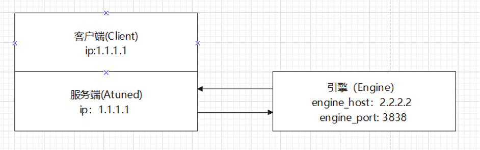
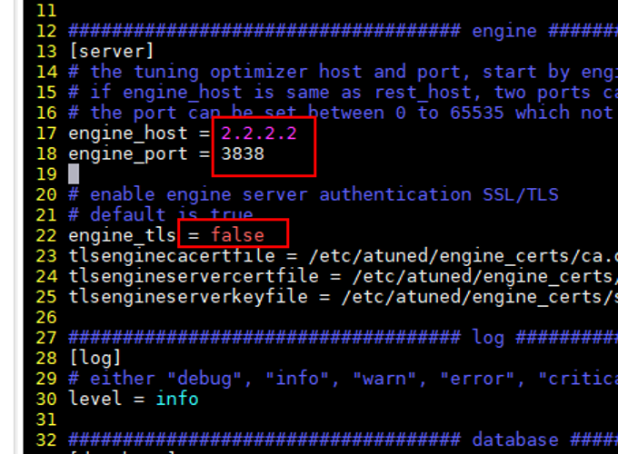
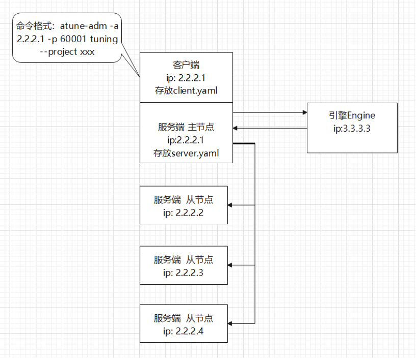
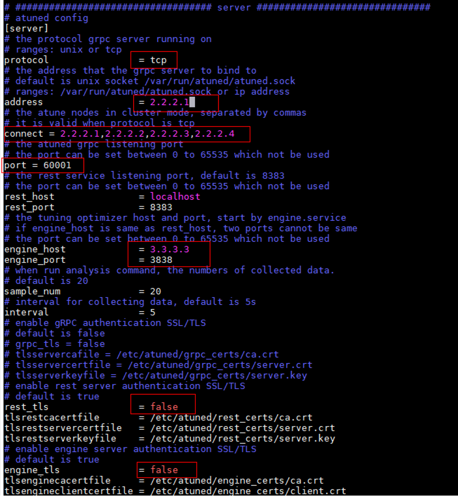
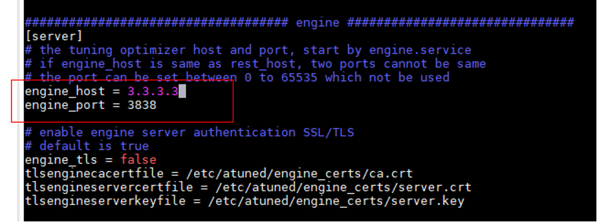

# 分节点部署

## 分节点部署目的
为了实现分布式架构和按需部署的目标，A-Tune支持分节点部署。可以将三个组件分开部署，轻量化组件部署对业务影响小，也避免安装过多依赖软件，减轻系统负担。

部署方式：本文档只介绍常用的一种部署方式：在同一节点部署客户端和服务端，在另一个节点上部署引擎模块。其他的部署方式请咨询A-Tune开发人员。

**部署关系图：** 

## 配置文件
分节点部署需要修改配置文件，将引擎的ip地址和端口号写入配置文件中，别的组件才能访问该ip地址上的引擎组件。

1.	修改服务端节点上的 /etc/atuned/ atuned.cnf文件：
34行的engine_host和engine_port修改为引擎节点的ip地址和端口号。如上图，应该修改为engine_host = 2.2.2.2 , engine_port=3838
将49行和55行的 rest_tls 和engine_tls 改为false，否则需要申请和配置证书。在测试环境中可以不用配置ssl证书，但是正式的现网环境需要配置证书，否则会有安全隐患。
2.	修改引擎节点/etc/atuned/engine.cnf文件：
17行和18行的engine_host和engine_port修改为引擎节点的ip地址和端口号。如上图，应该修改为engine_host = 2.2.2.2 , engine_port=3838
第22行的engine_tls的值改成false。 
3.	修改完配置文件后需要重启服务，配置才会生效
服务端节点输入命令：systemctl restart atuned
引擎端节点输入命令：systemctl restart atune-engine
4.	（可选步骤）在Compress文件夹下运行Tuning命令：
请先参考A-Tune/examples/tuning/compress/README 的指导进行预处理
执行atune-adm tuning --project compress --detail compress_client.yaml
执行Tuning命令的目的是检验分节点部署是否成功。

## 注意事项：
1.	atuned.cnf和engine.cnf中的rest_tls/engine_tls设成false
2.	修改完配置文件后需要重启服务，否则修改不会生效
3.	注意使用atune服务时不要同时打开代理
4.	Atuned.cnf 文件中的[system]模块的disk和network项需要修改，修改方法见A-Tune用户指南2.4.1章节，本文不展开描述。

## 举例：atuned.cnf:
 
## 举例 engine.cnf:
 

# 集群部署

## 集群部署的目的
为了支持多节点场景快速调优，A-Tune支持对多个节点里的参数配置同时进行动态调优，避免用户单独多次对每个节点进行调优，从而提升调优效率。
集群部署的方式：分为一个主节点和若干个从节点。在主节点部署客户端和服务端，负责接受命令和引擎交互。其他节点接受主节点的指令，对当前节点的参数进行配置。

**部署关系图：** 
 

上图中客户端和服务端部署在ip为2.2.2.1的节点上，项目文件存放在该节点上，其他节点不用放置项目文件。
主节点和从节点之间通过tcp 协议通信，所以需要修改配置文件。

## 修改内容：
1.	protocol 值设置为tcp
2.	address设置为当前节点的ip地址
3.	connect设置为所有节点的ip地址，第一个为主节点，其余为从节点ip，中间用逗号隔开。
4.	在调试时，可以设置rest_tls 和engine_tls 为false
所有的主从节点的atuned.cnf都按照上方描述修改

## atuned.cnf配置文件举例：
 

**备注：** engine.cnf参考分节点部署的配置文件

## 注意事项：
1.	将engine_host 和engine_port 设置为服务端atuned.cnf中engine_host 和engine_port一样的ip和端口号。
2.	atuned.cnf和engine.cnf中的rest_tls和engine_tls设置为false
3.	修改完配置文件后需要重启服务，否则修改不会生效
4.	注意使用atune服务时不要同时打开代理
5.	注意从节点的benchmark 文件路径必须都一模一样，因为执行流程是将主节点的benchmark语句通过消息传递给从节点，从节点直接执行，所以文件路径必须一样否则从节点执行会报错。

