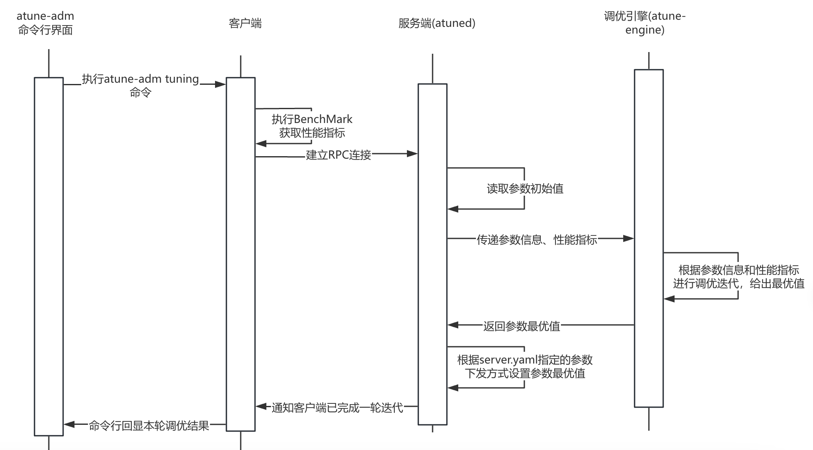

# A-Tune开发者指南

本文主要分析A-Tune提供的离线调优功能，通过介绍A-Tune的客户端、服务端以及引擎单个模块的处理流程以指导读者快速理解离线调优的功能。本文档适用于希望深入了解和参与A-Tune开发的社区开发者，开源爱好者和合作伙伴，使用前请先安装openEuler操作系统和A-Tune软件。

| 术语      | 含义                                                         |
| --------- | ------------------------------------------------------------ |
| 参数      | 操作系统、网络、应用或者存储的配置，本文中的参数指需要优化的配置，由用户定义，例如：cpu个数，应用可以使用的内存。 |
| 项目文件  | 即client.yaml和server.yaml，由用户定制。                     |
| 执行脚本  | 在项目文件中定义的，如何去获取参数的值和如何去设置参数值的shell脚本语言（也可以是python、C等程序）。 |
| 下发参数  | 根据AI算法中选取参数组合，通过执行脚本将相应的参数设置为最新的值。 |
| 调优      | 指通过AI算法动态选择的参数配置，使应用处理速度加快。         |
| 业务性能  | 指业务的评价指标，例如处理速度、准确性、响应时间，例如mysql的查询时间、web应用的处理速度。 |
| BenchMark | 用户定制的评价业务性能的表达式。                             |
| 基线性能  | 未调优前，执行BenchMark脚本获取的性能指标。                  |
| 节点      | 一台虚拟机或物理机为一个节点。                               |
| 项目      | 调优项目的名字，项目文件中project所指定的值。                |


## Tuning功能介绍

Tuning（离线动态调优）使用指定项目文件（client.yaml和server.yaml）对所选参数进行动态空间搜索，找到当前环境配置下的最优参数组合。具体是用AI算法对参数进行动态选择，通过不断迭代获得更好的性能。

Tuning由三个模块组成，分别是客户端（atune-adm）、服务端（atuned）和调优引擎（atune-engine）。三个模块交互图如下：


+ 客户端负责与命令行界面以及服务端进行交互，显示迭代中的参数信息和性能信息，第一轮调优迭代前或者每个轮次迭代完成后，客户端会执行BenchMark脚本以获取当前的性能指标，用于估算调优收益。
+ 服务端则接收来自客户端的指令，负责参数值获取、下发，并与调优引擎进行交互
+ 调优引擎则接收来自服务端的调优指令，接收到来自服务端提供的参数信息和性能指标，调优引擎通过算法迭代出参数最佳取值后回传给服务端，由服务端进行参数下发


下图为A-Tune一轮迭代调优的流程图，程序会迭代到用户设定的Iterations最大迭代轮次之后终止调优流程：




## Tuning项目结构介绍

Tuning项目通过指定server.yaml和client.yaml文件完成调优流程，用户需开发对应接口以进行离线调优。如下所示为典型的A-Tune调优项目结构，A-Tune通过用户定制脚本进行交互，用户定制脚本可以是shell脚本、python代码、其他可执行程序等等，A-Tune通过执行指定脚本来完成相关操作。

> server.yaml和client.yaml各字段说明请参考下面一节：Tuning配置文件介绍

```shell
example/
├── prepare.sh		# 用户定制脚本，环境准备文件，主要负责执行调优前相关准备工作，例如：安装应用、拷贝配置文件到A-Tune目录等
├── example_benchmark.sh			# 用户定制脚本，指导A-Tune如何对业务进行性能压测，并获取相关指标
├── example_server.yaml				# A-Tune服务端配置文件，主要指导A-Tune需要调整哪些参数、参数取值范围、参数如何获取值以及如何设置生效
├── example_client.yaml				# A-Tune客户端配置文件，主要指导A-Tune如何运行BenchMark以及如何获取性能指标
├── get_example_value.sh			# 用户定制脚本，如何获取参数值
└── set_example_value.sh			# 用户定制脚本，如何设置参数值
```

接下来以简单的例子来引导读者了解调优项目，这里以A-Tune源码仓中examples/tuning/gcc_compile为例：

**prepare.sh**

环境准备脚本一般为用户安装业务相关环境的脚本，通常只需要调优前执行一次即可，主要负责更新yaml或者shell脚本中的path变量以及拷贝server.yaml至atuned服务端的运行目录。

```shell
#!/bin/sh
path=$(
  cd "$(dirname "$0")"
  pwd
)

echo "update the client and server yaml files"
# 利用sed命令将脚本和配置文件中的path路径替换为绝对路径
sed -i "s#sh .*/gcc_compile.sh#sh $path/gcc_compile.sh#g" $path/gcc_compile_client.yaml
sed -i "s#cat .*/gcc_compile.sh#cat $path/gcc_compile.sh#g" $path/gcc_compile_server.yaml
sed -i "s#' .*/gcc_compile.sh#' $path/gcc_compile.sh#g" $path/gcc_compile_server.yaml

echo "copy the server yaml file to /etc/atuned/tuning/"
cp $path/gcc_compile_server.yaml /etc/atuned/tuning/
```


**gcc_compile.sh**

该脚本为业务的获取性能指标脚本，用户可以通过该脚本定制性能压测的方式，例如gcc_compile的例子中就指定了特定的编译选项进行内存带宽基准测试，该脚本运行后会输出相关性能指标供A-Tune获取。

> （1）benchmark脚本应注意对业务之前调优的中间结果（如：benchmark日志、数据库中的测试数据等）进行清理
>
> （2）请勿使用异步的方式让benchmark后台执行，否则会导致atune无法读取到性能指标而报错

```shell
#!/bin/sh

path=$(
  cd "$(dirname "$0")"
  pwd
)
echo "current run path is $path"

tune=generic
option=O0
array_size=20000000
times=10
offset=1024
isarch=no
if [[ $isarch == "yes" ]]; then
  arch="-march=native"
fi
isopenmp=no
if [[ $isopenmp == "yes" ]]; then
  openmp="-fopenmp"
fi

gcc -mtune=$tune $arch -$option $openmp -DSTREAM_ARRAY_SIZE=$array_size -DNTIMES=$times -DOFFSET=$offset $path/stream.c -o $path/stream.o
$path/stream.o
echo "file size: `wc -c $path/stream.o`"
rm -rf $path/stream.o
```

执行该脚本后会输出以下内容：

```shell
-------------------------------------------------------------
WARNING -- The above is only a rough guideline.
For best results, please be sure you know the
precision of your system timer.
-------------------------------------------------------------
Function    Best Rate MB/s  Avg time     Min time     Max time
Copy:           18005.9     0.023359     0.017772     0.032669
Scale:          17762.1     0.023237     0.018016     0.028169
Add:            24435.2     0.022648     0.019644     0.025576
Triad:          22934.8     0.025608     0.020929     0.034165
-------------------------------------------------------------
Solution Validates: avg error less than 1.000000e-13 on all three arrays
-------------------------------------------------------------
file size:    50472 /root/A-Tune/examples/tuning/gcc_compile/stream.o
```

该脚本的输出结果仍无法被A-Tune使用，需要通过命令或者脚本程序进一步处理得到性能指标的值，在此处需要提取Triad和file size的值作为调优目标。具体如何获取该性能指标值可以参考下面gcc_compile_client.yaml中的get配置。


**gcc_compile_client.yaml**

本yaml文件主要用于atune-adm客户端进行BenchMark验证，benchmark指定了"sh gcc_compile/gcc_compile.sh"，atune客户端会通过执行该脚本获取性能指标，且下面定义了两个性能指标，bandwith和size，atune客户端会利用get中的命令获取性能指标的值。获取性能指标的方式如下，```echo $out```表示benchmark脚本的输出结果，利用管道命令```grep 'Triad:' | awk '{print $2}'```我们就能获取Traid指标，size性能指标同理。

> （1）注意get可以指定命令，也可以指定脚本执行
>
> （2）用户需保证该接口输出结果可以转换成float类型，否则会报错

```shell
project: "gcc_compile"
engine : "bayes"
iterations : 50
random_starts : 10

benchmark : "sh gcc_compile/gcc_compile.sh"
evaluations :
  -
    name: "bandwidth"
    info:
        get: "echo '$out' | grep 'Triad:' | awk '{print $2}'"
        type: "negative"
        weight: 80
  -
    name: "size"
    info:
        get: "echo '$out' | grep 'file size:' | awk '{print $3}'"
        type: "positive"
        weight: 20
```


**gcc_compile_server.yaml**

如下为gcc_compile项目的server.yaml配置，由于本项目参数均不需要重启应用来设置生效，因此startworkload和stopworkload均为空。以**offset**参数为例，get和set均通过读取gcc_compile.sh脚本获取参数值，编写参数信息时需要注意的是，获取参数值需要能够转换成对应数据类型，若无法转换会导致无法进行调优业务。同时需要注意的是，server.yaml文件每次更新后需要拷贝到/etc/atuned/tuning目录下，否则atuned不会读取到最新配置。

```shell
project: "gcc_compile"
maxiterations: 500
startworkload: ""
stopworkload: ""
object :
  -
    name : "option"
    info :
        desc : "The gcc compilation options"
        get : "cat gcc_compile/gcc_compile.sh | grep -i '^option=' | awk -F '=' '{print $2}'"
        set : "sed -i 's/^option=.*/option=$value/g' gcc_compile/gcc_compile.sh"
        needrestart : "false"
        type : "discrete"
        options :
          - "O0"
          - "O1"
          - "O2"
          - "O3"
          - "Os"
          - "Ofast"
        dtype : "string"
  -
    name : "mtune"
    info :
        desc : "Tune to cpu-type everything applicable about the generated code"
        get : "cat gcc_compile/gcc_compile.sh | grep -i '^tune=' | awk -F '=' '{print $2}'"
        set : "sed -i 's/^tune=.*/tune=$value/g' gcc_compile/gcc_compile.sh"
        needrestart : "false"
        type : "discrete"
        options :
          - "generic"
          - "native"
        dtype : "string"
  -
    name : "march"
    info :
        desc : "Generate instructions for the machine type cpu-type"
        get : "cat gcc_compile/gcc_compile.sh | grep -i '^isarch=' | awk -F '=' '{print $2}'"
        set : "sed -i 's/^isarch=.*/isarch=$value/g' gcc_compile/gcc_compile.sh"
        needrestart : "false"
        type : "discrete"
        options :
          - "yes"
          - "no"
        dtype : "string"
  -
    name : "openmp"
    info :
        desc : "Adapts to multi-processor env, the defalut number of threads is the number of CPU threads after the function is enabled."
        get : "cat gcc_compile/gcc_compile.sh | grep -i '^isopenmp=' | awk -F '=' '{print $2}'"
        set : "sed -i 's/^isopenmp=.*/isopenmp=$value/g' gcc_compile/gcc_compile.sh"
        needrestart : "false"
        type : "discrete"
        options :
          - "yes"
          - "no"
        dtype : "string"
  -
    name : "offset"
    info :
        desc : "the array offset"
        get : "cat gcc_compile/gcc_compile.sh | grep -i '^offset=' | awk -F '=' '{print $2}'"
        set : "sed -i 's/^offset=.*/offset=$value/g' gcc_compile/gcc_compile.sh"
        needrestart: "false"
        type : "continuous"
        scope :
          - 1024
          - 61440
        dtype : "int"

```


## Tuning配置文件介绍

表1 服务端yaml文件(server.yaml)

| **配置名称**  | **配置说明**                                                 | **参数类型** | **取值范围** |
| ------------- | ------------------------------------------------------------ | ------------ | ------------ |
| project       | 项目名称。                                                   | 字符串       | -            |
| startworkload | 待调优服务的启动脚本，主要用于有参数需要重启才能生效的情况，若参数均能够实时生效则此处可为空。 | 字符串       | -            |
| stopworkload  | 待调优服务的停止脚本，主要用于有参数需要重启才能生效的情况，若参数均能够实时生效则此处可为空。 | 字符串       | -            |
| maxiterations | 最大调优迭代次数，用于限制客户端的迭代次数。一般来说，调优迭代次数越多，优化效果越好，但所需时间越长。用户必须根据实际的业务场景进行配置。 | 整型         | >10          |
| object        | 需要调节的参数项及信息，为一个列表。 object 配置项请参见表2。 | -            | -            |

表2 object项配置说明

| **配置名称** | **配置说明**                                                 | **参数类型** | **取值范围**                       |
| ------------ | ------------------------------------------------------------ | ------------ | ---------------------------------- |
| name         | 待调参数名称                                                 | 字符串       | -                                  |
| desc         | 待调参数描述                                                 | 字符串       | -                                  |
| get          | 查询参数值的脚本，脚本应输出对应参数的取值，若输出结果无法转为指定dtype将报错，请保证脚本输出正确的参数取值 | -            | -                                  |
| set          | 设置参数值的脚本                                             | -            | -                                  |
| needrestart  | 参数生效是否需要重启业务                                     | 枚举         | "true", "false"                    |
| type         | 参数的类型，目前支持discrete, continuous两种类型，对应离散型、连续型参数 | 枚举         | "discrete", "continuous"           |
| dtype        | 该参数仅在type为discrete类型时配置，目前支持int, float, string类型 | 枚举         | int, float, string                 |
| scope        | 参数设置范围，仅在type为discrete且dtype为int或float时或者type为continuous时生效 | 整型/浮点型  | 用户自定义，取值在该参数的合法范围 |
| step         | 参数值步长，dtype为int或float时使用                          | 整型/浮点型  | 用户自定义                         |
| items        | 参数值在scope定义范围之外的枚举值，dtype为int或float时使用   | 整型/浮点型  | 用户自定义，取值在该参数的合法范围 |
| options      | 参数值的枚举范围，dtype为string时使用                        | 字符串       | 用户自定义，取值在该参数的合法范围 |

表3 客户端yaml文件配置说明（client.yaml）

| **配置名称**          | **配置说明**                                                 | **参数类型** | **取值范围**                                      |
| --------------------- | ------------------------------------------------------------ | ------------ | ------------------------------------------------- |
| project               | 项目名称，需要与服务端对应配置文件中的project匹配            | 字符串       | -                                                 |
| engine                | 调优算法名称                                                 | 字符串       | "random", "forest", "gbrt", "bayes", "extraTrees" |
| iterations            | 调优迭代次数                                                 | 整型         | >= 10                                             |
| random_starts         | 随机迭代次数                                                 | 整型         | < iterations                                      |
| feature_filter_engine | 参数搜索算法，用于重要参数选择，该参数可选                   | 字符串       | "lhs"                                             |
| feature_filter_cycle  | 参数搜索轮数，用于重要参数选择，该参数配合feature_filter_engine使用 | 整型         | -                                                 |
| feature_filter_iters  | 每轮参数搜索的迭代次数，用于重要参数选择，该参数配合feature_filter_engine使用 | 整型         | -                                                 |
| split_count           | 调优参数取值范围中均匀选取的参数个数，用于重要参数选择，该参数配合feature_filter_engine使用 | 整型         | -                                                 |
| benchmark             | 性能测试脚本                                                 | -            | -                                                 |
| evaluations           | 性能测试评估指标 evaluations 配置项请参见表4                 | -            | -                                                 |

表4 evaluations项配置说明

| **配置名称** | **配置说明**                                                 | **参数类型** | **取值范围**          |
| ------------ | ------------------------------------------------------------ | ------------ | --------------------- |
| name         | 评价指标名称                                                 | 字符串       | -                     |
| get          | 获取性能评估结果的脚本，脚本应输出对应参数的取值，若输出结果无法转为指定type将报错，请保证脚本输出正确的参数取值 | -            | -                     |
| type         | 评估结果的正负类型，用于模型算法评估收益以确定下一轮迭代方向，positive代表这个性能指标越小越好，往值变小的方向迭代，比如：“执行耗时”，negative代表这个性能指标越大越好，往值变大的方向迭代，比如：”吞吐量“ | 枚举         | "positive","negative" |
| weight       | 该指标的权重百分比，当有多个性能指标时需设置（单个性能指标无需设置），多个指标的权重之和应为100，0-100 | 整型         | 0-100                 |
| threshold    | 该指标的最低性能要求                                         | 整型         | 用户指定              |


