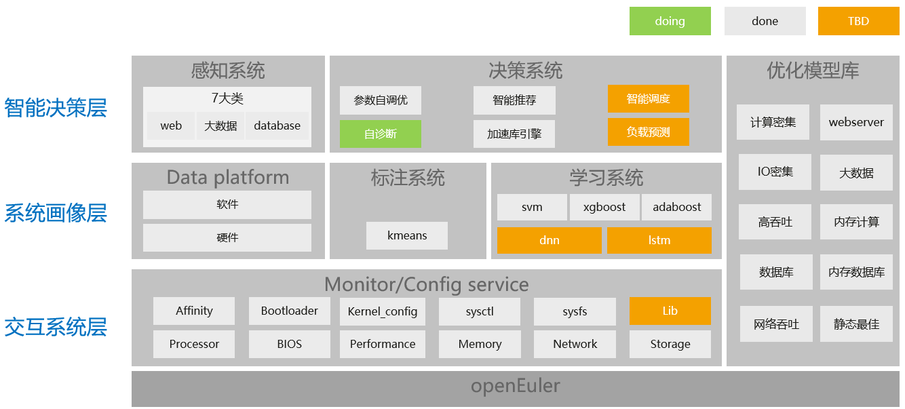
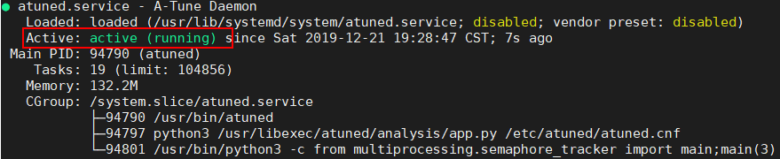

# A-Tune用户指南

<h2 id="法律申明.md">法律申明</h2>

**版权所有 © 2020 华为技术有限公司。**

您对“本文档”的复制，使用，修改及分发受知识共享\(Creative Commons\)署名—相同方式共享4.0国际公共许可协议\(以下简称“CC BY-SA 4.0”\)的约束。为了方便用户理解，您可以通过访问[https://creativecommons.org/licenses/by-sa/4.0/](https://creativecommons.org/licenses/by-sa/4.0/)  了解CC BY-SA 4.0的概要 \(但不是替代\)。CC BY-SA 4.0的完整协议内容您可以访问如下网址获取：[https://creativecommons.org/licenses/by-sa/4.0/legalcode](https://creativecommons.org/licenses/by-sa/4.0/legalcode)。

**商标声明**

A-Tune和其他华为商标均为华为技术有限公司的商标。本文档提及的其他所有商标或注册商标，由各自的所有人拥有。

**免责声明**

本文档仅作为使用指导，除非适用法强制规定或者双方有明确书面约定, 华为技术有限公司对本文档中的所有陈述、信息和建议不做任何明示或默示的声明或保证，包括但不限于不侵权，时效性或满足特定目的的担保。

<h2 id="前言.md">前言</h2>

## 概述<a name="section4537382116410"></a>

本文档介绍openEuler系统性能自优化软件A-Tune的安装部署和使用方法，以指导用户快速了解并使用A-Tune。

## 读者对象<a name="section4378592816410"></a>

本文档适用于使用openEuler系统并希望了解和使用A-Tune的社区开发者、开源爱好者以及相关合作伙伴。使用人员需要具备基本的Linux操作系统知识。

<h2 id="认识A-Tune.md">认识A-Tune</h2>

<h2 id="简介.md">简介</h2>

操作系统作为衔接应用和硬件的基础软件，如何调整系统和应用配置，充分发挥软硬件能力，从而提升业务性能，对用户来说至关重要。然而，运行在操作系统上的业务类型成百上千，应用形态千差万别，对资源的要求各不相同，且当前硬件和基础软件组成的应用环境涉及高达7000多个配置对象，随着调优对象的增加，调优所需的时间成本以指数级增长，配置调优成为了一项极其复杂的工程，超出了一般工程师的能力范围。为了应对这些挑战，A-Tune就应运而生了。

A-Tune是一款基于openEuler系统开发的性能智能自优化的基础软件，它利用人工智能技术，对应用建立精准的系统画像，通过AI感知并推理出业务特征，从而进行智能决策，匹配得出最佳的系统配置组合，使业务处于最佳运行状态。


<h2 id="架构.md">架构</h2>

A-Tune核心技术架构如下图，主要包括智能决策、系统画像和交互系统三层。

-   智能决策层：包含感知和决策两个子系统，分别承担对应用的智能感知和对系统的调优决策。
-   系统画像层：主要包括标注和学习系统，标注系统用于业务模型的聚类，学习系统用于业务模型的学习和分类。
-   交互系统层：用于各类系统资源的监控和配置，其中调优策略执行在本层进行。



<h2 id="支持特性与业务模型.md">支持特性与业务模型</h2>

## 支持特性<a name="section1743310211743"></a>

A-Tune支持的主要特性、特性成熟度以及使用建议请参见[表1](#table1919220557576)。

**表 1**  特性成熟度

<a name="table1919220557576"></a>
<table><thead align="left"><tr id="row81921355135715"><th class="cellrowborder" valign="top" width="33.33333333333333%" id="mcps1.2.4.1.1"><p id="p1419275514576"><a name="p1419275514576"></a><a name="p1419275514576"></a><strong id="b175661223205512"><a name="b175661223205512"></a><a name="b175661223205512"></a>特性</strong></p>
</th>
<th class="cellrowborder" valign="top" width="33.33333333333333%" id="mcps1.2.4.1.2"><p id="p7192195520572"><a name="p7192195520572"></a><a name="p7192195520572"></a><strong id="b185678233555"><a name="b185678233555"></a><a name="b185678233555"></a>成熟度</strong></p>
</th>
<th class="cellrowborder" valign="top" width="33.33333333333333%" id="mcps1.2.4.1.3"><p id="p519205518573"><a name="p519205518573"></a><a name="p519205518573"></a><strong id="b1156872320553"><a name="b1156872320553"></a><a name="b1156872320553"></a>使用建议</strong></p>
</th>
</tr>
</thead>
<tbody><tr id="row519275518572"><td class="cellrowborder" valign="top" width="33.33333333333333%" headers="mcps1.2.4.1.1 "><p id="p1349454518111"><a name="p1349454518111"></a><a name="p1349454518111"></a>七大类11款应用负载类型自动优化</p>
</td>
<td class="cellrowborder" valign="top" width="33.33333333333333%" headers="mcps1.2.4.1.2 "><p id="p48001027191117"><a name="p48001027191117"></a><a name="p48001027191117"></a>已测试</p>
</td>
<td class="cellrowborder" valign="top" width="33.33333333333333%" headers="mcps1.2.4.1.3 "><p id="p15192195515715"><a name="p15192195515715"></a><a name="p15192195515715"></a>试用</p>
</td>
</tr>
<tr id="row919217552579"><td class="cellrowborder" valign="top" width="33.33333333333333%" headers="mcps1.2.4.1.1 "><p id="p519218559571"><a name="p519218559571"></a><a name="p519218559571"></a>自定义负载类型和业务模型</p>
</td>
<td class="cellrowborder" valign="top" width="33.33333333333333%" headers="mcps1.2.4.1.2 "><p id="p18192655115710"><a name="p18192655115710"></a><a name="p18192655115710"></a>已测试</p>
</td>
<td class="cellrowborder" valign="top" width="33.33333333333333%" headers="mcps1.2.4.1.3 "><p id="p71921655145717"><a name="p71921655145717"></a><a name="p71921655145717"></a>试用</p>
</td>
</tr>
<tr id="row71921155165711"><td class="cellrowborder" valign="top" width="33.33333333333333%" headers="mcps1.2.4.1.1 "><p id="p619217556575"><a name="p619217556575"></a><a name="p619217556575"></a>参数自调优</p>
</td>
<td class="cellrowborder" valign="top" width="33.33333333333333%" headers="mcps1.2.4.1.2 "><p id="p11192135595712"><a name="p11192135595712"></a><a name="p11192135595712"></a>已测试</p>
</td>
<td class="cellrowborder" valign="top" width="33.33333333333333%" headers="mcps1.2.4.1.3 "><p id="p2019235511575"><a name="p2019235511575"></a><a name="p2019235511575"></a>试用</p>
</td>
</tr>
</tbody>
</table>

## 支持业务模型<a name="section1899518171052"></a>

根据应用的负载特征，A-Tune将业务分为七大类，各类型的负载特征和A-Tune支持的应用请参见[表2](#table2819164611311)。

**表 2**  支持的业务类型和应用

<a name="table2819164611311"></a>
<table><thead align="left"><tr id="row49114466133"><th class="cellrowborder" valign="top" width="22.12%" id="mcps1.2.5.1.1"><p id="p09116467130"><a name="p09116467130"></a><a name="p09116467130"></a><strong id="b161312710164"><a name="b161312710164"></a><a name="b161312710164"></a>业务类型</strong>（workload_type）</p>
</th>
<th class="cellrowborder" valign="top" width="12.959999999999999%" id="mcps1.2.5.1.2"><p id="p953251510111"><a name="p953251510111"></a><a name="p953251510111"></a><strong id="b910151811126"><a name="b910151811126"></a><a name="b910151811126"></a>类型说明</strong></p>
</th>
<th class="cellrowborder" valign="top" width="37.269999999999996%" id="mcps1.2.5.1.3"><p id="p169111846181310"><a name="p169111846181310"></a><a name="p169111846181310"></a><strong id="b1213516721612"><a name="b1213516721612"></a><a name="b1213516721612"></a>负载特征</strong></p>
</th>
<th class="cellrowborder" valign="top" width="27.650000000000002%" id="mcps1.2.5.1.4"><p id="p1591144617135"><a name="p1591144617135"></a><a name="p1591144617135"></a><strong id="b31363721611"><a name="b31363721611"></a><a name="b31363721611"></a>支持的应用</strong></p>
</th>
</tr>
</thead>
<tbody><tr id="row17911114651318"><td class="cellrowborder" valign="top" width="22.12%" headers="mcps1.2.5.1.1 "><p id="p1791124631317"><a name="p1791124631317"></a><a name="p1791124631317"></a>default</p>
</td>
<td class="cellrowborder" valign="top" width="12.959999999999999%" headers="mcps1.2.5.1.2 "><p id="p45321515191120"><a name="p45321515191120"></a><a name="p45321515191120"></a>默认类型</p>
</td>
<td class="cellrowborder" valign="top" width="37.269999999999996%" headers="mcps1.2.5.1.3 "><p id="p691184671312"><a name="p691184671312"></a><a name="p691184671312"></a>CPU、内存带宽、网络、IO各维度资源使用率都不高</p>
</td>
<td class="cellrowborder" valign="top" width="27.650000000000002%" headers="mcps1.2.5.1.4 "><p id="p69111946131318"><a name="p69111946131318"></a><a name="p69111946131318"></a>N/A</p>
</td>
</tr>
<tr id="row791164631318"><td class="cellrowborder" valign="top" width="22.12%" headers="mcps1.2.5.1.1 "><p id="p179110461137"><a name="p179110461137"></a><a name="p179110461137"></a>webserver</p>
</td>
<td class="cellrowborder" valign="top" width="12.959999999999999%" headers="mcps1.2.5.1.2 "><p id="p20532111512117"><a name="p20532111512117"></a><a name="p20532111512117"></a>https应用</p>
</td>
<td class="cellrowborder" valign="top" width="37.269999999999996%" headers="mcps1.2.5.1.3 "><p id="p1191117469133"><a name="p1191117469133"></a><a name="p1191117469133"></a>CPU使用率高</p>
</td>
<td class="cellrowborder" valign="top" width="27.650000000000002%" headers="mcps1.2.5.1.4 "><p id="p159111546161317"><a name="p159111546161317"></a><a name="p159111546161317"></a>Nginx</p>
</td>
</tr>
<tr id="row13911946141311"><td class="cellrowborder" valign="top" width="22.12%" headers="mcps1.2.5.1.1 "><p id="p2911164610134"><a name="p2911164610134"></a><a name="p2911164610134"></a>big_database</p>
</td>
<td class="cellrowborder" valign="top" width="12.959999999999999%" headers="mcps1.2.5.1.2 "><p id="p4532111561119"><a name="p4532111561119"></a><a name="p4532111561119"></a>数据库</p>
</td>
<td class="cellrowborder" valign="top" width="37.269999999999996%" headers="mcps1.2.5.1.3 "><a name="ul3724104521013"></a><a name="ul3724104521013"></a><ul id="ul3724104521013"><li>关系型数据库<p id="p14911124612131"><a name="p14911124612131"></a><a name="p14911124612131"></a>读： CPU、内存带宽、网络使用率高</p>
<p id="p1491144619136"><a name="p1491144619136"></a><a name="p1491144619136"></a>写：IO使用率高</p>
</li></ul>
<a name="ul26021547101013"></a><a name="ul26021547101013"></a><ul id="ul26021547101013"><li>非关系型数据库<p id="p169111462130"><a name="p169111462130"></a><a name="p169111462130"></a>CPU、IO使用率高</p>
</li></ul>
</td>
<td class="cellrowborder" valign="top" width="27.650000000000002%" headers="mcps1.2.5.1.4 "><p id="p1091134671313"><a name="p1091134671313"></a><a name="p1091134671313"></a>MongoDB、MySQL、PostgreSQL、MariaDB</p>
</td>
</tr>
<tr id="row3911174641312"><td class="cellrowborder" valign="top" width="22.12%" headers="mcps1.2.5.1.1 "><p id="p491144611319"><a name="p491144611319"></a><a name="p491144611319"></a>big_data</p>
</td>
<td class="cellrowborder" valign="top" width="12.959999999999999%" headers="mcps1.2.5.1.2 "><p id="p953261521112"><a name="p953261521112"></a><a name="p953261521112"></a>大数据</p>
</td>
<td class="cellrowborder" valign="top" width="37.269999999999996%" headers="mcps1.2.5.1.3 "><p id="p129111046151315"><a name="p129111046151315"></a><a name="p129111046151315"></a>CPU、IO使用率较高</p>
</td>
<td class="cellrowborder" valign="top" width="27.650000000000002%" headers="mcps1.2.5.1.4 "><p id="p119111946161317"><a name="p119111946161317"></a><a name="p119111946161317"></a>Hadoop、Spark</p>
</td>
</tr>
<tr id="row591112462132"><td class="cellrowborder" valign="top" width="22.12%" headers="mcps1.2.5.1.1 "><p id="p1791104661313"><a name="p1791104661313"></a><a name="p1791104661313"></a>in-memory_computing</p>
</td>
<td class="cellrowborder" valign="top" width="12.959999999999999%" headers="mcps1.2.5.1.2 "><p id="p453291517111"><a name="p453291517111"></a><a name="p453291517111"></a>内存密集型应用</p>
</td>
<td class="cellrowborder" valign="top" width="37.269999999999996%" headers="mcps1.2.5.1.3 "><p id="p591184671318"><a name="p591184671318"></a><a name="p591184671318"></a>CPU、内存带宽使用率高</p>
</td>
<td class="cellrowborder" valign="top" width="27.650000000000002%" headers="mcps1.2.5.1.4 "><p id="p2912846121315"><a name="p2912846121315"></a><a name="p2912846121315"></a>SPECjbb2015</p>
</td>
</tr>
<tr id="row59121246181320"><td class="cellrowborder" valign="top" width="22.12%" headers="mcps1.2.5.1.1 "><p id="p1391204619130"><a name="p1391204619130"></a><a name="p1391204619130"></a>in-memory_database</p>
</td>
<td class="cellrowborder" valign="top" width="12.959999999999999%" headers="mcps1.2.5.1.2 "><p id="p65328153111"><a name="p65328153111"></a><a name="p65328153111"></a>计算+网络密集型应用</p>
</td>
<td class="cellrowborder" valign="top" width="37.269999999999996%" headers="mcps1.2.5.1.3 "><p id="p3912164617133"><a name="p3912164617133"></a><a name="p3912164617133"></a>CPU单核使用率高，多实例下网络使用率高</p>
</td>
<td class="cellrowborder" valign="top" width="27.650000000000002%" headers="mcps1.2.5.1.4 "><p id="p1691254621313"><a name="p1691254621313"></a><a name="p1691254621313"></a>Redis</p>
</td>
</tr>
<tr id="row1891264641315"><td class="cellrowborder" valign="top" width="22.12%" headers="mcps1.2.5.1.1 "><p id="p391214621312"><a name="p391214621312"></a><a name="p391214621312"></a>single_computer_intensive_jobs</p>
</td>
<td class="cellrowborder" valign="top" width="12.959999999999999%" headers="mcps1.2.5.1.2 "><p id="p55324155117"><a name="p55324155117"></a><a name="p55324155117"></a>计算密集型应用</p>
</td>
<td class="cellrowborder" valign="top" width="37.269999999999996%" headers="mcps1.2.5.1.3 "><p id="p1912164651319"><a name="p1912164651319"></a><a name="p1912164651319"></a>CPU单核使用率高，部分子项内存带宽使用率高</p>
</td>
<td class="cellrowborder" valign="top" width="27.650000000000002%" headers="mcps1.2.5.1.4 "><p id="p9912746121311"><a name="p9912746121311"></a><a name="p9912746121311"></a>SPECCPU2006</p>
</td>
</tr>
<tr id="row2912184671312"><td class="cellrowborder" valign="top" width="22.12%" headers="mcps1.2.5.1.1 "><p id="p1391213464130"><a name="p1391213464130"></a><a name="p1391213464130"></a>communication</p>
</td>
<td class="cellrowborder" valign="top" width="12.959999999999999%" headers="mcps1.2.5.1.2 "><p id="p153210159118"><a name="p153210159118"></a><a name="p153210159118"></a>网络密集型应用</p>
</td>
<td class="cellrowborder" valign="top" width="37.269999999999996%" headers="mcps1.2.5.1.3 "><p id="p591214460137"><a name="p591214460137"></a><a name="p591214460137"></a>CPU、网络使用率高</p>
</td>
<td class="cellrowborder" valign="top" width="27.650000000000002%" headers="mcps1.2.5.1.4 "><p id="p391214619139"><a name="p391214619139"></a><a name="p391214619139"></a>Dubbo</p>
</td>
</tr>
<tr id="row1991224641317"><td class="cellrowborder" valign="top" width="22.12%" headers="mcps1.2.5.1.1 "><p id="p5912154613139"><a name="p5912154613139"></a><a name="p5912154613139"></a>idle</p>
</td>
<td class="cellrowborder" valign="top" width="12.959999999999999%" headers="mcps1.2.5.1.2 "><p id="p12532161561115"><a name="p12532161561115"></a><a name="p12532161561115"></a>系统idle</p>
</td>
<td class="cellrowborder" valign="top" width="37.269999999999996%" headers="mcps1.2.5.1.3 "><p id="p10912154631311"><a name="p10912154631311"></a><a name="p10912154631311"></a>系统处于空闲状态，无任何应用运行</p>
</td>
<td class="cellrowborder" valign="top" width="27.650000000000002%" headers="mcps1.2.5.1.4 "><p id="p11912164617133"><a name="p11912164617133"></a><a name="p11912164617133"></a>N/A</p>
</td>
</tr>
</tbody>
</table>

<h2 id="安装与部署.md">安装与部署</h2>

本章介绍如何安装和部署A-Tune。

<h2 id="软硬件要求.md">软硬件要求</h2>

## 硬件要求<a name="section175931749114410"></a>

-   鲲鹏920处理器

## 软件要求<a name="section19201810164619"></a>

-   操作系统：openEuler 1.0

<h2 id="环境准备.md">环境准备</h2>

安装openEuler系统，安装方法参考《openEuler 1.0 安装指南》。

<h2 id="安装A-Tune.md">安装A-Tune</h2>

本章介绍A-Tune的安装模式和安装方法。

<h2 id="安装模式介绍.md">安装模式介绍</h2>

A-Tune支持单机模式和分布式模式安装：

-   单机模式

    client和server安装到同一台机器上。

-   分布式模式

    client和server分别安装在不同的机器上。


<h2 id="安装操作.md">安装操作</h2>

安装A-Tune的操作步骤如下：

1.  挂载openEuler的iso文件。

    ```
    # mount openEuler-1.0-aarch64-dvd.iso /mnt
    ```

2.  配置本地yum源。

    ```
    # vim /etc/yum.repos.d/local.repo
    ```

    配置内容如下所示：

    ```
    [local]
    name=local
    baseurl=file:///mnt
    gpgcheck=0
    enabled=1
    ```

3.  安装A-Tune服务端。

    > **说明：**   
    >本步骤会同时安装服务端和客户端软件包，对于单机部署模式，请跳过**步骤4**。  

    ```
    # yum install atune -y
    ```

4.  安装A-Tune客户端。

    ```
    # yum install atune-client -y
    ```

5.  验证是否安装成功。

    ```
    # rpm -qa | grep atune
    atune-client-xxx
    atune-db-xxx
    atune-xxx
    ```

    有如上回显信息表示安装成功。


<h2 id="部署A-Tune.md">部署A-Tune</h2>

本章介绍A-Tune的配置部署。

<h2 id="配置介绍.md">配置介绍</h2>

A-Tune配置文件/etc/atuned/atuned.cnf的配置项说明如下：

-   A-Tune服务启动配置

    可根据需要进行修改。

    -   address：系统grpc服务的侦听地址，默认为127.0.0.1，若为多机部署，需进行修改。
    -   port：系统grpc服务的侦听端口，范围为0\~65535未使用的端口。
    -   rest\_port：系统restservice的侦听端口, 范围为0\~65535未使用的端口。
    -   sample\_num：系统执行analysis流程时采集样本的数量。

-   system信息

    system为系统执行相关的优化需要用到的参数信息，必须根据系统实际情况进行修改。

    -   disk：执行analysis流程时需要采集的对应磁盘的信息或执行磁盘相关优化时需要指定的磁盘。
    -   network：执行analysis时需要采集的对应的网卡的信息或执行网卡相关优化时需要指定的网卡。
    -   user：执行ulimit相关优化时用到的用户名。目前只支持root用户。
    -   tls：开启A-Tune的gRPC和http服务SSL/TLS证书校验，默认不开启。开启TLS后atune-adm命令在使用前需要设置以下环境变量方可与服务端进行通讯：
        -   export ATUNE\_TLS=yes
        -   export ATUNE\_CLICERT=<客户端证书路径\>

    -   tlsservercertfile：gPRC服务端证书路径。
    -   tlsserverkeyfile：gPRC服务端秘钥路径。
    -   tlshttpcertfile：http服务端证书路径。
    -   tlshttpkeyfile：http服务端秘钥路径。
    -   tlshttpcacertfile：http服务端CA证书路径。

-   日志信息

    根据情况修改日志的路径和级别，默认的日志信息在/var/log/message中。

-   monitor信息

    为系统启动时默认采集的系统的硬件信息。


## 配置示例<a name="section616213774714"></a>

```
#################################### server ###############################
# atuned config
[server]
# the address the grpc server to bind to, default is 127.0.0.1
address = 127.0.0.1

# the atuned grpc listening port, default is 60001
# the port can be set between 0 to 65535 the not be used
port = 60001

# the rest service listening port, default is 8383
# the port can be set between 0 to 65535 than not be used
rest_port = 8383

# when run analysis command, the numbers of collected data.
# default is 20
sample_num = 20

# Enable gRPC and http server authentication SSL/TLS
# default is false
# tls = true
# tlsservercertfile = /etc/atuned/server.pem
# tlsserverkeyfile = /etc/atuned/server.key
# tlshttpcertfile = /etc/atuned/http/server.pem
# tlshttpkeyfile = /etc/atuned/http/server.key
# tlshttpcacertfile = /etc/atuned/http/cacert.pem

#################################### log ###############################
# Either "debug", "info", "warn", "error", "critical", default is "info"
level = info

#################################### monitor ###############################
[monitor]
# With the module and format of the MPI, the format is {module}_{purpose}
# The module is Either "mem", "net", "cpu", "storage"
# The purpose is "topo"
module = mem_topo, cpu_topo

#################################### system ###############################
# you can add arbitrary key-value here, just like key = value
# you can use the key in the profile
[system]
# the disk to be analysis
disk = sda

# the network to be analysis
network = enp189s0f0

user = root
```

<h2 id="启动A-Tune.md">启动A-Tune</h2>

A-Tune安装完成后，需要启动A-Tune服务才能使用。

-   启动atuned服务：

    ```
    $ systemctl start atuned
    ```


-   查询atuned服务状态：

    ```
    $ systemctl status atuned
    ```

    若回显为如下，则服务启动成功。

    


<h2 id="使用方法.md">使用方法</h2>

用户可以通过调用A-Tune提供的命令行接口使用A-Tune提供的功能。本章介绍A-Tune命令行接口的功能和使用方式。

<h2 id="查询负载类型.md">查询负载类型</h2>

<h2 id="list.md">list</h2>

## 功能描述<a name="section124121426195015"></a>

查询系统当前支持的workload\_type和对应的profile，以及当前处于active状态的profile。

## 命令格式<a name="section1019897115110"></a>

**atune-adm list**

## 使用示例<a name="section5961238145111"></a>

```
$ atune-adm list

Support WorkloadTypes:
+-----------------------------------+------------------------+-----------+
| WorkloadType                      | ProfileName            | Active    |
+===================================+========================+===========+
| default                           | default                | true      |
+-----------------------------------+------------------------+-----------+
| webserver                         | ssl_webserver          | false     |
+-----------------------------------+------------------------+-----------+
| big_database                      | database               | false     |
+-----------------------------------+------------------------+-----------+
| big_data                          | big_data               | false     |
+-----------------------------------+------------------------+-----------+
| in-memory_computing               | in-memory_computing    | false     |
+-----------------------------------+------------------------+-----------+
| in-memory_database                | in-memory_database     | false     |
+-----------------------------------+------------------------+-----------+
| single_computer_intensive_jobs    | compute-intensive      | false     |
+-----------------------------------+------------------------+-----------+
| communication                     | rpc_communication      | false     |
+-----------------------------------+------------------------+-----------+
| idle                              | default                | false     |
+-----------------------------------+------------------------+-----------+

```

> **说明：**   
>Active为true表示当前激活的profile，示例表示当前激活的是default类型对应的profile。  

<h2 id="自定义负载类型.md">自定义负载类型</h2>

除了系统已定义的负载类型，A-Tune也支持用户定义新的workload\_type及对应profile，并允许更新或删除自定义的workload\_type。

用户也可以将“使用方法 \> 自定义模型”中用户训练的自定义模型添加到A-Tune中。

<h2 id="define.md">define</h2>

## 功能描述<a name="section124121426195015"></a>

添加用户自定义的workload\_type，及对应的profile优化项。

## 命令格式<a name="section1019897115110"></a>

**atune-adm define**  <WORKLOAD\_TYPE\> <PROFILE\_NAME\> <PROFILE\_PATH\>

## 使用示例<a name="section5961238145111"></a>

新增一个workload type，workload type的名称为test\_type，profile name的名称为test\_name，优化项的配置文件为example.conf。

```
$ atune-adm define test_type test_name ./example.conf
```

example.conf 可以参考如下方式书写（以下各优化项非必填，仅供参考），也可通过**atune-adm info**查看已有的profile是如何书写的。

```
[main]
# list it's parent profile
[tip]
# the recommended optimization, which should be performed manunaly
[check]
# check the environment
[affinity.irq]
# to change the affinity of irqs
[affinity.task]
# to change the affinity of tasks
[bios]
# to change the bios config
[bootloader.grub2]
# to change the grub2 config
[kernel_config]
# to change the kernel config
[script]
# the script extention of cpi
[sysctl]
# to change the /proc/sys/* config
[sysfs]
# to change the /sys/* config
[systemctl]
# to change the system service config
[ulimit]
# to change the resources limit of user
```

<h2 id="update.md">update</h2>

## 功能描述<a name="section124121426195015"></a>

将workload\_type原来的优化项更新为new.conf中的内容。

## 命令格式<a name="section1019897115110"></a>

**atune-adm update**  <WORKLOAD\_TYPE\> <PROFILE\_NAME\> <PROFILE\_FILE\>

## 使用示例<a name="section5961238145111"></a>

更新负载类型为test\_type，优化项名称为test\_name的优化项为new.conf。

```
$ atune-adm update test_type test_name ./new.conf
```

<h2 id="undefine.md">undefine</h2>

## 功能描述<a name="section124121426195015"></a>

删除用户自定义的workload\_type。

## 命令格式<a name="section1019897115110"></a>

**atune-adm undefine**  <WORKLOAD\_TYPE\>

## 使用示例<a name="section5961238145111"></a>

删除自定义的负载类型test\_type。

```
$ atune-adm undefine test_type 
```

<h2 id="自定义模型.md">自定义模型</h2>

A-Tune支持用户训练新的workload\_type。训练方法非常简单，用户只要通过collection和train两条命令，即可完成新模型的训练。

<h2 id="collection.md">collection</h2>

## 功能描述<a name="section124121426195015"></a>

采集业务运行时系统的全局资源使用情况以及OS的各项状态信息，并将收集的结果保存到csv格式的输出文件中，作为模型训练的输入数据集。

> **说明：**   
>本命令依赖采样工具perf，mpstat，vmstat，iostat，sar。CPU型号目前仅支持鲲鹏920，可通过dmidecode -t processor检查CPU型号。  

## 命令格式<a name="section1019897115110"></a>

**atune-adm collection**  <OPTIONS\>

## 参数说明<a name="section143803239510"></a>

-   OPTIONS

    <a name="zh-cn_topic_0210923698_table960915119119"></a>
    <table><thead align="left"><tr id="zh-cn_topic_0210923698_row13645013114"><th class="cellrowborder" valign="top" width="23.87%" id="mcps1.1.3.1.1"><p id="zh-cn_topic_0210923698_p176451311914"><a name="zh-cn_topic_0210923698_p176451311914"></a><a name="zh-cn_topic_0210923698_p176451311914"></a>参数</p>
    </th>
    <th class="cellrowborder" valign="top" width="76.13%" id="mcps1.1.3.1.2"><p id="zh-cn_topic_0210923698_p1364511211"><a name="zh-cn_topic_0210923698_p1364511211"></a><a name="zh-cn_topic_0210923698_p1364511211"></a>描述</p>
    </th>
    </tr>
    </thead>
    <tbody><tr id="zh-cn_topic_0210923698_row19645141112"><td class="cellrowborder" valign="top" width="23.87%" headers="mcps1.1.3.1.1 "><p id="zh-cn_topic_0210923698_p2645611710"><a name="zh-cn_topic_0210923698_p2645611710"></a><a name="zh-cn_topic_0210923698_p2645611710"></a>--filename, -f</p>
    </td>
    <td class="cellrowborder" valign="top" width="76.13%" headers="mcps1.1.3.1.2 "><p id="zh-cn_topic_0210923698_p10645512017"><a name="zh-cn_topic_0210923698_p10645512017"></a><a name="zh-cn_topic_0210923698_p10645512017"></a>生成的用于训练的csv文件名：name-时间戳.csv</p>
    </td>
    </tr>
    <tr id="zh-cn_topic_0210923698_row564581117"><td class="cellrowborder" valign="top" width="23.87%" headers="mcps1.1.3.1.1 "><p id="zh-cn_topic_0210923698_p15645911616"><a name="zh-cn_topic_0210923698_p15645911616"></a><a name="zh-cn_topic_0210923698_p15645911616"></a>--output_path, -o</p>
    </td>
    <td class="cellrowborder" valign="top" width="76.13%" headers="mcps1.1.3.1.2 "><p id="zh-cn_topic_0210923698_p106451918120"><a name="zh-cn_topic_0210923698_p106451918120"></a><a name="zh-cn_topic_0210923698_p106451918120"></a>生成的csv文件的存放路径</p>
    </td>
    </tr>
    <tr id="zh-cn_topic_0210923698_row8645711115"><td class="cellrowborder" valign="top" width="23.87%" headers="mcps1.1.3.1.1 "><p id="zh-cn_topic_0210923698_p14645713117"><a name="zh-cn_topic_0210923698_p14645713117"></a><a name="zh-cn_topic_0210923698_p14645713117"></a>--disk, -b</p>
    </td>
    <td class="cellrowborder" valign="top" width="76.13%" headers="mcps1.1.3.1.2 "><p id="zh-cn_topic_0210923698_p464519116110"><a name="zh-cn_topic_0210923698_p464519116110"></a><a name="zh-cn_topic_0210923698_p464519116110"></a>业务运行时实际使用的磁盘，如/dev/sda</p>
    </td>
    </tr>
    <tr id="zh-cn_topic_0210923698_row6645111714"><td class="cellrowborder" valign="top" width="23.87%" headers="mcps1.1.3.1.1 "><p id="zh-cn_topic_0210923698_p106451817111"><a name="zh-cn_topic_0210923698_p106451817111"></a><a name="zh-cn_topic_0210923698_p106451817111"></a>--network, -n</p>
    </td>
    <td class="cellrowborder" valign="top" width="76.13%" headers="mcps1.1.3.1.2 "><p id="zh-cn_topic_0210923698_p206451911611"><a name="zh-cn_topic_0210923698_p206451911611"></a><a name="zh-cn_topic_0210923698_p206451911611"></a>业务运行时使用的网络接口，如eth0</p>
    </td>
    </tr>
    <tr id="zh-cn_topic_0210923698_row14645219112"><td class="cellrowborder" valign="top" width="23.87%" headers="mcps1.1.3.1.1 "><p id="zh-cn_topic_0210923698_p9645191811"><a name="zh-cn_topic_0210923698_p9645191811"></a><a name="zh-cn_topic_0210923698_p9645191811"></a>--workload_type, -t</p>
    </td>
    <td class="cellrowborder" valign="top" width="76.13%" headers="mcps1.1.3.1.2 "><p id="zh-cn_topic_0210923698_p16450117114"><a name="zh-cn_topic_0210923698_p16450117114"></a><a name="zh-cn_topic_0210923698_p16450117114"></a>标记业务的负载类型，作为后续训练的标签</p>
    </td>
    </tr>
    <tr id="zh-cn_topic_0210923698_row76452118115"><td class="cellrowborder" valign="top" width="23.87%" headers="mcps1.1.3.1.1 "><p id="zh-cn_topic_0210923698_p96451114116"><a name="zh-cn_topic_0210923698_p96451114116"></a><a name="zh-cn_topic_0210923698_p96451114116"></a>--duration, -d</p>
    </td>
    <td class="cellrowborder" valign="top" width="76.13%" headers="mcps1.1.3.1.2 "><p id="p3205204519273"><a name="p3205204519273"></a><a name="p3205204519273"></a>业务运行时采集数据的时间，单位秒，默认采集时间1200秒</p>
    </td>
    </tr>
    <tr id="zh-cn_topic_0210923698_row76452118115"><td class="cellrowborder" valign="top" width="23.87%" headers="mcps1.1.3.1.1 "><p id="zh-cn_topic_0210923698_p96451114116"><a name="zh-cn_topic_0210923698_p96451114116"></a><a name="zh-cn_topic_0210923698_p96451114116"></a>--interval, -i</p>
    </td>
    <td class="cellrowborder" valign="top" width="76.13%" headers="mcps1.1.3.1.2 "><p id="p3205204519273"><a name="p3205204519273"></a><a name="p3205204519273"></a>采集数据的时间间隔，单位秒，默认采集间隔5秒</p>
    </td>
    </tr>
    </tbody>
    </table>


## 使用示例<a name="section5961238145111"></a>

```
$ atune-adm collection --filename name --interval 5 --duration 1200 --output_path /data –-disk sda --network eth0 --workload_type test_type 
```

<h2 id="train.md">train</h2>

## 功能描述<a name="section124121426195015"></a>

使用采集的数据进行模型的训练。训练时至少采集两种workload\_type的数据，否则会报错。

## 命令格式<a name="section1019897115110"></a>

**atune-adm train**  <OPTIONS\>

## 参数说明<a name="section4591487175"></a>

-   OPTIONS

    <a name="zh-cn_topic_0210923699_table847613161310"></a>
    <table><thead align="left"><tr id="zh-cn_topic_0210923699_row349814169120"><th class="cellrowborder" valign="top" width="23.87%" id="mcps1.1.3.1.1"><p id="zh-cn_topic_0210923699_p1549841614116"><a name="zh-cn_topic_0210923699_p1549841614116"></a><a name="zh-cn_topic_0210923699_p1549841614116"></a>参数</p>
    </th>
    <th class="cellrowborder" valign="top" width="76.13%" id="mcps1.1.3.1.2"><p id="zh-cn_topic_0210923699_p84988168119"><a name="zh-cn_topic_0210923699_p84988168119"></a><a name="zh-cn_topic_0210923699_p84988168119"></a>描述</p>
    </th>
    </tr>
    </thead>
    <tbody><tr id="zh-cn_topic_0210923699_row13499181612118"><td class="cellrowborder" valign="top" width="23.87%" headers="mcps1.1.3.1.1 "><p id="zh-cn_topic_0210923699_p24993163119"><a name="zh-cn_topic_0210923699_p24993163119"></a><a name="zh-cn_topic_0210923699_p24993163119"></a>--data_path, -d</p>
    </td>
    <td class="cellrowborder" valign="top" width="76.13%" headers="mcps1.1.3.1.2 "><p id="zh-cn_topic_0210923699_p134991316818"><a name="zh-cn_topic_0210923699_p134991316818"></a><a name="zh-cn_topic_0210923699_p134991316818"></a>存放模型训练所需的csv文件的目录</p>
    </td>
    </tr>
    <tr id="zh-cn_topic_0210923699_row149914161115"><td class="cellrowborder" valign="top" width="23.87%" headers="mcps1.1.3.1.1 "><p id="zh-cn_topic_0210923699_p14991516914"><a name="zh-cn_topic_0210923699_p14991516914"></a><a name="zh-cn_topic_0210923699_p14991516914"></a>--output_file, -o</p>
    </td>
    <td class="cellrowborder" valign="top" width="76.13%" headers="mcps1.1.3.1.2 "><p id="zh-cn_topic_0210923699_p049916166114"><a name="zh-cn_topic_0210923699_p049916166114"></a><a name="zh-cn_topic_0210923699_p049916166114"></a>训练生成的新模型</p>
    </td>
    </tr>
    </tbody>
    </table>


## 使用示例<a name="section5961238145111"></a>

使用data目录下的csv文件作为训练输入，生成的新模型new-model.m存放在model目录下。

```
$ atune-adm train --data_path ./data –output_file ./model/new-model.m 
```

<h2 id="分析负载类型并自优化.md">分析负载类型并自优化</h2>


<h2 id="analysis.md">analysis</h2>

## 功能描述<a name="section124121426195015"></a>

采集系统的实时统计数据进行负载类型识别，并进行自动优化。

## 命令格式<a name="section1019897115110"></a>

**atune-adm analysis**  \[OPTIONS\]

## 参数说明<a name="section16755152320311"></a>

<a name="table531317574132"></a>
<table><thead align="left"><tr id="row1031310575137"><th class="cellrowborder" valign="top" width="23.87%" id="mcps1.1.3.1.1"><p id="p6313115718133"><a name="p6313115718133"></a><a name="p6313115718133"></a>参数</p>
</th>
<th class="cellrowborder" valign="top" width="76.13%" id="mcps1.1.3.1.2"><p id="p16313157141312"><a name="p16313157141312"></a><a name="p16313157141312"></a>描述</p>
</th>
</tr>
</thead>
<tbody><tr id="row7313105711139"><td class="cellrowborder" valign="top" width="23.87%" headers="mcps1.1.3.1.1 "><p id="p203141657131315"><a name="p203141657131315"></a><a name="p203141657131315"></a>--model, -m</p>
</td>
<td class="cellrowborder" valign="top" width="76.13%" headers="mcps1.1.3.1.2 "><p id="p13141157151316"><a name="p13141157151316"></a><a name="p13141157151316"></a>用户自训练产生的新模型</p>
</td>
</tr>
</tbody>
</table>

## 使用示例<a name="section5961238145111"></a>

-   使用默认的模型进行分类识别

    ```
    $ atune-adm analysis
    ```

-   使用自训练的模型进行识别

    ```
    $ atune-adm analysis --model ./model/new-model.m
    ```


<h2 id="查询profile.md">查询profile</h2>

<h2 id="info.md">info</h2>

## 功能描述<a name="section124121426195015"></a>

查看workload\_type对应的profile内容。

## 命令格式<a name="section1019897115110"></a>

**atune-adm info**  <_WORKLOAD\_TYPE\>_

## 使用示例<a name="section5961238145111"></a>

查看webserver的profile内容：

```
$ atune-adm info webserver

*** ssl_webserver:

#
# webserver tuned configuration
#
[main]
#TODO CONFIG

[kernel_config]
#TODO CONFIG

[bios]
#TODO CONFIG

[sysfs]
#TODO CONFIG

[sysctl]
fs.file-max=6553600
fs.suid_dumpable = 1
fs.aio-max-nr = 1048576
kernel.shmmax = 68719476736
kernel.shmall = 4294967296
kernel.shmmni = 4096
kernel.sem = 250 32000 100 128
net.ipv4.tcp_tw_reuse = 1
net.ipv4.tcp_syncookies = 1
net.ipv4.ip_local_port_range = 1024     65500
net.ipv4.tcp_max_tw_buckets = 5000
net.core.somaxconn = 65535
net.core.netdev_max_backlog = 262144
net.ipv4.tcp_max_orphans = 262144
net.ipv4.tcp_max_syn_backlog = 262144
net.ipv4.tcp_timestamps = 0
net.ipv4.tcp_synack_retries = 1
net.ipv4.tcp_syn_retries = 1
net.ipv4.tcp_fin_timeout = 1
net.ipv4.tcp_keepalive_time = 60
net.ipv4.tcp_mem =  362619      483495   725238
net.ipv4.tcp_rmem = 4096         87380   6291456
net.ipv4.tcp_wmem = 4096         16384   4194304
net.core.wmem_default = 8388608
net.core.rmem_default = 8388608
net.core.rmem_max = 16777216
net.core.wmem_max = 16777216

[systemctl]
sysmonitor=stop
irqbalance=stop

[bootloader.grub2]
selinux=0
iommu.passthrough=1

[tip]
bind your master process to the CPU near the network = affinity
bind your network interrupt to the CPU that has this network = affinity
relogin into the system to enable limits setting = OS

[script]
openssl_hpre = 0
prefetch = off

[ulimit]
{user}.hard.nofile = 102400
{user}.soft.nofile = 102400

[affinity.task]
#TODO CONFIG

[affinity.irq]
#TODO CONFIG

[check]
#TODO CONFIG

```

<h2 id="设置profile.md">设置profile</h2>

<h2 id="profile.md">profile</h2>

## 功能描述<a name="section124121426195015"></a>

手动激活workload\_type对应的profile，使得workload\_type处于active状态。

## 命令格式<a name="section1019897115110"></a>

**atune-adm profile **_<_WORKLOAD\_TYPE_\>_

## 参数说明<a name="section13406211624"></a>

WORKLOAD\_TYPE 支持的类型参考list命令查询结果。

## 使用示例<a name="section5961238145111"></a>

激活webserver对应的profile配置。

```
$ atune-adm profile webserver
```

<h2 id="回滚profile.md">回滚profile</h2>

<h2 id="rollback.md">rollback</h2>

## 功能描述<a name="section124121426195015"></a>

回退当前的配置到系统的初始配置。

## 命令格式<a name="section1019897115110"></a>

**atune-adm rollback**

## 使用示例<a name="section5961238145111"></a>

```
$ atune-adm rollback
```

<h2 id="更新数据库.md">更新数据库</h2>

<h2 id="upgrade.md">upgrade</h2>

## 功能描述<a name="section124121426195015"></a>

更新系统的数据库。

## 命令格式<a name="section1019897115110"></a>

**atune-adm upgrade**  <DB\_FILE\>

## 使用示例<a name="section5961238145111"></a>

数据库更新为new\_sqlite.db。

```
$ atune-adm upgrade ./new_sqlite.db
```

<h2 id="系统信息查询.md">系统信息查询</h2>

<h2 id="check.md">check</h2>

## 功能描述<a name="section124121426195015"></a>

检查系统当前的cpu、bios、os、网卡等信息。

## 命令格式<a name="section1019897115110"></a>

**atune-adm check**

## 使用示例<a name="section5961238145111"></a>

```
$ atune-adm check
 cpu information:
     cpu:0   version: Kunpeng 920-6426  speed: 2600000000 HZ   cores: 64
     cpu:1   version: Kunpeng 920-6426  speed: 2600000000 HZ   cores: 64
 system information:
     DMIBIOSVersion: 0.59
     OSRelease: 4.19.36-vhulk1906.3.0.h356.eulerosv2r8.aarch64
 network information:
     name: eth0              product: HNS GE/10GE/25GE RDMA Network Controller
     name: eth1              product: HNS GE/10GE/25GE Network Controller
     name: eth2              product: HNS GE/10GE/25GE RDMA Network Controller
     name: eth3              product: HNS GE/10GE/25GE Network Controller
     name: eth4              product: HNS GE/10GE/25GE RDMA Network Controller
     name: eth5              product: HNS GE/10GE/25GE Network Controller
     name: eth6              product: HNS GE/10GE/25GE RDMA Network Controller
     name: eth7              product: HNS GE/10GE/25GE Network Controller
     name: docker0           product:
```

<h2 id="参数自调优.md">参数自调优</h2>

A-Tune提供了最佳配置的自动搜索能力，免去人工反复做参数调整、性能评价的调优过程，极大地提升最优配置的搜寻效率。

<h2 id="tuning.md">tuning</h2>

## 功能描述<a name="section124121426195015"></a>

使用指定的项目文件对参数进行动态空间的搜索，找到当前环境配置下的最优解。

## 命令格式<a name="section17158022202716"></a>

> **说明：**   
>在运行命令前，需要满足如下条件：  
>1.  编辑好服务端yaml配置文件，且需要服务端管理员将该配置文件放到服务端的/etc/atuned/tuning/目录下。  
>2.  编辑好客户端yaml配置文件并放在客户端任一目录。  

**atune-adm tuning**  <PROJECT\_YAML\>

其中PROJECT\_YAML为客户端yaml配置文件。

## 配置说明<a name="section1489142862718"></a>

**服务端yaml文件配置说明**

<a name="table779905612191"></a>
<table><thead align="left"><tr id="row6793195671913"><th class="cellrowborder" valign="top" width="16.84%" id="mcps1.1.5.1.1"><p id="p1679217568190"><a name="p1679217568190"></a><a name="p1679217568190"></a><strong id="b679215619197"><a name="b679215619197"></a><a name="b679215619197"></a>配置名称</strong></p>
</th>
<th class="cellrowborder" valign="top" width="19.97%" id="mcps1.1.5.1.2"><p id="p079314567197"><a name="p079314567197"></a><a name="p079314567197"></a><strong id="b15793456131912"><a name="b15793456131912"></a><a name="b15793456131912"></a>配置说明</strong></p>
</th>
<th class="cellrowborder" valign="top" width="15.72%" id="mcps1.1.5.1.3"><p id="p1079375616193"><a name="p1079375616193"></a><a name="p1079375616193"></a><strong id="b197931956141911"><a name="b197931956141911"></a><a name="b197931956141911"></a>参数类型</strong></p>
</th>
<th class="cellrowborder" valign="top" width="47.47%" id="mcps1.1.5.1.4"><p id="p67931356191914"><a name="p67931356191914"></a><a name="p67931356191914"></a><strong id="b579318564192"><a name="b579318564192"></a><a name="b579318564192"></a>取值范围</strong></p>
</th>
</tr>
</thead>
<tbody><tr id="row8794155611194"><td class="cellrowborder" valign="top" width="16.84%" headers="mcps1.1.5.1.1 "><p id="p779415565195"><a name="p779415565195"></a><a name="p779415565195"></a>project</p>
</td>
<td class="cellrowborder" valign="top" width="19.97%" headers="mcps1.1.5.1.2 "><p id="p1779413568199"><a name="p1779413568199"></a><a name="p1779413568199"></a>项目名称</p>
</td>
<td class="cellrowborder" valign="top" width="15.72%" headers="mcps1.1.5.1.3 "><p id="p147941956201915"><a name="p147941956201915"></a><a name="p147941956201915"></a>字符串</p>
</td>
<td class="cellrowborder" valign="top" width="47.47%" headers="mcps1.1.5.1.4 "><p id="p1079425615197"><a name="p1079425615197"></a><a name="p1079425615197"></a>-</p>
</td>
</tr>
<tr id="row3798165641910"><td class="cellrowborder" valign="top" width="16.84%" headers="mcps1.1.5.1.1 "><p id="p2798145614199"><a name="p2798145614199"></a><a name="p2798145614199"></a>startworkload</p>
</td>
<td class="cellrowborder" valign="top" width="19.97%" headers="mcps1.1.5.1.2 "><p id="p16798856191912"><a name="p16798856191912"></a><a name="p16798856191912"></a>待调服务的启动脚本</p>
</td>
<td class="cellrowborder" valign="top" width="15.72%" headers="mcps1.1.5.1.3 "><p id="p579885619192"><a name="p579885619192"></a><a name="p579885619192"></a>字符串</p>
</td>
<td class="cellrowborder" valign="top" width="47.47%" headers="mcps1.1.5.1.4 "><p id="p16798125611199"><a name="p16798125611199"></a><a name="p16798125611199"></a>-</p>
</td>
</tr>
<tr id="row13798656171913"><td class="cellrowborder" valign="top" width="16.84%" headers="mcps1.1.5.1.1 "><p id="p37987566192"><a name="p37987566192"></a><a name="p37987566192"></a>stopworkload</p>
</td>
<td class="cellrowborder" valign="top" width="19.97%" headers="mcps1.1.5.1.2 "><p id="p14798125621916"><a name="p14798125621916"></a><a name="p14798125621916"></a>待调服务的停止脚本</p>
</td>
<td class="cellrowborder" valign="top" width="15.72%" headers="mcps1.1.5.1.3 "><p id="p4798185681920"><a name="p4798185681920"></a><a name="p4798185681920"></a>字符串</p>
</td>
<td class="cellrowborder" valign="top" width="47.47%" headers="mcps1.1.5.1.4 "><p id="p19798256181910"><a name="p19798256181910"></a><a name="p19798256181910"></a>-</p>
</td>
</tr>
<tr id="row1879965613192"><td class="cellrowborder" valign="top" width="16.84%" headers="mcps1.1.5.1.1 "><p id="p87981456171916"><a name="p87981456171916"></a><a name="p87981456171916"></a>maxiterations</p>
</td>
<td class="cellrowborder" valign="top" width="19.97%" headers="mcps1.1.5.1.2 "><p id="p479835601912"><a name="p479835601912"></a><a name="p479835601912"></a>最大调优迭代次数，用于限制客户端的迭代次数</p>
</td>
<td class="cellrowborder" valign="top" width="15.72%" headers="mcps1.1.5.1.3 "><p id="p19798165601917"><a name="p19798165601917"></a><a name="p19798165601917"></a>整型</p>
</td>
<td class="cellrowborder" valign="top" width="47.47%" headers="mcps1.1.5.1.4 "><p id="p16798135651912"><a name="p16798135651912"></a><a name="p16798135651912"></a>&gt;=10</p>
</td>
</tr>
<tr id="row1430843016301"><td class="cellrowborder" valign="top" width="16.84%" headers="mcps1.1.5.1.1 "><p id="p385711417311"><a name="p385711417311"></a><a name="p385711417311"></a>object</p>
</td>
<td class="cellrowborder" valign="top" width="19.97%" headers="mcps1.1.5.1.2 "><p id="p185711483115"><a name="p185711483115"></a><a name="p185711483115"></a>需要调节的参数项及信息</p>
</td>
<td class="cellrowborder" valign="top" width="15.72%" headers="mcps1.1.5.1.3 "><p id="p98573149318"><a name="p98573149318"></a><a name="p98573149318"></a>-</p>
</td>
<td class="cellrowborder" valign="top" width="47.47%" headers="mcps1.1.5.1.4 "><p id="p158573145311"><a name="p158573145311"></a><a name="p158573145311"></a>-</p>
</td>
</tr>
</tbody>
</table>

**表 1**  object项配置说明

<a name="table9803156161910"></a>
<table><thead align="left"><tr id="row3800656151910"><th class="cellrowborder" valign="top" width="16.98%" id="mcps1.2.5.1.1"><p id="p3799185621910"><a name="p3799185621910"></a><a name="p3799185621910"></a><strong id="b279913562195"><a name="b279913562195"></a><a name="b279913562195"></a>配置名称</strong></p>
</th>
<th class="cellrowborder" valign="top" width="20.18%" id="mcps1.2.5.1.2"><p id="p117991565191"><a name="p117991565191"></a><a name="p117991565191"></a><strong id="b279975618198"><a name="b279975618198"></a><a name="b279975618198"></a>配置说明</strong></p>
</th>
<th class="cellrowborder" valign="top" width="15.47%" id="mcps1.2.5.1.3"><p id="p479915569196"><a name="p479915569196"></a><a name="p479915569196"></a><strong id="b179965691915"><a name="b179965691915"></a><a name="b179965691915"></a>参数类型</strong></p>
</th>
<th class="cellrowborder" valign="top" width="47.370000000000005%" id="mcps1.2.5.1.4"><p id="p18799135691918"><a name="p18799135691918"></a><a name="p18799135691918"></a><strong id="b779925614195"><a name="b779925614195"></a><a name="b779925614195"></a>取值范围</strong></p>
</th>
</tr>
</thead>
<tbody><tr id="row118001856111913"><td class="cellrowborder" valign="top" width="16.98%" headers="mcps1.2.5.1.1 "><p id="p3800115661916"><a name="p3800115661916"></a><a name="p3800115661916"></a>name</p>
</td>
<td class="cellrowborder" valign="top" width="20.18%" headers="mcps1.2.5.1.2 "><p id="p128005569191"><a name="p128005569191"></a><a name="p128005569191"></a>待调参数名称</p>
</td>
<td class="cellrowborder" valign="top" width="15.47%" headers="mcps1.2.5.1.3 "><p id="p4800256101910"><a name="p4800256101910"></a><a name="p4800256101910"></a>字符串</p>
</td>
<td class="cellrowborder" valign="top" width="47.370000000000005%" headers="mcps1.2.5.1.4 "><p id="p380015681919"><a name="p380015681919"></a><a name="p380015681919"></a>-</p>
</td>
</tr>
<tr id="row1480055611196"><td class="cellrowborder" valign="top" width="16.98%" headers="mcps1.2.5.1.1 "><p id="p2080075691918"><a name="p2080075691918"></a><a name="p2080075691918"></a>desc</p>
</td>
<td class="cellrowborder" valign="top" width="20.18%" headers="mcps1.2.5.1.2 "><p id="p128001256111918"><a name="p128001256111918"></a><a name="p128001256111918"></a>待调参数描述</p>
</td>
<td class="cellrowborder" valign="top" width="15.47%" headers="mcps1.2.5.1.3 "><p id="p880019566191"><a name="p880019566191"></a><a name="p880019566191"></a>字符串</p>
</td>
<td class="cellrowborder" valign="top" width="47.370000000000005%" headers="mcps1.2.5.1.4 "><p id="p78004562190"><a name="p78004562190"></a><a name="p78004562190"></a>-</p>
</td>
</tr>
<tr id="row1680018561195"><td class="cellrowborder" valign="top" width="16.98%" headers="mcps1.2.5.1.1 "><p id="p2080095621913"><a name="p2080095621913"></a><a name="p2080095621913"></a>get</p>
</td>
<td class="cellrowborder" valign="top" width="20.18%" headers="mcps1.2.5.1.2 "><p id="p9800256131914"><a name="p9800256131914"></a><a name="p9800256131914"></a>查询参数值的脚本</p>
</td>
<td class="cellrowborder" valign="top" width="15.47%" headers="mcps1.2.5.1.3 "><p id="p480085615191"><a name="p480085615191"></a><a name="p480085615191"></a>-</p>
</td>
<td class="cellrowborder" valign="top" width="47.370000000000005%" headers="mcps1.2.5.1.4 "><p id="p15800656201915"><a name="p15800656201915"></a><a name="p15800656201915"></a>-</p>
</td>
</tr>
<tr id="row17801165613192"><td class="cellrowborder" valign="top" width="16.98%" headers="mcps1.2.5.1.1 "><p id="p1880085631913"><a name="p1880085631913"></a><a name="p1880085631913"></a>set</p>
</td>
<td class="cellrowborder" valign="top" width="20.18%" headers="mcps1.2.5.1.2 "><p id="p168006565198"><a name="p168006565198"></a><a name="p168006565198"></a>设置参数值的脚本</p>
</td>
<td class="cellrowborder" valign="top" width="15.47%" headers="mcps1.2.5.1.3 "><p id="p1280035651911"><a name="p1280035651911"></a><a name="p1280035651911"></a>-</p>
</td>
<td class="cellrowborder" valign="top" width="47.370000000000005%" headers="mcps1.2.5.1.4 "><p id="p68018563195"><a name="p68018563195"></a><a name="p68018563195"></a>-</p>
</td>
</tr>
<tr id="row180175621919"><td class="cellrowborder" valign="top" width="16.98%" headers="mcps1.2.5.1.1 "><p id="p6801145621915"><a name="p6801145621915"></a><a name="p6801145621915"></a>needrestart</p>
</td>
<td class="cellrowborder" valign="top" width="20.18%" headers="mcps1.2.5.1.2 "><p id="p480111568197"><a name="p480111568197"></a><a name="p480111568197"></a>参数生效是否需要重启业务</p>
</td>
<td class="cellrowborder" valign="top" width="15.47%" headers="mcps1.2.5.1.3 "><p id="p8801155613194"><a name="p8801155613194"></a><a name="p8801155613194"></a>枚举</p>
</td>
<td class="cellrowborder" valign="top" width="47.370000000000005%" headers="mcps1.2.5.1.4 "><p id="p10801125615191"><a name="p10801125615191"></a><a name="p10801125615191"></a>"true", "false"</p>
</td>
</tr>
<tr id="row180118564191"><td class="cellrowborder" valign="top" width="16.98%" headers="mcps1.2.5.1.1 "><p id="p98015562190"><a name="p98015562190"></a><a name="p98015562190"></a>type</p>
</td>
<td class="cellrowborder" valign="top" width="20.18%" headers="mcps1.2.5.1.2 "><p id="p3801195681916"><a name="p3801195681916"></a><a name="p3801195681916"></a>参数的类型，目前支持discrete, continuous两种类型，对应离散型、连续型参数</p>
</td>
<td class="cellrowborder" valign="top" width="15.47%" headers="mcps1.2.5.1.3 "><p id="p17801195619197"><a name="p17801195619197"></a><a name="p17801195619197"></a>枚举</p>
</td>
<td class="cellrowborder" valign="top" width="47.370000000000005%" headers="mcps1.2.5.1.4 "><p id="p9801856171916"><a name="p9801856171916"></a><a name="p9801856171916"></a>"discrete", "continuous"</p>
</td>
</tr>
<tr id="row1480275691918"><td class="cellrowborder" valign="top" width="16.98%" headers="mcps1.2.5.1.1 "><p id="p78019565194"><a name="p78019565194"></a><a name="p78019565194"></a>dtype</p>
</td>
<td class="cellrowborder" valign="top" width="20.18%" headers="mcps1.2.5.1.2 "><p id="p17801756101914"><a name="p17801756101914"></a><a name="p17801756101914"></a>type为discrete类型时的参数值类型，目前支持int和string两种</p>
</td>
<td class="cellrowborder" valign="top" width="15.47%" headers="mcps1.2.5.1.3 "><p id="p180145611193"><a name="p180145611193"></a><a name="p180145611193"></a>枚举</p>
</td>
<td class="cellrowborder" valign="top" width="47.370000000000005%" headers="mcps1.2.5.1.4 "><p id="p7801956171913"><a name="p7801956171913"></a><a name="p7801956171913"></a>int, string</p>
</td>
</tr>
<tr id="row280235612194"><td class="cellrowborder" valign="top" width="16.98%" headers="mcps1.2.5.1.1 "><p id="p78027569198"><a name="p78027569198"></a><a name="p78027569198"></a>scope</p>
</td>
<td class="cellrowborder" valign="top" width="20.18%" headers="mcps1.2.5.1.2 "><p id="p180235617196"><a name="p180235617196"></a><a name="p180235617196"></a>参数设置范围，dtype为int时使用</p>
</td>
<td class="cellrowborder" valign="top" width="15.47%" headers="mcps1.2.5.1.3 "><p id="p1780215617191"><a name="p1780215617191"></a><a name="p1780215617191"></a>整型</p>
</td>
<td class="cellrowborder" valign="top" width="47.370000000000005%" headers="mcps1.2.5.1.4 "><p id="p1680255641916"><a name="p1680255641916"></a><a name="p1680255641916"></a>用户自定义，取值在该参数的合法范围</p>
</td>
</tr>
<tr id="row138022565199"><td class="cellrowborder" valign="top" width="16.98%" headers="mcps1.2.5.1.1 "><p id="p880265681911"><a name="p880265681911"></a><a name="p880265681911"></a>step</p>
</td>
<td class="cellrowborder" valign="top" width="20.18%" headers="mcps1.2.5.1.2 "><p id="p6802256161918"><a name="p6802256161918"></a><a name="p6802256161918"></a>参数值步长，dtype为int时使用</p>
</td>
<td class="cellrowborder" valign="top" width="15.47%" headers="mcps1.2.5.1.3 "><p id="p198021156141918"><a name="p198021156141918"></a><a name="p198021156141918"></a>整型</p>
</td>
<td class="cellrowborder" valign="top" width="47.370000000000005%" headers="mcps1.2.5.1.4 "><p id="p1180265619195"><a name="p1180265619195"></a><a name="p1180265619195"></a>用户自定义</p>
</td>
</tr>
<tr id="row8802175611912"><td class="cellrowborder" valign="top" width="16.98%" headers="mcps1.2.5.1.1 "><p id="p2802205614195"><a name="p2802205614195"></a><a name="p2802205614195"></a>items</p>
</td>
<td class="cellrowborder" valign="top" width="20.18%" headers="mcps1.2.5.1.2 "><p id="p5802105681916"><a name="p5802105681916"></a><a name="p5802105681916"></a>参数值在选定范围之外的枚举值，dtype为int时使用</p>
</td>
<td class="cellrowborder" valign="top" width="15.47%" headers="mcps1.2.5.1.3 "><p id="p28025564191"><a name="p28025564191"></a><a name="p28025564191"></a>整型</p>
</td>
<td class="cellrowborder" valign="top" width="47.370000000000005%" headers="mcps1.2.5.1.4 "><p id="p980211562191"><a name="p980211562191"></a><a name="p980211562191"></a>用户自定义，取值在该参数的合法范围</p>
</td>
</tr>
<tr id="row188031256171916"><td class="cellrowborder" valign="top" width="16.98%" headers="mcps1.2.5.1.1 "><p id="p14802165641912"><a name="p14802165641912"></a><a name="p14802165641912"></a>options</p>
</td>
<td class="cellrowborder" valign="top" width="20.18%" headers="mcps1.2.5.1.2 "><p id="p17802656201916"><a name="p17802656201916"></a><a name="p17802656201916"></a>参数值的枚举范围，dtype为string时使用</p>
</td>
<td class="cellrowborder" valign="top" width="15.47%" headers="mcps1.2.5.1.3 "><p id="p198025562197"><a name="p198025562197"></a><a name="p198025562197"></a>字符串</p>
</td>
<td class="cellrowborder" valign="top" width="47.370000000000005%" headers="mcps1.2.5.1.4 "><p id="p78039562198"><a name="p78039562198"></a><a name="p78039562198"></a>用户自定义，取值在该参数的合法范围</p>
</td>
</tr>
<tr id="row188031756141912"><td class="cellrowborder" valign="top" width="16.98%" headers="mcps1.2.5.1.1 "><p id="p10803205618199"><a name="p10803205618199"></a><a name="p10803205618199"></a>ref</p>
</td>
<td class="cellrowborder" valign="top" width="20.18%" headers="mcps1.2.5.1.2 "><p id="p18803205613196"><a name="p18803205613196"></a><a name="p18803205613196"></a>参数的推荐初始值</p>
</td>
<td class="cellrowborder" valign="top" width="15.47%" headers="mcps1.2.5.1.3 "><p id="p580345612191"><a name="p580345612191"></a><a name="p580345612191"></a>整型或字符串</p>
</td>
<td class="cellrowborder" valign="top" width="47.370000000000005%" headers="mcps1.2.5.1.4 "><p id="p10803165631912"><a name="p10803165631912"></a><a name="p10803165631912"></a>用户自定义，取值在该参数的合法范围</p>
</td>
</tr>
</tbody>
</table>

**客户端yaml文件配置说明**

<a name="table114320101924"></a>
<table><thead align="left"><tr id="row84321410123"><th class="cellrowborder" valign="top" width="16.84%" id="mcps1.1.5.1.1"><p id="p7432201016216"><a name="p7432201016216"></a><a name="p7432201016216"></a><strong id="b643212101122"><a name="b643212101122"></a><a name="b643212101122"></a>配置名称</strong></p>
</th>
<th class="cellrowborder" valign="top" width="19.97%" id="mcps1.1.5.1.2"><p id="p54328101323"><a name="p54328101323"></a><a name="p54328101323"></a><strong id="b94321810524"><a name="b94321810524"></a><a name="b94321810524"></a>配置说明</strong></p>
</th>
<th class="cellrowborder" valign="top" width="15.72%" id="mcps1.1.5.1.3"><p id="p20432191016216"><a name="p20432191016216"></a><a name="p20432191016216"></a><strong id="b243212101218"><a name="b243212101218"></a><a name="b243212101218"></a>参数类型</strong></p>
</th>
<th class="cellrowborder" valign="top" width="47.47%" id="mcps1.1.5.1.4"><p id="p3432171020211"><a name="p3432171020211"></a><a name="p3432171020211"></a><strong id="b134321910621"><a name="b134321910621"></a><a name="b134321910621"></a>取值范围</strong></p>
</th>
</tr>
</thead>
<tbody><tr id="row104321010525"><td class="cellrowborder" valign="top" width="16.84%" headers="mcps1.1.5.1.1 "><p id="p17432141014217"><a name="p17432141014217"></a><a name="p17432141014217"></a>project</p>
</td>
<td class="cellrowborder" valign="top" width="19.97%" headers="mcps1.1.5.1.2 "><p id="p1443261017218"><a name="p1443261017218"></a><a name="p1443261017218"></a>项目名称，需要与服务端对应配置文件中的project匹配</p>
</td>
<td class="cellrowborder" valign="top" width="15.72%" headers="mcps1.1.5.1.3 "><p id="p2432010828"><a name="p2432010828"></a><a name="p2432010828"></a>字符串</p>
</td>
<td class="cellrowborder" valign="top" width="47.47%" headers="mcps1.1.5.1.4 "><p id="p143215103213"><a name="p143215103213"></a><a name="p143215103213"></a>-</p>
</td>
</tr>
<tr id="row16432310326"><td class="cellrowborder" valign="top" width="16.84%" headers="mcps1.1.5.1.1 "><p id="p17432191018213"><a name="p17432191018213"></a><a name="p17432191018213"></a>iterations</p>
</td>
<td class="cellrowborder" valign="top" width="19.97%" headers="mcps1.1.5.1.2 "><p id="p243217101521"><a name="p243217101521"></a><a name="p243217101521"></a>调优迭代次数</p>
</td>
<td class="cellrowborder" valign="top" width="15.72%" headers="mcps1.1.5.1.3 "><p id="p543211018210"><a name="p543211018210"></a><a name="p543211018210"></a>整型</p>
</td>
<td class="cellrowborder" valign="top" width="47.47%" headers="mcps1.1.5.1.4 "><p id="p1343231017218"><a name="p1343231017218"></a><a name="p1343231017218"></a>&gt;=10</p>
</td>
</tr>
<tr id="row1543215101726"><td class="cellrowborder" valign="top" width="16.84%" headers="mcps1.1.5.1.1 "><p id="p2043215101522"><a name="p2043215101522"></a><a name="p2043215101522"></a>benchmark</p>
</td>
<td class="cellrowborder" valign="top" width="19.97%" headers="mcps1.1.5.1.2 "><p id="p9432210228"><a name="p9432210228"></a><a name="p9432210228"></a>性能测试脚本</p>
</td>
<td class="cellrowborder" valign="top" width="15.72%" headers="mcps1.1.5.1.3 "><p id="p1543214101927"><a name="p1543214101927"></a><a name="p1543214101927"></a>-</p>
</td>
<td class="cellrowborder" valign="top" width="47.47%" headers="mcps1.1.5.1.4 "><p id="p443214107215"><a name="p443214107215"></a><a name="p443214107215"></a>-</p>
</td>
</tr>
<tr id="row84323102029"><td class="cellrowborder" valign="top" width="16.84%" headers="mcps1.1.5.1.1 "><p id="p18432111012218"><a name="p18432111012218"></a><a name="p18432111012218"></a>evaluations</p>
</td>
<td class="cellrowborder" valign="top" width="19.97%" headers="mcps1.1.5.1.2 "><p id="p6432121016218"><a name="p6432121016218"></a><a name="p6432121016218"></a>性能测试评估指标</p>
</td>
<td class="cellrowborder" valign="top" width="15.72%" headers="mcps1.1.5.1.3 "><p id="p124321710422"><a name="p124321710422"></a><a name="p124321710422"></a>-</p>
</td>
<td class="cellrowborder" valign="top" width="47.47%" headers="mcps1.1.5.1.4 "><p id="p743214101326"><a name="p743214101326"></a><a name="p743214101326"></a>-</p>
</td>
</tr>
</tbody>
</table>

**表 2**  evaluations项配置说明

<a name="table58847714266"></a>
<table><thead align="left"><tr id="row96719161245"><th class="cellrowborder" valign="top" width="12.950000000000001%" id="mcps1.2.5.1.1"><p id="p49973411241"><a name="p49973411241"></a><a name="p49973411241"></a><strong id="b1999714118410"><a name="b1999714118410"></a><a name="b1999714118410"></a>配置名称</strong></p>
</th>
<th class="cellrowborder" valign="top" width="24.23%" id="mcps1.2.5.1.2"><p id="p119971941941"><a name="p119971941941"></a><a name="p119971941941"></a><strong id="b11997114111414"><a name="b11997114111414"></a><a name="b11997114111414"></a>配置说明</strong></p>
</th>
<th class="cellrowborder" valign="top" width="15.629999999999999%" id="mcps1.2.5.1.3"><p id="p1899784117416"><a name="p1899784117416"></a><a name="p1899784117416"></a><strong id="b29983411244"><a name="b29983411244"></a><a name="b29983411244"></a>参数类型</strong></p>
</th>
<th class="cellrowborder" valign="top" width="47.19%" id="mcps1.2.5.1.4"><p id="p1099814112416"><a name="p1099814112416"></a><a name="p1099814112416"></a><strong id="b19981411445"><a name="b19981411445"></a><a name="b19981411445"></a>取值范围</strong></p>
</th>
</tr>
</thead>
<tbody><tr id="row159636710262"><td class="cellrowborder" valign="top" width="12.950000000000001%" headers="mcps1.2.5.1.1 "><p id="p9963679262"><a name="p9963679262"></a><a name="p9963679262"></a>name</p>
</td>
<td class="cellrowborder" valign="top" width="24.23%" headers="mcps1.2.5.1.2 "><p id="p10963378267"><a name="p10963378267"></a><a name="p10963378267"></a>评价指标名称</p>
</td>
<td class="cellrowborder" valign="top" width="15.629999999999999%" headers="mcps1.2.5.1.3 "><p id="p86031433840"><a name="p86031433840"></a><a name="p86031433840"></a>字符串</p>
</td>
<td class="cellrowborder" valign="top" width="47.19%" headers="mcps1.2.5.1.4 "><p id="p247112292045"><a name="p247112292045"></a><a name="p247112292045"></a>-</p>
</td>
</tr>
<tr id="row496313714269"><td class="cellrowborder" valign="top" width="12.950000000000001%" headers="mcps1.2.5.1.1 "><p id="p696313782618"><a name="p696313782618"></a><a name="p696313782618"></a>get</p>
</td>
<td class="cellrowborder" valign="top" width="24.23%" headers="mcps1.2.5.1.2 "><p id="p16963147102617"><a name="p16963147102617"></a><a name="p16963147102617"></a>获取性能评估结果的脚本</p>
</td>
<td class="cellrowborder" valign="top" width="15.629999999999999%" headers="mcps1.2.5.1.3 "><p id="p360310338414"><a name="p360310338414"></a><a name="p360310338414"></a>-</p>
</td>
<td class="cellrowborder" valign="top" width="47.19%" headers="mcps1.2.5.1.4 "><p id="p204715298417"><a name="p204715298417"></a><a name="p204715298417"></a>-</p>
</td>
</tr>
<tr id="row5963107142620"><td class="cellrowborder" valign="top" width="12.950000000000001%" headers="mcps1.2.5.1.1 "><p id="p169631073264"><a name="p169631073264"></a><a name="p169631073264"></a>type</p>
</td>
<td class="cellrowborder" valign="top" width="24.23%" headers="mcps1.2.5.1.2 "><p id="p29631478264"><a name="p29631478264"></a><a name="p29631478264"></a>评估结果的正负类型，positive代表最小化对应性能值，negative代表最大化对应性能</p>
</td>
<td class="cellrowborder" valign="top" width="15.629999999999999%" headers="mcps1.2.5.1.3 "><p id="p76031331415"><a name="p76031331415"></a><a name="p76031331415"></a>枚举</p>
</td>
<td class="cellrowborder" valign="top" width="47.19%" headers="mcps1.2.5.1.4 "><p id="p1647116291411"><a name="p1647116291411"></a><a name="p1647116291411"></a>"positive","negative"</p>
</td>
</tr>
<tr id="row59635792614"><td class="cellrowborder" valign="top" width="12.950000000000001%" headers="mcps1.2.5.1.1 "><p id="p096320712268"><a name="p096320712268"></a><a name="p096320712268"></a>weight</p>
</td>
<td class="cellrowborder" valign="top" width="24.23%" headers="mcps1.2.5.1.2 "><p id="p2096347192620"><a name="p2096347192620"></a><a name="p2096347192620"></a>该指标的权重百分比，0-100</p>
</td>
<td class="cellrowborder" valign="top" width="15.629999999999999%" headers="mcps1.2.5.1.3 "><p id="p1666738163"><a name="p1666738163"></a><a name="p1666738163"></a>整型</p>
</td>
<td class="cellrowborder" valign="top" width="47.19%" headers="mcps1.2.5.1.4 "><p id="p154712292047"><a name="p154712292047"></a><a name="p154712292047"></a>0-100</p>
</td>
</tr>
<tr id="row17963117152615"><td class="cellrowborder" valign="top" width="12.950000000000001%" headers="mcps1.2.5.1.1 "><p id="p6963677267"><a name="p6963677267"></a><a name="p6963677267"></a>threshold</p>
</td>
<td class="cellrowborder" valign="top" width="24.23%" headers="mcps1.2.5.1.2 "><p id="p19632712261"><a name="p19632712261"></a><a name="p19632712261"></a>该指标的最低性能要求</p>
</td>
<td class="cellrowborder" valign="top" width="15.629999999999999%" headers="mcps1.2.5.1.3 "><p id="p36031331245"><a name="p36031331245"></a><a name="p36031331245"></a>整型</p>
</td>
<td class="cellrowborder" valign="top" width="47.19%" headers="mcps1.2.5.1.4 "><p id="p447132914413"><a name="p447132914413"></a><a name="p447132914413"></a>用户指定</p>
</td>
</tr>
</tbody>
</table>

## 配置示例<a name="section1660853192719"></a>

服务端yaml文件配置样例：

```
project: "example"
maxiterations: 10
startworkload: ""
stopworkload: ""
object :
  -
    name : "vm.swappiness"
    info :
        desc : "the vm.swappiness"
        get : "sysctl -a | grep vm.swappiness"
        set : "sysctl -w vm.swappiness=$value"
        needrestart: "false"
        type : "continuous"
        scope :
          - 0
          - 10
        ref : 1
  -
    name : "irqbalance"
    info :
        desc : "system irqbalance"
        get : "systemctl status irqbalance"
        set : "systemctl $value sysmonitor;systemctl $value irqbalance"
        needrestart: "false"
        type : "discrete"
        options:
          - "start"
          - "stop"
        dtype : "string"
        ref : "start"
  -
    name : "net.tcp_min_tso_segs"
    info :
        desc : "the minimum tso number"
        get : "cat /proc/sys/net/ipv4/tcp_min_tso_segs"
        set : "echo $value > /proc/sys/net/ipv4/tcp_min_tso_segs"
        needrestart: "false"
        type : "continuous"
        scope:
          - 1
          - 16
        ref : 2
  -
    name : "prefetcher"
    info :
        desc : ""
        get : "cat /sys/class/misc/prefetch/policy"
        set : "echo $value > /sys/class/misc/prefetch/policy"
        needrestart: "false"
        type : "discrete"
        options:
          - "0"
          - "15"
        dtype : "string"
        ref : "15"
  -
    name : "kernel.sched_min_granularity_ns"
    info :
        desc : "Minimal preemption granularity for CPU-bound tasks"
        get : "sysctl kernel.sched_min_granularity_ns"
        set : "sysctl -w kernel.sched_min_granularity_ns=$value"
        needrestart: "false"
        type : "continuous"
        scope:
          - 5000000
          - 50000000
        ref : 10000000
  -
    name : "kernel.sched_latency_ns"
    info :
        desc : ""
        get : "sysctl kernel.sched_latency_ns"
        set : "sysctl -w kernel.sched_latency_ns=$value"
        needrestart: "false"
        type : "continuous"
        scope:
          - 10000000
          - 100000000
        ref : 16000000

```

客户端yaml文件配置样例：

```
project: "example"
iterations : 10
benchmark : "sh /home/Benchmarks/mysql/tunning_mysql.sh"
evaluations :
  -
    name: "tps"
    info:
        get: "echo -e '$out' |grep 'transactions:' |awk '{print $3}' | cut -c 2-"
        type: "negative"
        weight: 100
        threshold: 100
```

## 使用示例<a name="section5961238145111"></a>

```
$ atune-adm tuning example-client.yaml
```

<h2 id="附录.md">附录</h2>

<h2 id="术语和缩略语.md">术语和缩略语</h2>

**表 1**  术语表

<a name="table1851716468384"></a>
<table><thead align="left"><tr id="row4517946163817"><th class="cellrowborder" valign="top" width="50%" id="mcps1.2.3.1.1"><p id="p951884613382"><a name="p951884613382"></a><a name="p951884613382"></a>术语</p>
</th>
<th class="cellrowborder" valign="top" width="50%" id="mcps1.2.3.1.2"><p id="p14518114693817"><a name="p14518114693817"></a><a name="p14518114693817"></a>含义</p>
</th>
</tr>
</thead>
<tbody><tr id="row1151816466383"><td class="cellrowborder" valign="top" width="50%" headers="mcps1.2.3.1.1 "><p id="p14597739134615"><a name="p14597739134615"></a><a name="p14597739134615"></a>workload_type</p>
</td>
<td class="cellrowborder" valign="top" width="50%" headers="mcps1.2.3.1.2 "><p id="p17726174816227"><a name="p17726174816227"></a><a name="p17726174816227"></a>负载类型，用于标记具有相同特征的一类业务</p>
</td>
</tr>
<tr id="row20518154612386"><td class="cellrowborder" valign="top" width="50%" headers="mcps1.2.3.1.1 "><p id="p4518144612386"><a name="p4518144612386"></a><a name="p4518144612386"></a>profile</p>
</td>
<td class="cellrowborder" valign="top" width="50%" headers="mcps1.2.3.1.2 "><p id="p17597758162211"><a name="p17597758162211"></a><a name="p17597758162211"></a>优化项集合，最佳的参数配置</p>
</td>
</tr>
</tbody>
</table>

