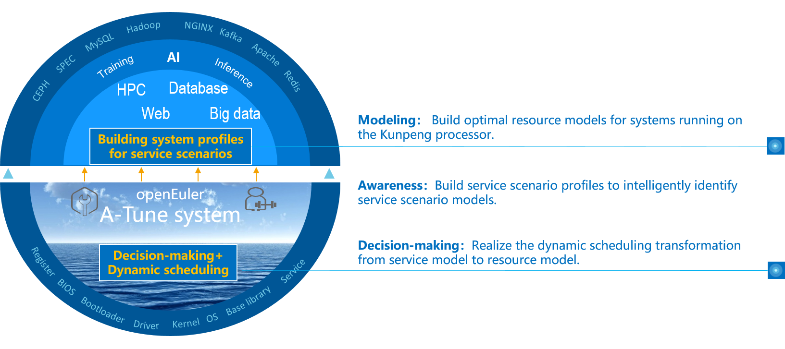
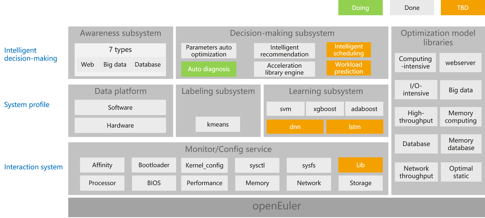
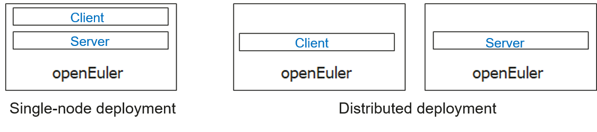

# A-Tune User Guide
English | [简体中文](./A-Tune用户指南.md)

## Legal Statement

**Copyright © Huawei Technologies Co., Ltd. 2020. All rights reserved.**

Your replication, use, modification, and distribution of this document are governed by the Creative Commons License Attribution-ShareAlike 4.0 International Public License \(CC BY-SA 4.0\). You can visit  [https://creativecommons.org/licenses/by-sa/4.0/](https://creativecommons.org/licenses/by-sa/4.0/)  to view a human-readable summary of \(and not a substitute for\) CC BY-SA 4.0. For the complete CC BY-SA 4.0, visit  [https://creativecommons.org/licenses/by-sa/4.0/legalcode](https://creativecommons.org/licenses/by-sa/4.0/legalcode).

**Trademarks and Permissions**

A-Tune and other Huawei trademarks are trademarks of Huawei Technologies Co., Ltd. All other trademarks and trade names mentioned in this document are the property of their respective holders.

**Disclaimer**

This document is used only as a guide. Unless otherwise specified by applicable laws or agreed by both parties in written form, all statements, information, and recommendations in this document are provided "AS IS" without warranties, guarantees or representations of any kind, including but not limited to non-infringement, timeliness, and specific purposes.

## Preface

## Overview

This document describes how to install and use A-Tune, which is a performance self-optimization software for openEuler.

## Intended Audience

This document is intended for developers, open-source enthusiasts, and partners who use the openEuler system and want to know and use A-Tune. You need to have basic knowledge of the Linux OS.

## 1 Getting to Know A-Tune


## 1.1 Introduction

An operating system \(OS\) is basic software that connects applications and hardware. It is critical for users to adjust OS and application configurations and make full use of software and hardware capabilities to achieve optimal service performance. However, numerous workload types and varied applications run on the OS, and the requirements on resources are different. Currently, the application environment composed of hardware and software involves more than 7000 configuration objects. As the service complexity and optimization objects increase, the time cost for optimization increases exponentially. As a result, optimization efficiency decreases sharply. Optimization becomes complex and brings great challenges to users.

Second, as infrastructure software, the OS provides a large number of software and hardware management capabilities. Each capability applies to different scenarios. Therefore, different capabilities need to be enabled or disabled in different scenarios to combine various capabilities provided by the system, maximizing the optimal performance of applications.

In addition, thousands of actual service scenarios exist, and hardware configurations for computing, network, and storage emerge. The lab cannot list all applications, service scenarios, and different hardware combinations.

To address the preceding challenges, openEuler launches A-Tune.

A-Tune is AI-based software that optimizes system performance. It uses AI technologies to create precise system profiles for service scenarios, aware and infer service characteristics, make intelligent decisions, and match and recommend the optimal system parameter configuration combination, ensuring the optimal running status of services.



## 1.2 Architecture

The following figure shows the A-Tune core technical architecture, which consists of intelligent decision-making, system profile, and interaction system.

-   Intelligent decision-making layer: consists of the awareness and decision-making subsystems, which implements intelligent awareness of applications and system optimization decision-making, respectively.
-   System profile layer: consists of the labeling and learning subsystems. The labeling subsystem is used to cluster service models, and the learning subsystem is used to learn and classify service models.
-   Interaction system layer: monitors and configures various system resources and executes optimization policies.



## 1.3 Supported Features and Service Models

### Supported Features

[Table 1](#table1919220557576)  describes the main features supported by A-Tune, feature maturity, and usage suggestions.

**Table  1**  Feature maturity

<a name="table1919220557576"></a>
<table><thead align="left"><tr id="row81921355135715"><th class="cellrowborder" valign="top" width="33.33333333333333%" id="mcps1.2.4.1.1"><p id="p1419275514576"><a name="p1419275514576"></a><a name="p1419275514576"></a><strong id="b175661223205512"><a name="b175661223205512"></a><a name="b175661223205512"></a>Feature</strong></p>
</th>
<th class="cellrowborder" valign="top" width="33.33333333333333%" id="mcps1.2.4.1.2"><p id="p7192195520572"><a name="p7192195520572"></a><a name="p7192195520572"></a><strong id="b1386461334120"><a name="b1386461334120"></a><a name="b1386461334120"></a>Maturity</strong></p>
</th>
<th class="cellrowborder" valign="top" width="33.33333333333333%" id="mcps1.2.4.1.3"><p id="p519205518573"><a name="p519205518573"></a><a name="p519205518573"></a><strong id="b135113227419"><a name="b135113227419"></a><a name="b135113227419"></a>Usage Suggestion</strong></p>
</th>
</tr>
</thead>
<tbody><tr id="row519275518572"><td class="cellrowborder" valign="top" width="33.33333333333333%" headers="mcps1.2.4.1.1 "><p id="p1349454518111"><a name="p1349454518111"></a><a name="p1349454518111"></a>Auto optimization of 11 applications in seven workload types</p>
</td>
<td class="cellrowborder" valign="top" width="33.33333333333333%" headers="mcps1.2.4.1.2 "><p id="p48001027191117"><a name="p48001027191117"></a><a name="p48001027191117"></a>Tested</p>
</td>
<td class="cellrowborder" valign="top" width="33.33333333333333%" headers="mcps1.2.4.1.3 "><p id="p15192195515715"><a name="p15192195515715"></a><a name="p15192195515715"></a>Pilot</p>
</td>
</tr>
<tr id="row919217552579"><td class="cellrowborder" valign="top" width="33.33333333333333%" headers="mcps1.2.4.1.1 "><p id="p519218559571"><a name="p519218559571"></a><a name="p519218559571"></a>User-defined workload types and service models</p>
</td>
<td class="cellrowborder" valign="top" width="33.33333333333333%" headers="mcps1.2.4.1.2 "><p id="p18192655115710"><a name="p18192655115710"></a><a name="p18192655115710"></a>Tested</p>
</td>
<td class="cellrowborder" valign="top" width="33.33333333333333%" headers="mcps1.2.4.1.3 "><p id="p71921655145717"><a name="p71921655145717"></a><a name="p71921655145717"></a>Pilot</p>
</td>
</tr>
<tr id="row71921155165711"><td class="cellrowborder" valign="top" width="33.33333333333333%" headers="mcps1.2.4.1.1 "><p id="p619217556575"><a name="p619217556575"></a><a name="p619217556575"></a>Automatic parameter optimization</p>
</td>
<td class="cellrowborder" valign="top" width="33.33333333333333%" headers="mcps1.2.4.1.2 "><p id="p11192135595712"><a name="p11192135595712"></a><a name="p11192135595712"></a>Tested</p>
</td>
<td class="cellrowborder" valign="top" width="33.33333333333333%" headers="mcps1.2.4.1.3 "><p id="p2019235511575"><a name="p2019235511575"></a><a name="p2019235511575"></a>Pilot</p>
</td>
</tr>
</tbody>
</table>

### Supported Service Models

Based on the workload characteristics of applications, A-Tune classifies services into seven types. For details about the workload characteristics of each type and the applications supported by A-Tune, see  [Table 2](#table2819164611311).

**Table  2**  Supported workload types and applications

<a name="table2819164611311"></a>
<table><thead align="left"><tr id="row49114466133"><th class="cellrowborder" valign="top" width="22.12%" id="mcps1.2.5.1.1"><p id="p09116467130"><a name="p09116467130"></a><a name="p09116467130"></a><strong id="b9909112918111"><a name="b9909112918111"></a><a name="b9909112918111"></a>Workload Type</strong></p>
</th>
<th class="cellrowborder" valign="top" width="12.959999999999999%" id="mcps1.2.5.1.2"><p id="p953251510111"><a name="p953251510111"></a><a name="p953251510111"></a><strong id="b17781735214"><a name="b17781735214"></a><a name="b17781735214"></a>Description</strong></p>
</th>
<th class="cellrowborder" valign="top" width="37.269999999999996%" id="mcps1.2.5.1.3"><p id="p169111846181310"><a name="p169111846181310"></a><a name="p169111846181310"></a><strong id="b1378654312217"><a name="b1378654312217"></a><a name="b1378654312217"></a>Workload Characteristic</strong></p>
</th>
<th class="cellrowborder" valign="top" width="27.650000000000002%" id="mcps1.2.5.1.4"><p id="p1591144617135"><a name="p1591144617135"></a><a name="p1591144617135"></a><strong id="b1191411502021"><a name="b1191411502021"></a><a name="b1191411502021"></a>Supported Application</strong></p>
</th>
</tr>
</thead>
<tbody><tr id="row17911114651318"><td class="cellrowborder" valign="top" width="22.12%" headers="mcps1.2.5.1.1 "><p id="p1791124631317"><a name="p1791124631317"></a><a name="p1791124631317"></a>default</p>
</td>
<td class="cellrowborder" valign="top" width="12.959999999999999%" headers="mcps1.2.5.1.2 "><p id="p45321515191120"><a name="p45321515191120"></a><a name="p45321515191120"></a>Default type</p>
</td>
<td class="cellrowborder" valign="top" width="37.269999999999996%" headers="mcps1.2.5.1.3 "><p id="p691184671312"><a name="p691184671312"></a><a name="p691184671312"></a>The usage of CPU, memory bandwidth, network, and I/O resources is low.</p>
</td>
<td class="cellrowborder" valign="top" width="27.650000000000002%" headers="mcps1.2.5.1.4 "><p id="p69111946131318"><a name="p69111946131318"></a><a name="p69111946131318"></a>N/A</p>
</td>
</tr>
<tr id="row791164631318"><td class="cellrowborder" valign="top" width="22.12%" headers="mcps1.2.5.1.1 "><p id="p179110461137"><a name="p179110461137"></a><a name="p179110461137"></a>webserver</p>
</td>
<td class="cellrowborder" valign="top" width="12.959999999999999%" headers="mcps1.2.5.1.2 "><p id="p20532111512117"><a name="p20532111512117"></a><a name="p20532111512117"></a>HTTPS application</p>
</td>
<td class="cellrowborder" valign="top" width="37.269999999999996%" headers="mcps1.2.5.1.3 "><p id="p1191117469133"><a name="p1191117469133"></a><a name="p1191117469133"></a>The CPU usage is high.</p>
</td>
<td class="cellrowborder" valign="top" width="27.650000000000002%" headers="mcps1.2.5.1.4 "><p id="p159111546161317"><a name="p159111546161317"></a><a name="p159111546161317"></a>Nginx</p>
</td>
</tr>
<tr id="row13911946141311"><td class="cellrowborder" valign="top" width="22.12%" headers="mcps1.2.5.1.1 "><p id="p2911164610134"><a name="p2911164610134"></a><a name="p2911164610134"></a>big_database</p>
</td>
<td class="cellrowborder" valign="top" width="12.959999999999999%" headers="mcps1.2.5.1.2 "><p id="p4532111561119"><a name="p4532111561119"></a><a name="p4532111561119"></a>Database</p>
</td>
<td class="cellrowborder" valign="top" width="37.269999999999996%" headers="mcps1.2.5.1.3 "><a name="ul3724104521013"></a><a name="ul3724104521013"></a><ul id="ul3724104521013"><li>Relational database<p id="p14911124612131"><a name="p14911124612131"></a><a name="p14911124612131"></a>Read: The usage of CPU, memory bandwidth, and network is high.</p>
<p id="p1491144619136"><a name="p1491144619136"></a><a name="p1491144619136"></a>Write: The usage of I/O is high.</p>
</li></ul>
<a name="ul26021547101013"></a><a name="ul26021547101013"></a><ul id="ul26021547101013"><li>Non-relational database<p id="p169111462130"><a name="p169111462130"></a><a name="p169111462130"></a>The usage of CPU and I/O is high.</p>
</li></ul>
</td>
<td class="cellrowborder" valign="top" width="27.650000000000002%" headers="mcps1.2.5.1.4 "><p id="p1091134671313"><a name="p1091134671313"></a><a name="p1091134671313"></a>MongoDB, MySQL, PostgreSQL, and MariaDB</p>
</td>
</tr>
<tr id="row3911174641312"><td class="cellrowborder" valign="top" width="22.12%" headers="mcps1.2.5.1.1 "><p id="p491144611319"><a name="p491144611319"></a><a name="p491144611319"></a>big_data</p>
</td>
<td class="cellrowborder" valign="top" width="12.959999999999999%" headers="mcps1.2.5.1.2 "><p id="p953261521112"><a name="p953261521112"></a><a name="p953261521112"></a>Big data</p>
</td>
<td class="cellrowborder" valign="top" width="37.269999999999996%" headers="mcps1.2.5.1.3 "><p id="p129111046151315"><a name="p129111046151315"></a><a name="p129111046151315"></a>The usage of CPU and I/O is high.</p>
</td>
<td class="cellrowborder" valign="top" width="27.650000000000002%" headers="mcps1.2.5.1.4 "><p id="p119111946161317"><a name="p119111946161317"></a><a name="p119111946161317"></a>Hadoop and Spark</p>
</td>
</tr>
<tr id="row591112462132"><td class="cellrowborder" valign="top" width="22.12%" headers="mcps1.2.5.1.1 "><p id="p1791104661313"><a name="p1791104661313"></a><a name="p1791104661313"></a>in-memory_computing</p>
</td>
<td class="cellrowborder" valign="top" width="12.959999999999999%" headers="mcps1.2.5.1.2 "><p id="p453291517111"><a name="p453291517111"></a><a name="p453291517111"></a>Memory-intensive application</p>
</td>
<td class="cellrowborder" valign="top" width="37.269999999999996%" headers="mcps1.2.5.1.3 "><p id="p591184671318"><a name="p591184671318"></a><a name="p591184671318"></a>The usage of CPU and memory bandwidth is high.</p>
</td>
<td class="cellrowborder" valign="top" width="27.650000000000002%" headers="mcps1.2.5.1.4 "><p id="p2912846121315"><a name="p2912846121315"></a><a name="p2912846121315"></a>SPECjbb2015</p>
</td>
</tr>
<tr id="row59121246181320"><td class="cellrowborder" valign="top" width="22.12%" headers="mcps1.2.5.1.1 "><p id="p1391204619130"><a name="p1391204619130"></a><a name="p1391204619130"></a>in-memory_database</p>
</td>
<td class="cellrowborder" valign="top" width="12.959999999999999%" headers="mcps1.2.5.1.2 "><p id="p65328153111"><a name="p65328153111"></a><a name="p65328153111"></a>Computing- and network-intensive application</p>
</td>
<td class="cellrowborder" valign="top" width="37.269999999999996%" headers="mcps1.2.5.1.3 "><p id="p3912164617133"><a name="p3912164617133"></a><a name="p3912164617133"></a>The usage of a single-core CPU is high, and the network usage is high in multi-instance scenarios.</p>
</td>
<td class="cellrowborder" valign="top" width="27.650000000000002%" headers="mcps1.2.5.1.4 "><p id="p1691254621313"><a name="p1691254621313"></a><a name="p1691254621313"></a>Redis</p>
</td>
</tr>
<tr id="row1891264641315"><td class="cellrowborder" valign="top" width="22.12%" headers="mcps1.2.5.1.1 "><p id="p391214621312"><a name="p391214621312"></a><a name="p391214621312"></a>single_computer_intensive_jobs</p>
</td>
<td class="cellrowborder" valign="top" width="12.959999999999999%" headers="mcps1.2.5.1.2 "><p id="p55324155117"><a name="p55324155117"></a><a name="p55324155117"></a>Computing-intensive application</p>
</td>
<td class="cellrowborder" valign="top" width="37.269999999999996%" headers="mcps1.2.5.1.3 "><p id="p1912164651319"><a name="p1912164651319"></a><a name="p1912164651319"></a>The usage of a single-core CPU is high, and the usage of memory bandwidth of some subitems is high.</p>
</td>
<td class="cellrowborder" valign="top" width="27.650000000000002%" headers="mcps1.2.5.1.4 "><p id="p9912746121311"><a name="p9912746121311"></a><a name="p9912746121311"></a>SPECCPU2006</p>
</td>
</tr>
<tr id="row2912184671312"><td class="cellrowborder" valign="top" width="22.12%" headers="mcps1.2.5.1.1 "><p id="p1391213464130"><a name="p1391213464130"></a><a name="p1391213464130"></a>communication</p>
</td>
<td class="cellrowborder" valign="top" width="12.959999999999999%" headers="mcps1.2.5.1.2 "><p id="p153210159118"><a name="p153210159118"></a><a name="p153210159118"></a>Network-intensive application</p>
</td>
<td class="cellrowborder" valign="top" width="37.269999999999996%" headers="mcps1.2.5.1.3 "><p id="p591214460137"><a name="p591214460137"></a><a name="p591214460137"></a>The usage of CPU and network is high.</p>
</td>
<td class="cellrowborder" valign="top" width="27.650000000000002%" headers="mcps1.2.5.1.4 "><p id="p391214619139"><a name="p391214619139"></a><a name="p391214619139"></a>Dubbo</p>
</td>
</tr>
<tr id="row1991224641317"><td class="cellrowborder" valign="top" width="22.12%" headers="mcps1.2.5.1.1 "><p id="p5912154613139"><a name="p5912154613139"></a><a name="p5912154613139"></a>idle</p>
</td>
<td class="cellrowborder" valign="top" width="12.959999999999999%" headers="mcps1.2.5.1.2 "><p id="p12532161561115"><a name="p12532161561115"></a><a name="p12532161561115"></a>System in idle state</p>
</td>
<td class="cellrowborder" valign="top" width="37.269999999999996%" headers="mcps1.2.5.1.3 "><p id="p10912154631311"><a name="p10912154631311"></a><a name="p10912154631311"></a>The system is in idle state and no applications are running.</p>
</td>
<td class="cellrowborder" valign="top" width="27.650000000000002%" headers="mcps1.2.5.1.4 "><p id="p11912164617133"><a name="p11912164617133"></a><a name="p11912164617133"></a>N/A</p>
</td>
</tr>
</tbody>
</table>

## 2 Installation and Deployment

This chapter describes how to install and deploy A-Tune.


## 2.1 Software and Hardware Requirements

### Hardware Requirement

-   Huawei Kunpeng 920 processor

### Software Requirement

-   OS: openEuler 1.0

## 2.2 Environment Preparation

Install an openEuler OS. For details, see  _openEuler 1.0 Installation Guide_.

## 2.3 A-Tune Installation

This chapter describes the installation modes and methods of the A-Tune.


### 2.3.1 Installation Modes
A-Tune can be installed in single-node or distributed mode.

-   Single-node mode

    The client and server are installed on the same system.

-   Distributed mode

    The client and server are installed on different systems.




### 2.3.2 Installation Procedure

To install the A-Tune, perform the following steps:

1.  Mount an openEuler ISO file.

    ```
    # mount openEuler-1.0-aarch64-dvd.iso /mnt
    ```

2.  Configure the local yum source.

    ```
    # vim /etc/yum.repos.d/local.repo
    ```

    The configured contents are as follows:

    ```
    [local]
    name=local
    baseurl=file:///mnt
    gpgcheck=0
    enabled=1
    ```

3.  Install an A-Tune server.

    > **NOTE:**   
    >In this step, both the server and client software packages are installed. For the single-node deployment, skip  **Step 4**.  

    ```
    # yum install atune -y
    ```

4.  Install an A-Tune client.

    ```
    # yum install atune-client -y
    ```

5.  Check whether the installation is successful.

    ```
    # rpm -qa | grep atune
    atune-client-xxx
    atune-db-xxx
    atune-xxx
    ```

    If the preceding information is displayed, the installation is successful.


## 2.4 A-Tune Deployment

This chapter describes how to deploy A-Tune.


### 2.4.1 Overview

The configuration items in the A-Tune configuration file  **/etc/atuned/atuned.cnf**  are described as follows:

-   A-Tune service startup configuration

    You can modify the parameter value as required.

    -   **address**: Listening IP address of the gRPC server. The default value is  **127.0.0.1**. Modify the value for distributed deployment.
    -   **port**: Listening port of the gRPC server. The value ranges from 0 to 65535. The port is not in use.
    -   **rest\_port**: Listening port of the system REST service. The value ranges from 0 to 65535. The port is not in use.
    -   **sample\_num**: Number of samples collected when the system executes the analysis process.

-   System information

    System is the parameter information required for system optimization. You must modify the parameter information according to the actual situation.

    -   **disk**: Disk information to be collected during the analysis process or specified disk during disk optimization.
    -   **network**: NIC information to be collected during the analysis process or specified NIC during NIC optimization.
    -   **user**: User name used for ulimit optimization. Currently, only the user  **root**  is supported.
    -   **tls**: SSL/TLS certificate verification for the gRPC and HTTP services of A-Tune. This is disabled by default. After TLS is enabled, you need to set the following environment variables before running the  **atune-adm**  command to communicate with the server:
        -   export ATUNE\_TLS=yes
        -   export ATUNE\_CLICERT=<Client certificate path\>

    -   tlsservercertfile: path of the gPRC server certificate.
    -   tlsserverkeyfile: gPRC server key path.
    -   tlshttpcertfile: HTTP server certificate path.
    -   tlshttpkeyfile: HTTP server key path.
    -   tlshttpcacertfile: CA certificate path of the HTTP server.

-   Log information

    Change the log path and level based on the site requirements. By default, the log information is stored in  **/var/log/message**.

-   Monitor information

    The hardware information that is collected by default when the system is started.


### Example

```
#################################### server ###############################
# atuned config
[server]
# the address that the grpc server to bind to, default is 127.0.0.1
address = 127.0.0.1

# the atuned grpc listening port, default is 60001
# the port can be set between 0 to 65535 which not be used
port = 60001

# the rest service listening port, default is 8383
# the port can be set between 0 to 65535 which not be used
rest_port = 8383

# when run analysis command, the numbers of collected data.
# default is 20
sample_num = 20

# enable gRPC and http server authentication SSL/TLS
# default is false
# tls = true
# tlsservercertfile = /etc/atuned/server.pem
# tlsserverkeyfile = /etc/atuned/server.key
# tlshttpcertfile = /etc/atuned/http/server.pem
# tlshttpkeyfile = /etc/atuned/http/server.key
# tlshttpcacertfile = /etc/atuned/http/cacert.pem

#################################### log ###############################
# either "debug", "info", "warn", "error", "critical", default is "info"
level = info

#################################### monitor ###############################
[monitor]
# with the module and format of the MPI, the format is {module}_{purpose}
# the module is Either "mem", "net", "cpu", "storage"
# the purpose is "topo"
module = mem_topo, cpu_topo

#################################### system ###############################
# you can add arbitrary key-value here, just like key = value
# you can use the key in the profile
[system]
# the disk to be analysis
disk = sda

# the network to be analysis
network = enp189s0f0

user = root
```

## 2.5 Starting A-Tune

After the A-Tune is installed, you need to start the A-Tune service.

-   Start the atuned service.

    ```
    $ systemctl start atuned
    ```


-   To query the status of the atuned service, run the following command:

    ```
    $ systemctl status atuned
    ```

    If the following information is displayed, the service is started successfully:

    


## 3 Application Scenarios

You can invoke the command line interface \(CLI\) provided by A-Tune to use A-Tune functions. This chapter describes the functions and usage of the A-Tune CLI.


## 3.1 Querying Workload Types


## list

### Function

Query the supported workload types, profiles, and the values of Active.

### Format

**atune-adm list**

### Example

```
$ atune-adm list

Support WorkloadTypes:
+-----------------------------------+------------------------+-----------+
| WorkloadType                      | ProfileName            | Active    |
+===================================+========================+===========+
| default                           | default                | true      |
+-----------------------------------+------------------------+-----------+
| webserver                         | ssl_webserver          | false     |
+-----------------------------------+------------------------+-----------+
| big_database                      | database               | false     |
+-----------------------------------+------------------------+-----------+
| big_data                          | big_data               | false     |
+-----------------------------------+------------------------+-----------+
| in-memory_computing               | in-memory_computing    | false     |
+-----------------------------------+------------------------+-----------+
| in-memory_database                | in-memory_database     | false     |
+-----------------------------------+------------------------+-----------+
| single_computer_intensive_jobs    | compute-intensive      | false     |
+-----------------------------------+------------------------+-----------+
| communication                     | rpc_communication      | false     |
+-----------------------------------+------------------------+-----------+
| idle                              | default                | false     |
+-----------------------------------+------------------------+-----------+

```

> **NOTE:**   
>If the value of Active is  **true**, the profile is activated. In the example, the profile of the default type is activated.  

## 3.2 User-defined Workload Types

In addition to the workload types defined in the system, A-Tune also supports user-defined workload types and corresponding profiles, and you can update or delete these workload types.

You can also add the user-defined model to A-Tune. For details about how to train a model, see  [User-defined Model](user-defined-model.md).


## define

### Function

Add a user-defined workload type and the corresponding profile optimization item.

### Format

**atune-adm define**  <WORKLOAD\_TYPE\> <PROFILE\_NAME\> <PROFILE\_PATH\>

### Example

Add a workload type. Set workload type to  **test\_type**, profile name to  **test\_name**, and configuration file of an optimization item to  **example.conf**.

```
$ atune-adm define test_type test_name ./example.conf
```

The  **example.conf**  file can be written as follows \(the following optimization items are optional and are for reference only\). You can also run the  **atune-adm info**  command to view how the existing profile is written.

```
[main]
# list it's parent profile
[tip]
# the recommended optimization, which should be performed manunaly
[check]
# check the environment
[affinity.irq]
# to change the affinity of irqs
[affinity.task]
# to change the affinity of tasks
[bios]
# to change the bios config
[bootloader.grub2]
# to change the grub2 config
[kernel_config]
# to change the kernel config
[script]
# the script extention of cpi
[sysctl]
# to change the /proc/sys/* config
[sysfs]
# to change the /sys/* config
[systemctl]
# to change the system service config
[ulimit]
# to change the resources limit of user
```

## update

### Function

Update an optimization item of a workload type to the content in the  **new.conf**  file.

### Format

**atune-adm update**  <WORKLOAD\_TYPE\> <PROFILE\_NAME\> <PROFILE\_FILE\>

### Example

Update the workload type to  **test\_type**  and the optimization item of test\_name to  **new.conf**.

```
$ atune-adm update test_type test_name ./new.conf
```

## undefine

### Function

Delete a user-defined workload type.

### Format

**atune-adm undefine**  <WORKLOAD\_TYPE\>

### Example

Delete the  **test\_type**  workload type.

```
$ atune-adm undefine test_type 
```

## 3.3 User-defined Model

You can train a new workload type model by running the  **collection**  and  **train**  commands.


## collection

### Function

Collect the global resource usage and OS status information during service running, and save the collected information to a CSV output file as the input dataset for model training.

> **NOTE:**   
>This command depends on the sampling tools such as perf, mpstat, vmstat, iostat, and sar. Currently, only the Kunpeng 920 CPU is supported. You can run the  **dmidecode -t processor**  command to check the CPU model.  

### Format

**atune-adm collection**  <OPTIONS\>

### Parameter Description

-   OPTIONS

    <a name="en-us_topic_0210923698_table960915119119"></a>
    <table><thead align="left"><tr id="en-us_topic_0210923698_row13645013114"><th class="cellrowborder" valign="top" width="23.87%" id="mcps1.1.3.1.1"><p id="en-us_topic_0210923698_p176451311914"><a name="en-us_topic_0210923698_p176451311914"></a><a name="en-us_topic_0210923698_p176451311914"></a>Parameter</p>
    </th>
    <th class="cellrowborder" valign="top" width="76.13%" id="mcps1.1.3.1.2"><p id="en-us_topic_0210923698_p1364511211"><a name="en-us_topic_0210923698_p1364511211"></a><a name="en-us_topic_0210923698_p1364511211"></a>Description</p>
    </th>
    </tr>
    </thead>
    <tbody><tr id="en-us_topic_0210923698_row19645141112"><td class="cellrowborder" valign="top" width="23.87%" headers="mcps1.1.3.1.1 "><p id="en-us_topic_0210923698_p2645611710"><a name="en-us_topic_0210923698_p2645611710"></a><a name="en-us_topic_0210923698_p2645611710"></a>--filename, -f</p>
    </td>
    <td class="cellrowborder" valign="top" width="76.13%" headers="mcps1.1.3.1.2 "><p id="en-us_topic_0210923698_p10645512017"><a name="en-us_topic_0210923698_p10645512017"></a><a name="en-us_topic_0210923698_p10645512017"></a>Name of the generated CSV file used for training: <em id="i116524010250"><a name="i116524010250"></a><a name="i116524010250"></a>name</em>-<em id="i186921240599"><a name="i186921240599"></a><a name="i186921240599"></a>timestamp</em>.csv</p>
    </td>
    </tr>
    <tr id="en-us_topic_0210923698_row564581117"><td class="cellrowborder" valign="top" width="23.87%" headers="mcps1.1.3.1.1 "><p id="en-us_topic_0210923698_p15645911616"><a name="en-us_topic_0210923698_p15645911616"></a><a name="en-us_topic_0210923698_p15645911616"></a>--output_path, -o</p>
    </td>
    <td class="cellrowborder" valign="top" width="76.13%" headers="mcps1.1.3.1.2 "><p id="en-us_topic_0210923698_p106451918120"><a name="en-us_topic_0210923698_p106451918120"></a><a name="en-us_topic_0210923698_p106451918120"></a>Path for storing the generated CSV file. The absolute path is required.</p>
    </td>
    </tr>
    <tr id="en-us_topic_0210923698_row8645711115"><td class="cellrowborder" valign="top" width="23.87%" headers="mcps1.1.3.1.1 "><p id="en-us_topic_0210923698_p14645713117"><a name="en-us_topic_0210923698_p14645713117"></a><a name="en-us_topic_0210923698_p14645713117"></a>--disk, -b</p>
    </td>
    <td class="cellrowborder" valign="top" width="76.13%" headers="mcps1.1.3.1.2 "><p id="en-us_topic_0210923698_p464519116110"><a name="en-us_topic_0210923698_p464519116110"></a><a name="en-us_topic_0210923698_p464519116110"></a>Disk used during service running, for example, /dev/sda.</p>
    </td>
    </tr>
    <tr id="en-us_topic_0210923698_row6645111714"><td class="cellrowborder" valign="top" width="23.87%" headers="mcps1.1.3.1.1 "><p id="en-us_topic_0210923698_p106451817111"><a name="en-us_topic_0210923698_p106451817111"></a><a name="en-us_topic_0210923698_p106451817111"></a>--network, -n</p>
    </td>
    <td class="cellrowborder" valign="top" width="76.13%" headers="mcps1.1.3.1.2 "><p id="en-us_topic_0210923698_p206451911611"><a name="en-us_topic_0210923698_p206451911611"></a><a name="en-us_topic_0210923698_p206451911611"></a>Network port used during service running, for example, eth0.</p>
    </td>
    </tr>
    <tr id="en-us_topic_0210923698_row14645219112"><td class="cellrowborder" valign="top" width="23.87%" headers="mcps1.1.3.1.1 "><p id="en-us_topic_0210923698_p9645191811"><a name="en-us_topic_0210923698_p9645191811"></a><a name="en-us_topic_0210923698_p9645191811"></a>--workload_type, -t</p>
    </td>
    <td class="cellrowborder" valign="top" width="76.13%" headers="mcps1.1.3.1.2 "><p id="en-us_topic_0210923698_p16450117114"><a name="en-us_topic_0210923698_p16450117114"></a><a name="en-us_topic_0210923698_p16450117114"></a>Workload type, which is used as a label for subsequent training.</p>
    </td>
    </tr>
    <tr id="en-us_topic_0210923698_row76452118115"><td class="cellrowborder" valign="top" width="23.87%" headers="mcps1.1.3.1.1 "><p id="en-us_topic_0210923698_p96451114116"><a name="en-us_topic_0210923698_p96451114116"></a><a name="en-us_topic_0210923698_p96451114116"></a>--duration, -d</p>
    </td>
    <td class="cellrowborder" valign="top" width="76.13%" headers="mcps1.1.3.1.2 "><p id="p3205204519273"><a name="p3205204519273"></a><a name="p3205204519273"></a>Data collection time during service running, in seconds. The default collection time is 1200 seconds.</p>
    </td>
    </tr>
    <tr id="row17981103311169"><td class="cellrowborder" valign="top" width="23.87%" headers="mcps1.1.3.1.1 "><p id="p698223313169"><a name="p698223313169"></a><a name="p698223313169"></a>--interval, -i</p>
    </td>
    <td class="cellrowborder" valign="top" width="76.13%" headers="mcps1.1.3.1.2 "><p id="p12982633141617"><a name="p12982633141617"></a><a name="p12982633141617"></a>Interval for collecting data, in seconds. The default interval is 5 seconds.</p>
    </td>
    </tr>
    </tbody>
    </table>


### Example

```
$ atune-adm collection --filename name --interval 5 --duration 1200 --output_path /home --disk sda --network eth0 --workload_type test_type 
```

## train

### Function

Use the collected data to train the model. Collect data of at least two workload types during training. Otherwise, an error is reported.

### Format

**atune-adm train**  <OPTIONS\>

### Parameter Description

-   OPTIONS

    <a name="en-us_topic_0210923699_table847613161310"></a>
    <table><thead align="left"><tr id="en-us_topic_0210923699_row349814169120"><th class="cellrowborder" valign="top" width="23.87%" id="mcps1.1.3.1.1"><p id="en-us_topic_0210923699_p1549841614116"><a name="en-us_topic_0210923699_p1549841614116"></a><a name="en-us_topic_0210923699_p1549841614116"></a>Parameter</p>
    </th>
    <th class="cellrowborder" valign="top" width="76.13%" id="mcps1.1.3.1.2"><p id="en-us_topic_0210923699_p84988168119"><a name="en-us_topic_0210923699_p84988168119"></a><a name="en-us_topic_0210923699_p84988168119"></a>Description</p>
    </th>
    </tr>
    </thead>
    <tbody><tr id="en-us_topic_0210923699_row13499181612118"><td class="cellrowborder" valign="top" width="23.87%" headers="mcps1.1.3.1.1 "><p id="en-us_topic_0210923699_p24993163119"><a name="en-us_topic_0210923699_p24993163119"></a><a name="en-us_topic_0210923699_p24993163119"></a>--data_path, -d</p>
    </td>
    <td class="cellrowborder" valign="top" width="76.13%" headers="mcps1.1.3.1.2 "><p id="en-us_topic_0210923699_p134991316818"><a name="en-us_topic_0210923699_p134991316818"></a><a name="en-us_topic_0210923699_p134991316818"></a>Path for storing CSV files required for model training</p>
    </td>
    </tr>
    <tr id="en-us_topic_0210923699_row149914161115"><td class="cellrowborder" valign="top" width="23.87%" headers="mcps1.1.3.1.1 "><p id="en-us_topic_0210923699_p14991516914"><a name="en-us_topic_0210923699_p14991516914"></a><a name="en-us_topic_0210923699_p14991516914"></a>--output_file, -o</p>
    </td>
    <td class="cellrowborder" valign="top" width="76.13%" headers="mcps1.1.3.1.2 "><p id="en-us_topic_0210923699_p049916166114"><a name="en-us_topic_0210923699_p049916166114"></a><a name="en-us_topic_0210923699_p049916166114"></a>Model generated through training</p>
    </td>
    </tr>
    </tbody>
    </table>


### Example

Use the CSV file in the  **data**  directory as the training input. The generated model  **new-model.m**  is stored in the  **model**  directory.

```
$ atune-adm train --data_path ./data --output_file ./model/new-model.m 
```

## 3.4 Workload Type Analysis and Auto Optimization


## analysis

### Function

Collect real-time statistics from the system to identify and automatically optimize workload types.

### Format

**atune-adm analysis**  \[OPTIONS\]

### Parameter Description

<a name="table531317574132"></a>
<table><thead align="left"><tr id="row1031310575137"><th class="cellrowborder" valign="top" width="23.87%" id="mcps1.1.3.1.1"><p id="p6313115718133"><a name="p6313115718133"></a><a name="p6313115718133"></a>Parameter</p>
</th>
<th class="cellrowborder" valign="top" width="76.13%" id="mcps1.1.3.1.2"><p id="p16313157141312"><a name="p16313157141312"></a><a name="p16313157141312"></a>Description</p>
</th>
</tr>
</thead>
<tbody><tr id="row7313105711139"><td class="cellrowborder" valign="top" width="23.87%" headers="mcps1.1.3.1.1 "><p id="p203141657131315"><a name="p203141657131315"></a><a name="p203141657131315"></a>--model, -m</p>
</td>
<td class="cellrowborder" valign="top" width="76.13%" headers="mcps1.1.3.1.2 "><p id="p13141157151316"><a name="p13141157151316"></a><a name="p13141157151316"></a>Model generated by user-defined training</p>
</td>
</tr>
</tbody>
</table>

### Example

-   Use the default model for classification and identification.

    ```
    $ atune-adm analysis
    ```

-   Use the user-defined training model for recognition.

    ```
    $ atune-adm analysis --model ./model/new-model.m
    ```


## 3.5 Querying Profiles


## info

### Function

View the profile content of a workload type.

### Format

**atune-adm info**  <_WORKLOAD\_TYPE\>_

### Example

View the profile content of webserver.

```
$ atune-adm info webserver

*** ssl_webserver:

#
# webserver tuned configuration
#
[main]
#TODO CONFIG

[kernel_config]
#TODO CONFIG

[bios]
#TODO CONFIG

[sysfs]
#TODO CONFIG

[sysctl]
fs.file-max=6553600
fs.suid_dumpable = 1
fs.aio-max-nr = 1048576
kernel.shmmax = 68719476736
kernel.shmall = 4294967296
kernel.shmmni = 4096
kernel.sem = 250 32000 100 128
net.ipv4.tcp_tw_reuse = 1
net.ipv4.tcp_syncookies = 1
net.ipv4.ip_local_port_range = 1024     65500
net.ipv4.tcp_max_tw_buckets = 5000
net.core.somaxconn = 65535
net.core.netdev_max_backlog = 262144
net.ipv4.tcp_max_orphans = 262144
net.ipv4.tcp_max_syn_backlog = 262144
net.ipv4.tcp_timestamps = 0
net.ipv4.tcp_synack_retries = 1
net.ipv4.tcp_syn_retries = 1
net.ipv4.tcp_fin_timeout = 1
net.ipv4.tcp_keepalive_time = 60
net.ipv4.tcp_mem =  362619      483495   725238
net.ipv4.tcp_rmem = 4096         87380   6291456
net.ipv4.tcp_wmem = 4096         16384   4194304
net.core.wmem_default = 8388608
net.core.rmem_default = 8388608
net.core.rmem_max = 16777216
net.core.wmem_max = 16777216

[systemctl]
sysmonitor=stop
irqbalance=stop

[bootloader.grub2]
selinux=0
iommu.passthrough=1

[tip]
bind your master process to the CPU near the network = affinity
bind your network interrupt to the CPU that has this network = affinity
relogin into the system to enable limits setting = OS

[script]
openssl_hpre = 0
prefetch = off

[ulimit]
{user}.hard.nofile = 102400
{user}.soft.nofile = 102400

[affinity.task]
#TODO CONFIG

[affinity.irq]
#TODO CONFIG

[check]
#TODO CONFIG

```

## 3.6 Activing Profiles


## profile

### Function

Manually activate a profile of a workload type.

### Format

**atune-adm profile** <WORKLOAD\_TYPE\>

### Parameter Description

You can run the  **list**  command to query the supported workload types.

### Example

Activate the profile configuration of webserver.

```
$ atune-adm profile webserver
```

## 3.7 Rolling Back Profiles


## rollback

### Function

Roll back the current configuration to the initial configuration of the system.

### Format

**atune-adm rollback**

### Example

```
$ atune-adm rollback
```

## 3.8 Updating Database


## upgrade

### Function

Update the system database.

### Format

**atune-adm upgrade**  <DB\_FILE\>

### Example

The database is updated to  **new\_sqlite.db**.

```
$ atune-adm upgrade ./new_sqlite.db
```

## 3.9 Querying System Information


## check

### Function

Check the CPU, BIOS, OS, and NIC information.

### Format

**atune-adm check**

### Example

```
$ atune-adm check
 cpu information:
     cpu:0   version: Kunpeng 920-6426  speed: 2600000000 HZ   cores: 64
     cpu:1   version: Kunpeng 920-6426  speed: 2600000000 HZ   cores: 64
 system information:
     DMIBIOSVersion: 0.59
     OSRelease: 4.19.36-vhulk1906.3.0.h356.eulerosv2r8.aarch64
 network information:
     name: eth0              product: HNS GE/10GE/25GE RDMA Network Controller
     name: eth1              product: HNS GE/10GE/25GE Network Controller
     name: eth2              product: HNS GE/10GE/25GE RDMA Network Controller
     name: eth3              product: HNS GE/10GE/25GE Network Controller
     name: eth4              product: HNS GE/10GE/25GE RDMA Network Controller
     name: eth5              product: HNS GE/10GE/25GE Network Controller
     name: eth6              product: HNS GE/10GE/25GE RDMA Network Controller
     name: eth7              product: HNS GE/10GE/25GE Network Controller
     name: docker0           product:
```

## 3.10 Automatic Parameter Optimization

A-Tune provides the automatic search capability for optimal configurations, eliminating the need for repeated manual parameter adjustment and performance evaluation. This greatly improves the search efficiency of optimal configurations.


## tuning

### Function

Use the specified project file to search the dynamic space for parameters to find the optimal solution under the current environment configuration.

### Format 

**atune-adm tuning**  \[OPTIONS\] <PROJECT\_YAML\>

> **NOTE:**   
>Before running the command, ensure that the following conditions are met:  
>1.  The YAML configuration file of the server has been edited and placed in the  **/etc/atuned/tuning/**  directory on the server by the server administrator.  
>2.  The YAML configuration file of the client has been edited and placed in any directory on the client. 

### Parameter Description

-   PROJECT\_YAML

YAML configuration file of the client.

-   OPTIONS

<a name="table960915119119"></a>
<table><thead align="left"><tr id="en-us_topic_0210923698_row13645013114"><th class="cellrowborder" valign="top" width="23.87%" id="mcps1.1.3.1.1"><p id="en-us_topic_0210923698_p176451311914"><a name="en-us_topic_0210923698_p176451311914"></a><a name="en-us_topic_0210923698_p176451311914"></a>Parameter</p>
</th>
<th class="cellrowborder" valign="top" width="76.13%" id="mcps1.1.3.1.2"><p id="en-us_topic_0210923698_p1364511211"><a name="en-us_topic_0210923698_p1364511211"></a><a name="en-us_topic_0210923698_p1364511211"></a>Description</p>
</th>
</tr>
</thead>
<tbody>
<tr id="en-us_topic_0210923698_row76452118115"><td class="cellrowborder" valign="top" width="23.87%" headers="mcps1.1.3.1.1 "><p id="en-us_topic_0210923698_p96451114116"><a name="en-us_topic_0210923698_p96451114116"></a><a name="en-us_topic_0210923698_p96451114116"></a>--restore, -r</p>
</td>
<td class="cellrowborder" valign="top" width="76.13%" headers="mcps1.1.3.1.2 "><p id="p3205204519273"><a name="p3205204519273"></a><a name="p3205204519273"></a>restore pre-optimized initial configuration.</p>
</td>
</tr>
<tr id="row17981103311169"><td class="cellrowborder" valign="top" width="23.87%" headers="mcps1.1.3.1.1 "><p id="p698223313169"><a name="p698223313169"></a><a name="p698223313169"></a> --project value, -p value</p>
</td>
<td class="cellrowborder" valign="top" width="76.13%" headers="mcps1.1.3.1.2 "><p id="p12982633141617"><a name="p12982633141617"></a><a name="p12982633141617"></a>The project name of the yaml file.</p>
</td>
</tr>
</tbody>
</table>

### Configuration Description

The configuration items of a YAML file on a server are as follows:

<a name="table779905612191"></a>
<table><thead align="left"><tr id="row6793195671913"><th class="cellrowborder" valign="top" width="16.84%" id="mcps1.1.5.1.1"><p id="p1679217568190"><a name="p1679217568190"></a><a name="p1679217568190"></a><strong id="b281172518502"><a name="b281172518502"></a><a name="b281172518502"></a>Name</strong></p>
</th>
<th class="cellrowborder" valign="top" width="19.97%" id="mcps1.1.5.1.2"><p id="p079314567197"><a name="p079314567197"></a><a name="p079314567197"></a><strong id="b15793456131912"><a name="b15793456131912"></a><a name="b15793456131912"></a>Description</strong></p>
</th>
<th class="cellrowborder" valign="top" width="15.72%" id="mcps1.1.5.1.3"><p id="p1079375616193"><a name="p1079375616193"></a><a name="p1079375616193"></a><strong id="b197931956141911"><a name="b197931956141911"></a><a name="b197931956141911"></a>Type</strong></p>
</th>
<th class="cellrowborder" valign="top" width="47.47%" id="mcps1.1.5.1.4"><p id="p67931356191914"><a name="p67931356191914"></a><a name="p67931356191914"></a><strong id="b328520511159"><a name="b328520511159"></a><a name="b328520511159"></a>Value Range</strong></p>
</th>
</tr>
</thead>
<tbody><tr id="row8794155611194"><td class="cellrowborder" valign="top" width="16.84%" headers="mcps1.1.5.1.1 "><p id="p779415565195"><a name="p779415565195"></a><a name="p779415565195"></a>project</p>
</td>
<td class="cellrowborder" valign="top" width="19.97%" headers="mcps1.1.5.1.2 "><p id="p1779413568199"><a name="p1779413568199"></a><a name="p1779413568199"></a>Project name.</p>
</td>
<td class="cellrowborder" valign="top" width="15.72%" headers="mcps1.1.5.1.3 "><p id="p147941956201915"><a name="p147941956201915"></a><a name="p147941956201915"></a>Character string</p>
</td>
<td class="cellrowborder" valign="top" width="47.47%" headers="mcps1.1.5.1.4 "><p id="p1079425615197"><a name="p1079425615197"></a><a name="p1079425615197"></a>-</p>
</td>
</tr>
<tr id="row3798165641910"><td class="cellrowborder" valign="top" width="16.84%" headers="mcps1.1.5.1.1 "><p id="p2798145614199"><a name="p2798145614199"></a><a name="p2798145614199"></a>startworkload</p>
</td>
<td class="cellrowborder" valign="top" width="19.97%" headers="mcps1.1.5.1.2 "><p id="p16798856191912"><a name="p16798856191912"></a><a name="p16798856191912"></a>Startup script of the service to be optimized.</p>
</td>
<td class="cellrowborder" valign="top" width="15.72%" headers="mcps1.1.5.1.3 "><p id="p579885619192"><a name="p579885619192"></a><a name="p579885619192"></a>Character string</p>
</td>
<td class="cellrowborder" valign="top" width="47.47%" headers="mcps1.1.5.1.4 "><p id="p16798125611199"><a name="p16798125611199"></a><a name="p16798125611199"></a>-</p>
</td>
</tr>
<tr id="row13798656171913"><td class="cellrowborder" valign="top" width="16.84%" headers="mcps1.1.5.1.1 "><p id="p37987566192"><a name="p37987566192"></a><a name="p37987566192"></a>stopworkload</p>
</td>
<td class="cellrowborder" valign="top" width="19.97%" headers="mcps1.1.5.1.2 "><p id="p14798125621916"><a name="p14798125621916"></a><a name="p14798125621916"></a>Stopping script of the service to be optimized.</p>
</td>
<td class="cellrowborder" valign="top" width="15.72%" headers="mcps1.1.5.1.3 "><p id="p4798185681920"><a name="p4798185681920"></a><a name="p4798185681920"></a>Character string</p>
</td>
<td class="cellrowborder" valign="top" width="47.47%" headers="mcps1.1.5.1.4 "><p id="p19798256181910"><a name="p19798256181910"></a><a name="p19798256181910"></a>-</p>
</td>
</tr>
<tr id="row1879965613192"><td class="cellrowborder" valign="top" width="16.84%" headers="mcps1.1.5.1.1 "><p id="p87981456171916"><a name="p87981456171916"></a><a name="p87981456171916"></a>maxiterations</p>
</td>
<td class="cellrowborder" valign="top" width="19.97%" headers="mcps1.1.5.1.2 "><p id="p479835601912"><a name="p479835601912"></a><a name="p479835601912"></a>Maximum number of optimization iterations, which is used to limit the number of iterations on the client.</p>
</td>
<td class="cellrowborder" valign="top" width="15.72%" headers="mcps1.1.5.1.3 "><p id="p19798165601917"><a name="p19798165601917"></a><a name="p19798165601917"></a>Integer</p>
</td>
<td class="cellrowborder" valign="top" width="47.47%" headers="mcps1.1.5.1.4 "><p id="p16798135651912"><a name="p16798135651912"></a><a name="p16798135651912"></a>&gt;=10</p>
</td>
</tr>
<tr id="row1430843016301"><td class="cellrowborder" valign="top" width="16.84%" headers="mcps1.1.5.1.1 "><p id="p385711417311"><a name="p385711417311"></a><a name="p385711417311"></a>object</p>
</td>
<td class="cellrowborder" valign="top" width="19.97%" headers="mcps1.1.5.1.2 "><p id="p185711483115"><a name="p185711483115"></a><a name="p185711483115"></a>Parameters to be optimized and related information.</p>
</td>
<td class="cellrowborder" valign="top" width="15.72%" headers="mcps1.1.5.1.3 "><p id="p98573149318"><a name="p98573149318"></a><a name="p98573149318"></a>-</p>
</td>
<td class="cellrowborder" valign="top" width="47.47%" headers="mcps1.1.5.1.4 "><p id="p158573145311"><a name="p158573145311"></a><a name="p158573145311"></a>-</p>
</td>
</tr>
</tbody>
</table>

**Table  1**  Description of object configuration item

<a name="table9803156161910"></a>
<table><thead align="left"><tr id="row3800656151910"><th class="cellrowborder" valign="top" width="16.98%" id="mcps1.2.5.1.1"><p id="p3799185621910"><a name="p3799185621910"></a><a name="p3799185621910"></a><strong id="b295122519566"><a name="b295122519566"></a><a name="b295122519566"></a>Name</strong> </p>
</th>
<th class="cellrowborder" valign="top" width="20.18%" id="mcps1.2.5.1.2"><p id="p117991565191"><a name="p117991565191"></a><a name="p117991565191"></a><strong id="b972722710568"><a name="b972722710568"></a><a name="b972722710568"></a>Description</strong></p>
</th>
<th class="cellrowborder" valign="top" width="15.47%" id="mcps1.2.5.1.3"><p id="p479915569196"><a name="p479915569196"></a><a name="p479915569196"></a><strong id="b179965691915"><a name="b179965691915"></a><a name="b179965691915"></a>Type</strong></p>
</th>
<th class="cellrowborder" valign="top" width="47.370000000000005%" id="mcps1.2.5.1.4"><p id="p18799135691918"><a name="p18799135691918"></a><a name="p18799135691918"></a><strong id="b1572030135612"><a name="b1572030135612"></a><a name="b1572030135612"></a>Value Range</strong></p>
</th>
</tr>
</thead>
<tbody><tr id="row118001856111913"><td class="cellrowborder" valign="top" width="16.98%" headers="mcps1.2.5.1.1 "><p id="p3800115661916"><a name="p3800115661916"></a><a name="p3800115661916"></a>name</p>
</td>
<td class="cellrowborder" valign="top" width="20.18%" headers="mcps1.2.5.1.2 "><p id="p128005569191"><a name="p128005569191"></a><a name="p128005569191"></a>Parameter to be optimized.</p>
</td>
<td class="cellrowborder" valign="top" width="15.47%" headers="mcps1.2.5.1.3 "><p id="p4800256101910"><a name="p4800256101910"></a><a name="p4800256101910"></a>Character string</p>
</td>
<td class="cellrowborder" valign="top" width="47.370000000000005%" headers="mcps1.2.5.1.4 "><p id="p380015681919"><a name="p380015681919"></a><a name="p380015681919"></a>-</p>
</td>
</tr>
<tr id="row1480055611196"><td class="cellrowborder" valign="top" width="16.98%" headers="mcps1.2.5.1.1 "><p id="p2080075691918"><a name="p2080075691918"></a><a name="p2080075691918"></a>desc</p>
</td>
<td class="cellrowborder" valign="top" width="20.18%" headers="mcps1.2.5.1.2 "><p id="p128001256111918"><a name="p128001256111918"></a><a name="p128001256111918"></a>Description of parameters to be optimized.</p>
</td>
<td class="cellrowborder" valign="top" width="15.47%" headers="mcps1.2.5.1.3 "><p id="p880019566191"><a name="p880019566191"></a><a name="p880019566191"></a>Character string</p>
</td>
<td class="cellrowborder" valign="top" width="47.370000000000005%" headers="mcps1.2.5.1.4 "><p id="p78004562190"><a name="p78004562190"></a><a name="p78004562190"></a>-</p>
</td>
</tr>
<tr id="row1680018561195"><td class="cellrowborder" valign="top" width="16.98%" headers="mcps1.2.5.1.1 "><p id="p2080095621913"><a name="p2080095621913"></a><a name="p2080095621913"></a>get</p>
</td>
<td class="cellrowborder" valign="top" width="20.18%" headers="mcps1.2.5.1.2 "><p id="p9800256131914"><a name="p9800256131914"></a><a name="p9800256131914"></a>Script for querying parameter values.</p>
</td>
<td class="cellrowborder" valign="top" width="15.47%" headers="mcps1.2.5.1.3 "><p id="p480085615191"><a name="p480085615191"></a><a name="p480085615191"></a>-</p>
</td>
<td class="cellrowborder" valign="top" width="47.370000000000005%" headers="mcps1.2.5.1.4 "><p id="p15800656201915"><a name="p15800656201915"></a><a name="p15800656201915"></a>-</p>
</td>
</tr>
<tr id="row17801165613192"><td class="cellrowborder" valign="top" width="16.98%" headers="mcps1.2.5.1.1 "><p id="p1880085631913"><a name="p1880085631913"></a><a name="p1880085631913"></a>set</p>
</td>
<td class="cellrowborder" valign="top" width="20.18%" headers="mcps1.2.5.1.2 "><p id="p168006565198"><a name="p168006565198"></a><a name="p168006565198"></a>Script for setting parameter values.</p>
</td>
<td class="cellrowborder" valign="top" width="15.47%" headers="mcps1.2.5.1.3 "><p id="p1280035651911"><a name="p1280035651911"></a><a name="p1280035651911"></a>-</p>
</td>
<td class="cellrowborder" valign="top" width="47.370000000000005%" headers="mcps1.2.5.1.4 "><p id="p68018563195"><a name="p68018563195"></a><a name="p68018563195"></a>-</p>
</td>
</tr>
<tr id="row180175621919"><td class="cellrowborder" valign="top" width="16.98%" headers="mcps1.2.5.1.1 "><p id="p6801145621915"><a name="p6801145621915"></a><a name="p6801145621915"></a>needrestart</p>
</td>
<td class="cellrowborder" valign="top" width="20.18%" headers="mcps1.2.5.1.2 "><p id="p480111568197"><a name="p480111568197"></a><a name="p480111568197"></a>Specifies whether to restart the service for the parameter to take effect.</p>
</td>
<td class="cellrowborder" valign="top" width="15.47%" headers="mcps1.2.5.1.3 "><p id="p8801155613194"><a name="p8801155613194"></a><a name="p8801155613194"></a>Enumeration</p>
</td>
<td class="cellrowborder" valign="top" width="47.370000000000005%" headers="mcps1.2.5.1.4 "><p id="p10801125615191"><a name="p10801125615191"></a><a name="p10801125615191"></a>"true", "false"</p>
</td>
</tr>
<tr id="row180118564191"><td class="cellrowborder" valign="top" width="16.98%" headers="mcps1.2.5.1.1 "><p id="p98015562190"><a name="p98015562190"></a><a name="p98015562190"></a>type</p>
</td>
<td class="cellrowborder" valign="top" width="20.18%" headers="mcps1.2.5.1.2 "><p id="p3801195681916"><a name="p3801195681916"></a><a name="p3801195681916"></a>Parameter type. Currently, the <strong id="b152491516105914"><a name="b152491516105914"></a><a name="b152491516105914"></a>discrete</strong> and <strong id="b10883111875910"><a name="b10883111875910"></a><a name="b10883111875910"></a>continuous</strong> types are supported.</p>
</td>
<td class="cellrowborder" valign="top" width="15.47%" headers="mcps1.2.5.1.3 "><p id="p17801195619197"><a name="p17801195619197"></a><a name="p17801195619197"></a>Enumeration</p>
</td>
<td class="cellrowborder" valign="top" width="47.370000000000005%" headers="mcps1.2.5.1.4 "><p id="p9801856171916"><a name="p9801856171916"></a><a name="p9801856171916"></a>"discrete", "continuous"</p>
</td>
</tr>
<tr id="row1480275691918"><td class="cellrowborder" valign="top" width="16.98%" headers="mcps1.2.5.1.1 "><p id="p78019565194"><a name="p78019565194"></a><a name="p78019565194"></a>dtype</p>
</td>
<td class="cellrowborder" valign="top" width="20.18%" headers="mcps1.2.5.1.2 "><p id="p17801756101914"><a name="p17801756101914"></a><a name="p17801756101914"></a>Parameter value type when type is set to <strong id="b42694113299"><a name="b42694113299"></a><a name="b42694113299"></a>discrete</strong>. Currently, <strong id="b664572615438"><a name="b664572615438"></a><a name="b664572615438"></a>int</strong> and <strong id="b116903295434"><a name="b116903295434"></a><a name="b116903295434"></a>string</strong> are supported.</p>
</td>
<td class="cellrowborder" valign="top" width="15.47%" headers="mcps1.2.5.1.3 "><p id="p180145611193"><a name="p180145611193"></a><a name="p180145611193"></a>Enumeration</p>
</td>
<td class="cellrowborder" valign="top" width="47.370000000000005%" headers="mcps1.2.5.1.4 "><p id="p7801956171913"><a name="p7801956171913"></a><a name="p7801956171913"></a>int, string</p>
</td>
</tr>
<tr id="row280235612194"><td class="cellrowborder" valign="top" width="16.98%" headers="mcps1.2.5.1.1 "><p id="p78027569198"><a name="p78027569198"></a><a name="p78027569198"></a>scope</p>
</td>
<td class="cellrowborder" valign="top" width="20.18%" headers="mcps1.2.5.1.2 "><p id="p180235617196"><a name="p180235617196"></a><a name="p180235617196"></a>Parameter value range, which is used when dtype is set to <strong id="b19383154201"><a name="b19383154201"></a><a name="b19383154201"></a>int</strong>.</p>
</td>
<td class="cellrowborder" valign="top" width="15.47%" headers="mcps1.2.5.1.3 "><p id="p1780215617191"><a name="p1780215617191"></a><a name="p1780215617191"></a>Integer</p>
</td>
<td class="cellrowborder" valign="top" width="47.370000000000005%" headers="mcps1.2.5.1.4 "><p id="p1680255641916"><a name="p1680255641916"></a><a name="p1680255641916"></a>The value is user-defined and must be within the valid range of this parameter.</p>
</td>
</tr>
<tr id="row138022565199"><td class="cellrowborder" valign="top" width="16.98%" headers="mcps1.2.5.1.1 "><p id="p880265681911"><a name="p880265681911"></a><a name="p880265681911"></a>step</p>
</td>
<td class="cellrowborder" valign="top" width="20.18%" headers="mcps1.2.5.1.2 "><p id="p6802256161918"><a name="p6802256161918"></a><a name="p6802256161918"></a>Parameter value step, which is used when <strong id="b13833241114316"><a name="b13833241114316"></a><a name="b13833241114316"></a>dtype</strong> is set to <strong id="b871165128"><a name="b871165128"></a><a name="b871165128"></a>int</strong>.</p>
</td>
<td class="cellrowborder" valign="top" width="15.47%" headers="mcps1.2.5.1.3 "><p id="p198021156141918"><a name="p198021156141918"></a><a name="p198021156141918"></a>Integer</p>
</td>
<td class="cellrowborder" valign="top" width="47.370000000000005%" headers="mcps1.2.5.1.4 "><p id="p1180265619195"><a name="p1180265619195"></a><a name="p1180265619195"></a>This value is user-defined.</p>
</td>
</tr>
<tr id="row8802175611912"><td class="cellrowborder" valign="top" width="16.98%" headers="mcps1.2.5.1.1 "><p id="p2802205614195"><a name="p2802205614195"></a><a name="p2802205614195"></a>items</p>
</td>
<td class="cellrowborder" valign="top" width="20.18%" headers="mcps1.2.5.1.2 "><p id="p5802105681916"><a name="p5802105681916"></a><a name="p5802105681916"></a>Enumerated value of which the parameter value is not within the selected range. This is used when <strong id="b15657184154415"><a name="b15657184154415"></a><a name="b15657184154415"></a>dtype</strong> is set to <strong id="b15131115132"><a name="b15131115132"></a><a name="b15131115132"></a>int</strong>.</p>
</td>
<td class="cellrowborder" valign="top" width="15.47%" headers="mcps1.2.5.1.3 "><p id="p28025564191"><a name="p28025564191"></a><a name="p28025564191"></a>Integer</p>
</td>
<td class="cellrowborder" valign="top" width="47.370000000000005%" headers="mcps1.2.5.1.4 "><p id="p980211562191"><a name="p980211562191"></a><a name="p980211562191"></a>The value is user-defined and must be within the valid range of this parameter.</p>
</td>
</tr>
<tr id="row188031256171916"><td class="cellrowborder" valign="top" width="16.98%" headers="mcps1.2.5.1.1 "><p id="p14802165641912"><a name="p14802165641912"></a><a name="p14802165641912"></a>options</p>
</td>
<td class="cellrowborder" valign="top" width="20.18%" headers="mcps1.2.5.1.2 "><p id="p17802656201916"><a name="p17802656201916"></a><a name="p17802656201916"></a>Enumerated value range of the parameter value, which is used when <strong id="b23211832164418"><a name="b23211832164418"></a><a name="b23211832164418"></a>dtype</strong> is set to <strong id="b172537206518"><a name="b172537206518"></a><a name="b172537206518"></a>string</strong>.</p>
</td>
<td class="cellrowborder" valign="top" width="15.47%" headers="mcps1.2.5.1.3 "><p id="p198025562197"><a name="p198025562197"></a><a name="p198025562197"></a>Character string</p>
</td>
<td class="cellrowborder" valign="top" width="47.370000000000005%" headers="mcps1.2.5.1.4 "><p id="p78039562198"><a name="p78039562198"></a><a name="p78039562198"></a>The value is user-defined and must be within the valid range of this parameter.</p>
</td>
</tr>
<tr id="row188031756141912"><td class="cellrowborder" valign="top" width="16.98%" headers="mcps1.2.5.1.1 "><p id="p10803205618199"><a name="p10803205618199"></a><a name="p10803205618199"></a>ref</p>
</td>
<td class="cellrowborder" valign="top" width="20.18%" headers="mcps1.2.5.1.2 "><p id="p18803205613196"><a name="p18803205613196"></a><a name="p18803205613196"></a>Recommended initial value of the parameter</p>
</td>
<td class="cellrowborder" valign="top" width="15.47%" headers="mcps1.2.5.1.3 "><p id="p580345612191"><a name="p580345612191"></a><a name="p580345612191"></a>Integer or character string</p>
</td>
<td class="cellrowborder" valign="top" width="47.370000000000005%" headers="mcps1.2.5.1.4 "><p id="p10803165631912"><a name="p10803165631912"></a><a name="p10803165631912"></a>The value is user-defined and must be within the valid range of this parameter.</p>
</td>
</tr>
</tbody>
</table>

The configuration items of a YAML file on a client are as follows:

<a name="table114320101924"></a>
<table><thead align="left"><tr id="row84321410123"><th class="cellrowborder" valign="top" width="16.84%" id="mcps1.1.5.1.1"><p id="p7432201016216"><a name="p7432201016216"></a><a name="p7432201016216"></a><strong id="b85212388194"><a name="b85212388194"></a><a name="b85212388194"></a>Name</strong> </p>
</th>
<th class="cellrowborder" valign="top" width="19.97%" id="mcps1.1.5.1.2"><p id="p54328101323"><a name="p54328101323"></a><a name="p54328101323"></a><strong id="b94321810524"><a name="b94321810524"></a><a name="b94321810524"></a>Description</strong></p>
</th>
<th class="cellrowborder" valign="top" width="15.72%" id="mcps1.1.5.1.3"><p id="p20432191016216"><a name="p20432191016216"></a><a name="p20432191016216"></a><strong id="b243212101218"><a name="b243212101218"></a><a name="b243212101218"></a>Type</strong></p>
</th>
<th class="cellrowborder" valign="top" width="47.47%" id="mcps1.1.5.1.4"><p id="p3432171020211"><a name="p3432171020211"></a><a name="p3432171020211"></a><strong id="b134321910621"><a name="b134321910621"></a><a name="b134321910621"></a>Value Range</strong></p>
</th>
</tr>
</thead>
<tbody><tr id="row104321010525"><td class="cellrowborder" valign="top" width="16.84%" headers="mcps1.1.5.1.1 "><p id="p17432141014217"><a name="p17432141014217"></a><a name="p17432141014217"></a>project</p>
</td>
<td class="cellrowborder" valign="top" width="19.97%" headers="mcps1.1.5.1.2 "><p id="p1443261017218"><a name="p1443261017218"></a><a name="p1443261017218"></a>Project name, which must be the same as that in the configuration file on the server.</p>
</td>
<td class="cellrowborder" valign="top" width="15.72%" headers="mcps1.1.5.1.3 "><p id="p2432010828"><a name="p2432010828"></a><a name="p2432010828"></a>Character string</p>
</td>
<td class="cellrowborder" valign="top" width="47.47%" headers="mcps1.1.5.1.4 "><p id="p143215103213"><a name="p143215103213"></a><a name="p143215103213"></a>-</p>
</td>
</tr>
<tr id="row16432310326"><td class="cellrowborder" valign="top" width="16.84%" headers="mcps1.1.5.1.1 "><p id="p17432191018213"><a name="p17432191018213"></a><a name="p17432191018213"></a>iterations</p>
</td>
<td class="cellrowborder" valign="top" width="19.97%" headers="mcps1.1.5.1.2 "><p id="p243217101521"><a name="p243217101521"></a><a name="p243217101521"></a>Number of optimization iterations.</p>
</td>
<td class="cellrowborder" valign="top" width="15.72%" headers="mcps1.1.5.1.3 "><p id="p543211018210"><a name="p543211018210"></a><a name="p543211018210"></a>Integer</p>
</td>
<td class="cellrowborder" valign="top" width="47.47%" headers="mcps1.1.5.1.4 "><p id="p1343231017218"><a name="p1343231017218"></a><a name="p1343231017218"></a>≥ 10</p>
</td>
</tr>
<tr id="row1543215101726"><td class="cellrowborder" valign="top" width="16.84%" headers="mcps1.1.5.1.1 "><p id="p2043215101522"><a name="p2043215101522"></a><a name="p2043215101522"></a>benchmark</p>
</td>
<td class="cellrowborder" valign="top" width="19.97%" headers="mcps1.1.5.1.2 "><p id="p9432210228"><a name="p9432210228"></a><a name="p9432210228"></a>Performance test script.</p>
</td>
<td class="cellrowborder" valign="top" width="15.72%" headers="mcps1.1.5.1.3 "><p id="p1543214101927"><a name="p1543214101927"></a><a name="p1543214101927"></a>-</p>
</td>
<td class="cellrowborder" valign="top" width="47.47%" headers="mcps1.1.5.1.4 "><p id="p443214107215"><a name="p443214107215"></a><a name="p443214107215"></a>-</p>
</td>
</tr>
<tr id="row84323102029"><td class="cellrowborder" valign="top" width="16.84%" headers="mcps1.1.5.1.1 "><p id="p18432111012218"><a name="p18432111012218"></a><a name="p18432111012218"></a>evaluations</p>
</td>
<td class="cellrowborder" valign="top" width="19.97%" headers="mcps1.1.5.1.2 "><p id="p6432121016218"><a name="p6432121016218"></a><a name="p6432121016218"></a>Performance test evaluation index.</p>
</td>
<td class="cellrowborder" valign="top" width="15.72%" headers="mcps1.1.5.1.3 "><p id="p124321710422"><a name="p124321710422"></a><a name="p124321710422"></a>-</p>
</td>
<td class="cellrowborder" valign="top" width="47.47%" headers="mcps1.1.5.1.4 "><p id="p743214101326"><a name="p743214101326"></a><a name="p743214101326"></a>-</p>
</td>
</tr>
</tbody>
</table>

**Table  2**  Description of evaluations configuration item

<a name="table58847714266"></a>
<table><thead align="left"><tr id="row96719161245"><th class="cellrowborder" valign="top" width="12.950000000000001%" id="mcps1.2.5.1.1"><p id="p49973411241"><a name="p49973411241"></a><a name="p49973411241"></a><strong id="b17506714192519"><a name="b17506714192519"></a><a name="b17506714192519"></a>Name</strong> </p>
</th>
<th class="cellrowborder" valign="top" width="24.23%" id="mcps1.2.5.1.2"><p id="p119971941941"><a name="p119971941941"></a><a name="p119971941941"></a><strong id="b11997114111414"><a name="b11997114111414"></a><a name="b11997114111414"></a>Description</strong></p>
</th>
<th class="cellrowborder" valign="top" width="15.629999999999999%" id="mcps1.2.5.1.3"><p id="p1899784117416"><a name="p1899784117416"></a><a name="p1899784117416"></a><strong id="b29983411244"><a name="b29983411244"></a><a name="b29983411244"></a>Type</strong></p>
</th>
<th class="cellrowborder" valign="top" width="47.19%" id="mcps1.2.5.1.4"><p id="p1099814112416"><a name="p1099814112416"></a><a name="p1099814112416"></a><strong id="b19981411445"><a name="b19981411445"></a><a name="b19981411445"></a>Value Range</strong></p>
</th>
</tr>
</thead>
<tbody><tr id="row159636710262"><td class="cellrowborder" valign="top" width="12.950000000000001%" headers="mcps1.2.5.1.1 "><p id="p9963679262"><a name="p9963679262"></a><a name="p9963679262"></a>name</p>
</td>
<td class="cellrowborder" valign="top" width="24.23%" headers="mcps1.2.5.1.2 "><p id="p10963378267"><a name="p10963378267"></a><a name="p10963378267"></a>Evaluation index name.</p>
</td>
<td class="cellrowborder" valign="top" width="15.629999999999999%" headers="mcps1.2.5.1.3 "><p id="p86031433840"><a name="p86031433840"></a><a name="p86031433840"></a>Character string</p>
</td>
<td class="cellrowborder" valign="top" width="47.19%" headers="mcps1.2.5.1.4 "><p id="p247112292045"><a name="p247112292045"></a><a name="p247112292045"></a>-</p>
</td>
</tr>
<tr id="row496313714269"><td class="cellrowborder" valign="top" width="12.950000000000001%" headers="mcps1.2.5.1.1 "><p id="p696313782618"><a name="p696313782618"></a><a name="p696313782618"></a>get</p>
</td>
<td class="cellrowborder" valign="top" width="24.23%" headers="mcps1.2.5.1.2 "><p id="p16963147102617"><a name="p16963147102617"></a><a name="p16963147102617"></a>Script for obtaining performance evaluation results.</p>
</td>
<td class="cellrowborder" valign="top" width="15.629999999999999%" headers="mcps1.2.5.1.3 "><p id="p360310338414"><a name="p360310338414"></a><a name="p360310338414"></a>-</p>
</td>
<td class="cellrowborder" valign="top" width="47.19%" headers="mcps1.2.5.1.4 "><p id="p204715298417"><a name="p204715298417"></a><a name="p204715298417"></a>-</p>
</td>
</tr>
<tr id="row5963107142620"><td class="cellrowborder" valign="top" width="12.950000000000001%" headers="mcps1.2.5.1.1 "><p id="p169631073264"><a name="p169631073264"></a><a name="p169631073264"></a>type</p>
</td>
<td class="cellrowborder" valign="top" width="24.23%" headers="mcps1.2.5.1.2 "><p id="p29631478264"><a name="p29631478264"></a><a name="p29631478264"></a>Specifies a positive or negative type of the evaluation result. The value <strong id="b657222615267"><a name="b657222615267"></a><a name="b657222615267"></a>positive</strong> indicates that the performance value is minimized, and the value <strong id="b11324144120263"><a name="b11324144120263"></a><a name="b11324144120263"></a>negative</strong> indicates that the performance value is maximized.</p>
</td>
<td class="cellrowborder" valign="top" width="15.629999999999999%" headers="mcps1.2.5.1.3 "><p id="p76031331415"><a name="p76031331415"></a><a name="p76031331415"></a>Enumeration</p>
</td>
<td class="cellrowborder" valign="top" width="47.19%" headers="mcps1.2.5.1.4 "><p id="p1647116291411"><a name="p1647116291411"></a><a name="p1647116291411"></a>"positive","negative"</p>
</td>
</tr>
<tr id="row59635792614"><td class="cellrowborder" valign="top" width="12.950000000000001%" headers="mcps1.2.5.1.1 "><p id="p096320712268"><a name="p096320712268"></a><a name="p096320712268"></a>weight</p>
</td>
<td class="cellrowborder" valign="top" width="24.23%" headers="mcps1.2.5.1.2 "><p id="p2096347192620"><a name="p2096347192620"></a><a name="p2096347192620"></a>Weight of the index. The value ranges from 0 to 100.</p>
</td>
<td class="cellrowborder" valign="top" width="15.629999999999999%" headers="mcps1.2.5.1.3 "><p id="p1666738163"><a name="p1666738163"></a><a name="p1666738163"></a>Integer</p>
</td>
<td class="cellrowborder" valign="top" width="47.19%" headers="mcps1.2.5.1.4 "><p id="p154712292047"><a name="p154712292047"></a><a name="p154712292047"></a>0-100</p>
</td>
</tr>
<tr id="row17963117152615"><td class="cellrowborder" valign="top" width="12.950000000000001%" headers="mcps1.2.5.1.1 "><p id="p6963677267"><a name="p6963677267"></a><a name="p6963677267"></a>threshold</p>
</td>
<td class="cellrowborder" valign="top" width="24.23%" headers="mcps1.2.5.1.2 "><p id="p19632712261"><a name="p19632712261"></a><a name="p19632712261"></a>Minimum performance requirement of the index.</p>
</td>
<td class="cellrowborder" valign="top" width="15.629999999999999%" headers="mcps1.2.5.1.3 "><p id="p36031331245"><a name="p36031331245"></a><a name="p36031331245"></a>Integer</p>
</td>
<td class="cellrowborder" valign="top" width="47.19%" headers="mcps1.2.5.1.4 "><p id="p447132914413"><a name="p447132914413"></a><a name="p447132914413"></a>User-specified</p>
</td>
</tr>
</tbody>
</table>

### Configuration Example

The following is an example of the YAML file configuration on a server:

```
project: "example"
maxiterations: 10
startworkload: ""
stopworkload: ""
object :
  -
    name : "vm.swappiness"
    info :
        desc : "the vm.swappiness"
        get : "sysctl -a | grep vm.swappiness"
        set : "sysctl -w vm.swappiness=$value"
        needrestart: "false"
        type : "continuous"
        scope :
          - 0
          - 10
        ref : 1
  -
    name : "irqbalance"
    info :
        desc : "system irqbalance"
        get : "systemctl status irqbalance"
        set : "systemctl $value sysmonitor;systemctl $value irqbalance"
        needrestart: "false"
        type : "discrete"
        options:
          - "start"
          - "stop"
        dtype : "string"
        ref : "start"
  -
    name : "net.tcp_min_tso_segs"
    info :
        desc : "the minimum tso number"
        get : "cat /proc/sys/net/ipv4/tcp_min_tso_segs"
        set : "echo $value > /proc/sys/net/ipv4/tcp_min_tso_segs"
        needrestart: "false"
        type : "continuous"
        scope:
          - 1
          - 16
        ref : 2
  -
    name : "prefetcher"
    info :
        desc : ""
        get : "cat /sys/class/misc/prefetch/policy"
        set : "echo $value > /sys/class/misc/prefetch/policy"
        needrestart: "false"
        type : "discrete"
        options:
          - "0"
          - "15"
        dtype : "string"
        ref : "15"
  -
    name : "kernel.sched_min_granularity_ns"
    info :
        desc : "Minimal preemption granularity for CPU-bound tasks"
        get : "sysctl kernel.sched_min_granularity_ns"
        set : "sysctl -w kernel.sched_min_granularity_ns=$value"
        needrestart: "false"
        type : "continuous"
        scope:
          - 5000000
          - 50000000
        ref : 10000000
  -
    name : "kernel.sched_latency_ns"
    info :
        desc : ""
        get : "sysctl kernel.sched_latency_ns"
        set : "sysctl -w kernel.sched_latency_ns=$value"
        needrestart: "false"
        type : "continuous"
        scope:
          - 10000000
          - 100000000
        ref : 16000000
```

The following is an example of the YAML file configuration on a client:

```
project: "example"
iterations : 10
benchmark : "sh /home/Benchmarks/mysql/tunning_mysql.sh"
evaluations :
  -
    name: "tps"
    info:
        get: "echo -e '$out' |grep 'transactions:' |awk '{print $3}' | cut -c 2-"
        type: "negative"
        weight: 100
        threshold: 100
```

### Example

-   Tuning

```
$ atune-adm tuning example-client.yaml
```

-   Restore the initial configuration before tuning

```
$ atune-adm tuning -restore -project example
```

## 4 Appendixes


### Acronyms and Abbreviations

**Table  1**  Terminology

<a name="table1851716468384"></a>
<table><thead align="left"><tr id="row4517946163817"><th class="cellrowborder" valign="top" width="50%" id="mcps1.2.3.1.1"><p id="p951884613382"><a name="p951884613382"></a><a name="p951884613382"></a>Term</p>
</th>
<th class="cellrowborder" valign="top" width="50%" id="mcps1.2.3.1.2"><p id="p14518114693817"><a name="p14518114693817"></a><a name="p14518114693817"></a>Description</p>
</th>
</tr>
</thead>
<tbody><tr id="row1151816466383"><td class="cellrowborder" valign="top" width="50%" headers="mcps1.2.3.1.1 "><p id="p14597739134615"><a name="p14597739134615"></a><a name="p14597739134615"></a>workload_type</p>
</td>
<td class="cellrowborder" valign="top" width="50%" headers="mcps1.2.3.1.2 "><p id="p17726174816227"><a name="p17726174816227"></a><a name="p17726174816227"></a>Workload type, which is used to identify a type of service with the same characteristics.</p>
</td>
</tr>
<tr id="row20518154612386"><td class="cellrowborder" valign="top" width="50%" headers="mcps1.2.3.1.1 "><p id="p4518144612386"><a name="p4518144612386"></a><a name="p4518144612386"></a>profile</p>
</td>
<td class="cellrowborder" valign="top" width="50%" headers="mcps1.2.3.1.2 "><p id="p17597758162211"><a name="p17597758162211"></a><a name="p17597758162211"></a>Set of optimization items and optimal parameter configuration.</p>
</td>
</tr>
</tbody>
</table>

