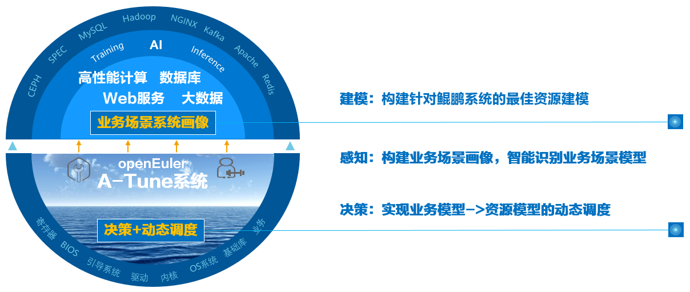

# Getting to Know A-Tune

## Introduction

An operating system \(OS\) is basic software that connects applications and hardware. It is critical for users to adjust OS and application configurations and make full use of software and hardware capabilities to achieve optimal service performance. However, numerous workload types and varied applications run on the OS, and the requirements on resources are different. Currently, the application environment composed of hardware and software involves more than 7000 configuration objects. As the service complexity and optimization objects increase, the time cost for optimization increases exponentially. As a result, optimization efficiency decreases sharply. Optimization becomes complex and brings great challenges to users.

Second, as infrastructure software, the OS provides a large number of software and hardware management capabilities. The capability required varies in different scenarios. Therefore, capabilities need to be enabled or disabled depending on scenarios, and a combination of capabilities will maximize the optimal performance of applications.

In addition, the actual business embraces hundreds and thousands of scenarios, and each scenario involves a wide variety of hardware configurations for computing, network, and storage. The lab cannot list all applications, business scenarios, and hardware combinations.

To address the preceding challenges, openEuler launches A-Tune.

A-Tune is an AI-based engine that optimizes system performance. It uses AI technologies to precisely profile business scenarios, discover and infer business characteristics, so as to make intelligent decisions, match with the optimal system parameter configuration combination, and give recommendations, ensuring the optimal business running status.

## Architecture

The following figure shows the A-Tune core technical architecture, which consists of intelligent decision-making, system profile, and interaction system.

- Intelligent decision-making layer: consists of the awareness and decision-making subsystems, which implements intelligent awareness of applications and system optimization decision-making, respectively.
- System profile layer: consists of the feature engineering and two-layer classification model. The feature engineering is used to automatically select service features, and the two-layer classification model is used to learn and classify service models.
- Interaction system layer: monitors and configures various system resources and executes optimization policies.

## Supported Features and Service Models

### Supported Features

[Table 1](#table1919220557576)  describes the main features supported by A-Tune, feature maturity, and usage suggestions.

**Table  1**  Feature maturity

| Feature                                                   | Maturity | Usage Suggestion |
| --------------------------------------------------------- | -------- | ---------------- |
| Auto optimization of 15 applications in 11 workload types | Tested   | Pilot            |
| User-defined profile and service models                   | Tested   | Pilot            |
| Automatic parameter optimization                          | Tested   | Pilot            |

### Supported Service Models

Based on the workload characteristics of applications, A-Tune classifies services into 11 types. For details about the bottleneck of each type and the applications supported by A-Tune, see  [Table 2](#table2819164611311).

**Table  2**  Supported workload types and applications

| Service category   | Type                 | Bottleneck                                                   | Supported Application               |
| ------------------ | -------------------- | ------------------------------------------------------------ | ----------------------------------- |
| default            | Default type         | Low resource usage in terms of cpu, memory, network, and I/O | N/A                                 |
| webserver          | Web application      | Bottlenecks of cpu and network                               | Nginx, Apache Traffic Server        |
| database           | Database             | Bottlenecks of cpu, memory, and I/O                          | Mongodb, Mysql, Postgresql, Mariadb |
| big_data           | Big data             | Bottlenecks of cpu and memory                                | Hadoop-hdfs, Hadoop-spark           |
| middleware         | Middleware framework | Bottlenecks of cpu and network                               | Dubbo                               |
| in-memory_database | Memory database      | Bottlenecks of memory and I/O                                | Redis                               |
| basic-test-suite   | Basic test suite     | Bottlenecks of cpu and memory                                | SPECCPU2006, SPECjbb2015            |
| hpc                | Human genome         | Bottlenecks of cpu, memory, and I/O                          | Gatk4                               |
| storage            | Storage              | Bottlenecks of network, and I/O                              | Ceph                                |
| virtualization     | Virtualization       | Bottlenecks of cpu, memory, and I/O                          | Consumer-cloud, Mariadb             |
| docker             | Docker               | Bottlenecks of cpu, memory, and I/O                          | Mariadb                             |
