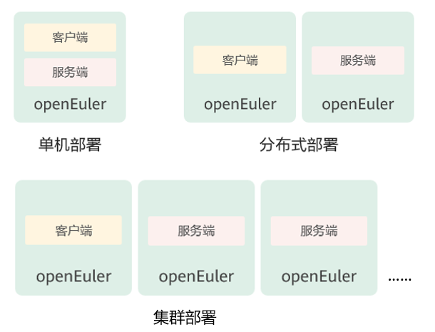
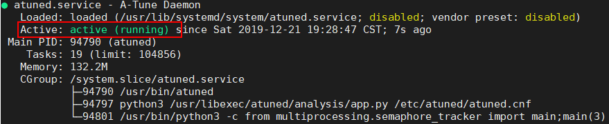
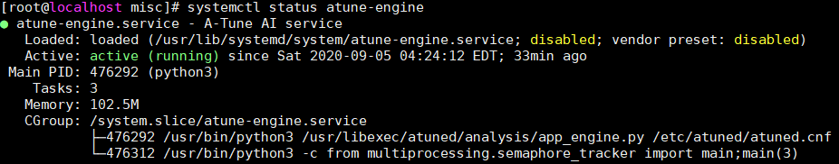
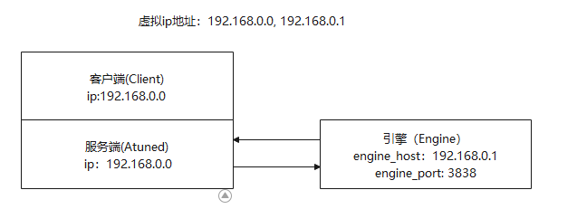

# Installation and Deployment

This chapter describes how to install and deploy A-Tune.

## Software and Hardware Requirements

### Hardware Requirement

- Huawei Kunpeng 920 processor

### Software Requirement

- OS: openEuler 22.03

## Environment Preparation

For details about installing an openEuler OS, see the [_openEuler Installation Guide_](https://docs.openeuler.openatom.cn/en/docs/24.03_LTS_SP1/server/installation_upgrade/installation/installation_on_servers.html).

## A-Tune Installation

This section describes the installation modes and methods of the A-Tune.

### Installation Modes

A-Tune can be installed in single-node, distributed, and cluster modes.

- Single-node mode

    The client and server are installed on the same system.

- Distributed mode

    The client and server are installed on different systems.

- Cluster mode
    A cluster consists of a client and more than one servers.

The installation modes are as follows:



### Installation Procedure

To install the A-Tune, perform the following steps:

1. Mount an openEuler ISO image.

    ```shell
    mount openEuler-22.03-LTS-everything-x86_64-dvd.iso /mnt
    ```

    > Use the **everything** ISO image.

2. Configure the local Yum source.

    ```shell
    vim /etc/yum.repos.d/local.repo
    ```

    The configured contents are as follows:

    ```conf
    [local]
    name=local
    baseurl=file:///mnt
    gpgcheck=1
    enabled=1
    ```

3. Import the GPG public key of the RPM digital signature to the system.

    ```shell
    rpm --import /mnt/RPM-GPG-KEY-openEuler
    ```

4. Install an A-Tune server.

    > [!NOTE]NOTE  
    > In this step, both the server and client software packages are installed. For the single-node deployment, skip  **Step 5**.  

    ```shell
    yum install atune -y
    yum install atune-engine -y
    ```

5. For a distributed mode, install an A-Tune client on associated server.

    ```shell
    yum install atune-client -y
    ```

6. Check whether the installation is successful.

    ```shell
    $ rpm -qa | grep atune
    atune-client-xxx
    atune-db-xxx
    atune-xxx
    atune-engine-xxx
    ```

    If the preceding information is displayed, the installation is successful.

## A-Tune Deployment

This section describes how to deploy A-Tune.

### Overview

The configuration items in the A-Tune configuration file  **/etc/atuned/atuned.cnf**  are described as follows:

- A-Tune service startup configuration (modify the parameter values as required).

    - **protocol**: Protocol used by the gRPC service. The value can be  **unix**  or  **tcp**.  **unix**  indicates the local socket communication mode, and  **tcp**  indicates the socket listening port mode. The default value is  **unix**.
    - **address**: Listening IP address of the gRPC service. The default value is  **unix socket**. If the gRPC service is deployed in distributed mode, change the value to the listening IP address.
    - **port**: Listening port of the gRPC server. The value ranges from 0 to 65535. If **protocol** is set to **unix**, you do not need to set this parameter.
    - **connect**: IP address list of the nodes where the A-Tune is located when the A-Tune is deployed in a cluster. IP addresses are separated by commas (,).
    - **rest_host**: Listening address of the REST service. The default value is localhost.
    - **rest_port**: Listening port of the REST service. The value ranges from 0 to 65535. The default value is 8383.
    - **engine_host**: IP address for connecting to the A-Tune engine service of the system.
    - **engine_port**: Port for connecting to the A-Tune engine service of the system.
    - **sample_num**: Number of samples collected when the system executes the analysis process. The default value is 20.
    - **interval**: Interval for collecting samples when the system executes the analysis process. The default value is 5s.
    - **grpc_tls**: Indicates whether to enable SSL/TLS certificate verification for the gRPC service. By default, this function is disabled. After grpc_tls is enabled, you need to set the following environment variables before running the **atune-adm** command to communicate with the server:
        - export ATUNE_TLS=yes
        - export ATUNED_CACERT=\<Path of the client CA certificate>
        - export ATUNED_CLIENTCERT=\<Client certificate path>
        - export ATUNED_CLIENTKEY=\<Client key path>
        - export ATUNED_SERVERCN=server
    - **tlsservercafile**: Path of the gPRC server's CA certificate.
    - **tlsservercertfile**: Path of the gPRC server certificate.
    - **tlsserverkeyfile**: Path of the gPRC server key.
    - **rest_tls**: Indicates whether to enable SSL/TLS certificate verification for the REST service. This function is enabled by default.
    - **tlsrestcacertfile**: Path of the server's CA certificate of the REST service.
    - **tlsrestservercertfile**: Path of the server certificate of the REST service.
    - **tlsrestserverkeyfile**: Indicates the key path of the REST service.
    - **engine_tls**: Indicates whether to enable SSL/TLS certificate verification for the A-Tune engine service. This function is enabled by default..
    - **tlsenginecacertfile**: Path of the client CA certificate of the A-Tune engine service.
    - **tlsengineclientcertfile**: Client certificate path of the A-Tune engine service.
    - **tlsengineclientkeyfile**: Client key path of the A-Tune engine service.

- System information

    System is the parameter information required for system optimization. You must modify the parameter information according to the actual situation.

    - **disk**: Disk information to be collected during the analysis process or specified disk during disk optimization.
    - **network**: NIC information to be collected during the analysis process or specified NIC during NIC optimization.
    - **user**: User name used for ulimit optimization. Currently, only the user  **root**  is supported.
    
- Log information

    Change the log level as required. The default log level is info. Log information is recorded in the **/var/log/messages** file.

- Monitor information

    Hardware information that is collected by default when the system is started.
    
- Tuning information

    Tuning is the parameter information required for offline tuning.
    
    - **noise**: Evaluation value of Gaussian noise.
    - **sel_feature**: Indicates whether to enable the function of generating the importance ranking of offline tuning parameters. By default, this function is disabled.

#### Example

```conf
#################################### server ############################### 
 # atuned config 
 [server] 
 # the protocol grpc server running on 
 # ranges: unix or tcp 
 protocol = unix 

 # the address that the grpc server to bind to
 # default is unix socket /var/run/atuned/atuned.sock
 # ranges: /var/run/atuned/atuned.sock or ip address
 address = /var/run/atuned/atuned.sock 

 # the atune nodes in cluster mode, separated by commas
 # it is valid when protocol is tcp
 # connect = ip01,ip02,ip03

 # the atuned grpc listening port
 # the port can be set between 0 to 65535 which not be used
 # port = 60001

 # the rest service listening port, default is 8383
 # the port can be set between 0 to 65535 which not be used
 rest_host = localhost
 rest_port = 8383

 # the tuning optimizer host and port, start by engine.service
 # if engine_host is same as rest_host, two ports cannot be same
 # the port can be set between 0 to 65535 which not be used
 engine_host = localhost
 engine_port = 3838

 # when run analysis command, the numbers of collected data.
 # default is 20
 sample_num = 20

 # interval for collecting data, default is 5s
 interval = 5

 # enable gRPC authentication SSL/TLS
 # default is false
 # grpc_tls = false
 # tlsservercafile = /etc/atuned/grpc_certs/ca.crt
 # tlsservercertfile = /etc/atuned/grpc_certs/server.crt
 # tlsserverkeyfile = /etc/atuned/grpc_certs/server.key

 # enable rest server authentication SSL/TLS
 # default is true
 rest_tls = true
 tlsrestcacertfile = /etc/atuned/rest_certs/ca.crt
 tlsrestservercertfile = /etc/atuned/rest_certs/server.crt
 tlsrestserverkeyfile = /etc/atuned/rest_certs/server.key

 # enable engine server authentication SSL/TLS
 # default is true
 engine_tls = true
 tlsenginecacertfile = /etc/atuned/engine_certs/ca.crt
 tlsengineclientcertfile = /etc/atuned/engine_certs/client.crt
 tlsengineclientkeyfile = /etc/atuned/engine_certs/client.key


 #################################### log ############################### 
 [log]
 # either "debug", "info", "warn", "error", "critical", default is "info"
 level = info

 #################################### monitor ############################### 
 [monitor]
 # with the module and format of the MPI, the format is {module}_{purpose}
 # the module is Either "mem", "net", "cpu", "storage"
 # the purpose is "topo"
 module = mem_topo, cpu_topo

 #################################### system ############################### 
 # you can add arbitrary key-value here, just like key = value
 # you can use the key in the profile
 [system]
 # the disk to be analysis
 disk = sda

 # the network to be analysis
 network = enp189s0f0

 user = root
 
 #################################### tuning ###############################
 # tuning configs
 [tuning]
 noise = 0.000000001
 sel_feature = false
```

The configuration items in the configuration file **/etc/atuned/engine.cnf** of the A-Tune engine are described as follows:

- Startup configuration of the A-Tune engine service (modify the parameter values as required).

    - **engine_host**: Listening address of the A-Tune engine service. The default value is localhost.
    - **engine_port**: Listening port of the A-Tune engine service. The value ranges from 0 to 65535. The default value is 3838.
    - **engine_tls**: Indicates whether to enable SSL/TLS certificate verification for the A-Tune engine service. This function is enabled by default.
    - **tlsenginecacertfile**: Path of the server CA certificate of the A-Tune engine service.
    - **tlsengineservercertfile**: Path of the server certificate of the A-Tune engine service.
    - **tlsengineserverkeyfile**: Server key path of the A-Tune engine service.

- Log information

  Change the log level as required. The default log level is info. Log information is recorded in the **/var/log/messages** file.

#### Example

```conf
#################################### engine ###############################
 [server]
 # the tuning optimizer host and port, start by engine.service
 # if engine_host is same as rest_host, two ports cannot be same
 # the port can be set between 0 to 65535 which not be used
 engine_host = localhost
 engine_port = 3838

 # enable engine server authentication SSL/TLS
 # default is true
 engine_tls = true
 tlsenginecacertfile = /etc/atuned/engine_certs/ca.crt
 tlsengineservercertfile = /etc/atuned/engine_certs/server.crt
 tlsengineserverkeyfile = /etc/atuned/engine_certs/server.key

 #################################### log ###############################
 [log]
 # either "debug", "info", "warn", "error", "critical", default is "info"
 level = info
```

## Starting A-Tune

After A-Tune is installed, you need to configure the A-Tune service before starting it.

- Configure the A-Tune service.
    Modify the network adapter and drive information in the **atuned.cnf** configuration file.
    > Note:
    >
    > If atuned is installed through `make install`, the network adapter and drive information in the configuration file is automatically updated to the default devices on the machine. To collect data from other devices, perform the following steps to configure atuned.
    
    Run the following command to search for the network adapter that needs to be specified for optimization or data collection, and change the value of **network** in the **/etc/atuned/atuned.cnf** file to the specified network adapter:

    ```shell
    ip addr
    ```

    Run the following command to search for the drive that need to be specified for optimization or data collection, and change the value of **disk** in the **/etc/atuned/atuned.cnf** file to the specified drive:

    ```shell
    fdisk -l | grep dev
    ```

- About the certificate:
  The A-Tune engine and client use the gRPC communication protocol. Therefore, you need to configure a certificate to ensure system security. For information security purposes, A-Tune does not provide a certificate generation method. You need to configure a system certificate by yourself.
  If security is not considered, set **rest_tls** and **engine_tls** in the **/etc/atuned/atuned.cnf** file to **false**, set **engine_tls** in the **/etc/atuned/engine.cnf** file to **false**.
  A-Tune is not liable for any consequences incurred if no security certificate is configured.

- Start the atuned service.

  ```shell
  systemctl start atuned
  ```

- Query the atuned service status.

  ```shell
  systemctl status atuned
  ```

  If the following command output is displayed, the service is started successfully:

  

## Starting A-Tune Engine

To use AI functions, you need to start the A-Tune engine service.

- Start the atune-engine service.

    ```shell
    systemctl start atune-engine
    ```

- Query the atune-engine service status.

    ```shell
    systemctl status atune-engine
    ```

    If the following command output is displayed, the service is started successfully:

    

## Distributed Deployment

### Purpose of Distributed Deployment

A-Tune supports distributed deployment to implement distributed architecture and on-demand deployment. The components of A-Tune can be deployed separately. Lightweight component deployment has little impact on services and avoids installing too many dependencies to reduce the system load.

This document describes only a common deployment mode: deploying the client and server on the same node and deploying the engine module on another node. For details about other deployment modes, contact A-Tune developers.

**Deployment relationship**


### Configuration File

In distributed deployment mode, you need to configure the write the IP address and port number of the engine in the configuration file so that other components can access the engine component through the IP address.

1. Modify the **/etc/atuned/atuned.cnf** file on the server node.

    - Change the values of **engine_host** and **engine_port** in line 34 to the IP address and port number of the engine node. For the deployment in the preceding figure, the values are **engine_host = 192.168.0.1 engine_port = 3838**.
    - Change the values of **rest_tls** and **engine_tls** in lines 49 and 55 to **false**. Otherwise, you need to apply for and configure certificates. You do not need to configure SSL certificates in the test environment. However, you need to configure SSL certificates in the production environment to prevent security risks.

2. Modify the**/etc/atuned/engine.cnf** file on the engine node.

    - Change the values of **engine_host** and **engine_port** in lines 17 and 18 to the IP address and port number of the engine node. For the deployment in the preceding figure, the value are **engine_host = 192.168.0.1 engine_port = 3838**.
    - Change the value of **engine_tls** in line 22 to **false**.

3. After modifying the configuration file, restart the service for the modification to take effect.

    - Run the `systemctl restart atuned command` on the server node.
    - Run the `systemctl restart atune-engine` command on the engine node.

4. (Optional) Run the `tuning` command in the **A-Tune/examples/tuning/compress** folder.

    - For details, see **A-Tune/examples/tuning/compress/README**.
    - Run the `atune-adm tuning --project compress --detail compress_client.yaml` command.
    - This step is to check whether the distributed deployment is successful.

### Precautions

1. This document does not describe how to configure the authentication certificates. You can set **rest_tls** or **engine_tls** in the **atuned.cnf** and **engine.cnf** files to **false** if necessary.
2. After modifying the configuration file, restart the service. Otherwise, the modification does not take effect.
3. Do not enable the proxy when using A-Tune.
4. The **disk** and **network** items of the **\[system]** section in the **atuned.cnf** file need to be modified. For details about how to modify the items, see the [A-Tune User Guide](https://gitee.com/gaoruoshu/A-Tune/blob/master/Documentation/UserGuide/A-Tune%E7%94%A8%E6%88%B7%E6%8C%87%E5%8D%97.md).

### Example

#### atuned.cnf

```conf
# ......

# the tuning optimizer host and port, start by engine.service
# if engine_host is same as rest_host, two ports cannot be same
# the port can be set between 0 to 65535 which not be used
engine_host = 192.168.0.1
engine_port = 3838

# ......
```

#### engine.cnf

```bash
[server]
# the tuning optimizer host and port, start by engine.service
# if engine_host is same as rest_host, two ports cannot be same
# the port can be set between 0 to 65535 which not be used
engine_host = 192.168.0.1
engine_port = 3838
```

## Cluster Deployment

### Purpose of Cluster Deployment

To support fast tuning in multi-node scenarios, A-Tune supports dynamic tuning of parameter settings on multiple nodes at the same time. In this way, you do not need to tune each node separately, improving tuning efficiency.
Cluster deployment mode consists of one master node and several agent nodes. The client and server are deployed on the master node to receive commands and interact with the engine. Other nodes receive instructions from the master node and configure the parameters of the current node.

**Deployment relationship**
 

In the preceding figure, the client and server are deployed on the node whose IP address is 192.168.0.0. Project files are stored on this node. Other nodes do not contain project files.
The master node communicates with the agent nodes through TCP. Therefore, you need to modify the configuration file.

### Modifications to atuned.cnf

1. Set the value of **protocol** to **tcp**.
2. Set the value of **address** to the IP address of the current node.
3. Set the value of **connect** to the IP addresses of all nodes. The first IP address is the IP address of the master node, and the subsequent IP addresses are the IP addresses of agent nodes. Use commas (,) to separate the IP addresses.
4. During debugging, you can set **rest_tls** and **engine_tls** to **false**.
5. Perform the same modification on the **atuned.cnf** files of all the master and agent nodes.

### Precautions

1. The values of **engine_host** and **engine_port** must be consistent in the **engine.cnf** file and the **atuned.cnf** file on the server.
2. This document does not describe how to configure the authentication certificates. You can set **rest_tls** or **engine_tls** in the **atuned.cnf** and **engine.cnf** files to **false** if necessary.
3. After modifying the configuration file, restart the service. Otherwise, the modification does not take effect.
4. Do not enable the proxy when using A-Tune.

### Example

#### atuned.cnf

```conf
# ......

[server]
# the protocol grpc server running on
# ranges: unix or tcp
protocol = tcp

# the address that the grpc server to bind to
# default is unix socket /var/run/atuned/atuned.sock
# ranges: /var/run/atuned/atuned.sock or ip address
address = 192.168.0.0

# the atune nodes in cluster mode, separated by commas
# it is valid when protocol is tcp
connect = 192.168.0.0,192.168.0.1,192.168.0.2,192.168.0.3

# the atuned grpc listening port
# the port can be set between 0 to 65535 which not be used
port = 60001

# the rest service listening port, default is 8383
# the port can be set between 0 to 65535 which not be used
rest_host = localhost
rest_port = 8383

# the tuning optimizer host and port, start by engine.service
# if engine_host is same as rest_host, two ports cannot be same
# the port can be set between 0 to 65535 which not be used
engine_host = 192.168.1.1
engine_port = 3838

# ......
```

#### engine.cnf

```bash
[server]
# the tuning optimizer host and port, start by engine.service
# if engine_host is same as rest_host, two ports cannot be same
# the port can be set between 0 to 65535 which not be used
engine_host = 192.168.1.1
engine_port = 3838
```

Note: For details about the **engine.cnf** file, see the configuration file for distributed deployment.
