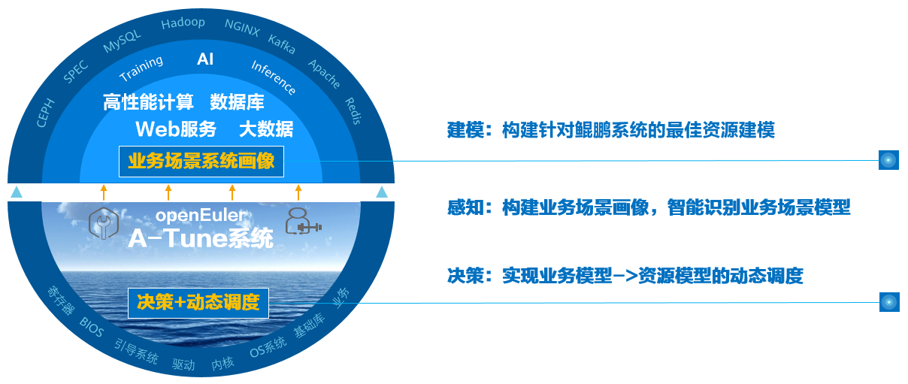
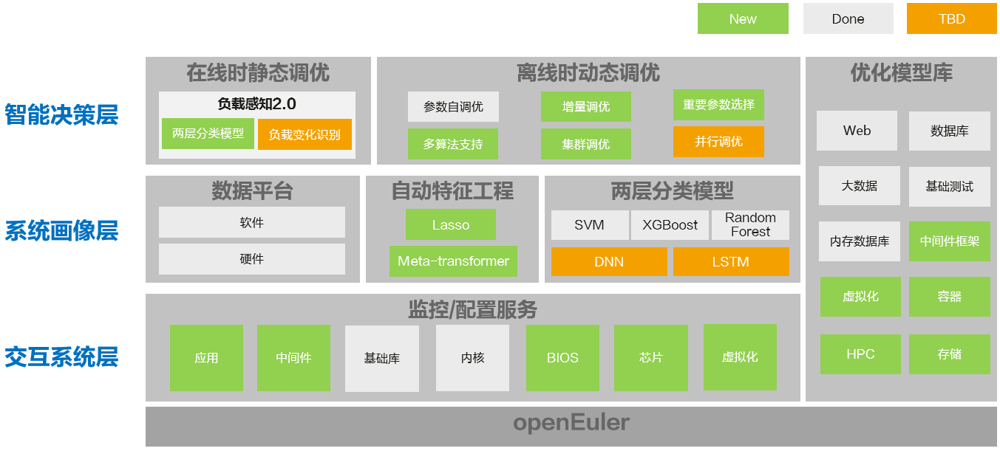

# 认识A-Tune

## 简介

操作系统作为衔接应用和硬件的基础软件，如何调整系统和应用配置，充分发挥软硬件能力，从而使业务性能达到最优，对用户至关重要。然而，运行在操作系统上的业务类型成百上千，应用形态千差万别，对资源的要求各不相同。当前硬件和基础软件组成的应用环境涉及高达7000多个配置对象，随着业务复杂度和调优对象的增加，调优所需的时间成本呈指数级增长，导致调优效率急剧下降，调优成为了一项极其复杂的工程，给用户带来巨大挑战。

其次，操作系统作为基础设施软件，提供了大量的软硬件管理能力，每种能力适用场景不尽相同，并非对所有的应用场景都通用有益，因此，不同的场景需要开启或关闭不同的能力，组合使用系统提供的各种能力，才能发挥应用程序的最佳性能。

另外，实际业务场景成千上万，计算、网络、存储等硬件配置也层出不穷，实验室无法遍历穷举所有的应用和业务场景，以及不同的硬件组合。

为了应对上述挑战，openEuler推出了A-Tune。

A-Tune是一款基于AI开发的系统性能优化引擎，它利用人工智能技术，对业务场景建立精准的系统画像，感知并推理出业务特征，进而做出智能决策，匹配并推荐最佳的系统参数配置组合，使业务处于最佳运行状态。

## 架构

A-Tune核心技术架构如下图，主要包括智能决策、系统画像和交互系统三层。

- 智能决策层：包含感知和决策两个子系统，分别完成对应用的智能感知和对系统的调优决策。
- 系统画像层：主要包括自动特征工程和两层分类模型，自动特征工程用于业务特征的自动选择，两层分类模型用于业务模型的学习和分类。
- 交互系统层：用于各类系统资源的监控和配置，调优策略执行在本层进行。

## 支持特性与业务模型

### 支持特性

A-Tune支持的主要特性、特性成熟度以及使用建议请参见[表1](#table1919220557576)。

**表 1**  特性成熟度

<table><thead align="left"><tr id="row81921355135715"><th class="cellrowborder" valign="top" width="33.33333333333333%" id="mcps1.2.4.1.1">
<strong id="b175661223205512">特性</strong>

</th>
<th class="cellrowborder" valign="top" width="33.33333333333333%" id="mcps1.2.4.1.2">
<strong id="b185678233555">成熟度</strong>

</th>
<th class="cellrowborder" valign="top" width="33.33333333333333%" id="mcps1.2.4.1.3">
<strong id="b1156872320553">使用建议</strong>

</th>
</tr>
</thead>
<tbody><tr id="row519275518572"><td class="cellrowborder" valign="top" width="33.33333333333333%" headers="mcps1.2.4.1.1 ">
11大类15款应用负载类型自动优化

</td>
<td class="cellrowborder" valign="top" width="33.33333333333333%" headers="mcps1.2.4.1.2 ">
已测试

</td>
<td class="cellrowborder" valign="top" width="33.33333333333333%" headers="mcps1.2.4.1.3 ">
试用

</td>
</tr>
<tr id="row919217552579"><td class="cellrowborder" valign="top" width="33.33333333333333%" headers="mcps1.2.4.1.1 ">
自定义profile和业务模型

</td>
<td class="cellrowborder" valign="top" width="33.33333333333333%" headers="mcps1.2.4.1.2 ">
已测试

</td>
<td class="cellrowborder" valign="top" width="33.33333333333333%" headers="mcps1.2.4.1.3 ">
试用

</td>
</tr>
<tr id="row71921155165711"><td class="cellrowborder" valign="top" width="33.33333333333333%" headers="mcps1.2.4.1.1 ">
参数自调优

</td>
<td class="cellrowborder" valign="top" width="33.33333333333333%" headers="mcps1.2.4.1.2 ">
已测试

</td>
<td class="cellrowborder" valign="top" width="33.33333333333333%" headers="mcps1.2.4.1.3 ">
试用

</td>
</tr>
</tbody>
</table>

### 支持业务模型

根据应用的负载特征，A-Tune将业务分为11大类，各类型的负载特征和A-Tune支持的应用请参见[表2](#table2819164611311)。

**表 2**  支持的业务类型和应用

<table class="MsoNormalTable" border="0" cellspacing="0" cellpadding="0" width="1440" style="width:1080.0pt;background:white;border-collapse:collapse">
 <thead>
  <tr>
   <td width="14%" valign="top" style="width:14.0%;border:solid #DFE2E5 1.0pt;
   padding:4.5pt 9.75pt 4.5pt 9.75pt">
   
<b>业务大类</b>

   </td>
   <td width="13%" valign="top" style="width:13.0%;border:solid #DFE2E5 1.0pt;
   border-left:none;padding:4.5pt 9.75pt 4.5pt 9.75pt">
   
<b>业务类型</b>

   </td>
   <td width="28%" valign="top" style="width:28.0%;border:solid #DFE2E5 1.0pt;
   border-left:none;padding:4.5pt 9.75pt 4.5pt 9.75pt">
   
<b>瓶颈点</b>

   </td>
   <td width="22%" valign="top" style="width:22.0%;border:solid #DFE2E5 1.0pt;
   border-left:none;padding:4.5pt 9.75pt 4.5pt 9.75pt">
   
<b>支持的应用</b>

   </td>
   <td width="20%" valign="top" style="width:20.0%;border:solid #DFE2E5 1.0pt;
   border-left:none;padding:4.5pt 9.75pt 4.5pt 9.75pt">
   
<b>待规划的应用</b>

   </td>
  </tr>
 </thead>
 <tbody><tr>
  <td width="14%" valign="top" style="width:14.0%;border:solid #DFE2E5 1.0pt;
  border-top:none;padding:4.5pt 9.75pt 4.5pt 9.75pt">
  
default

  </td>
  <td width="13%" valign="top" style="width:13.0%;border-top:none;border-left:
  none;border-bottom:solid #DFE2E5 1.0pt;border-right:solid #DFE2E5 1.0pt;
  padding:4.5pt 9.75pt 4.5pt 9.75pt">
  
默认类型

  </td>
  <td width="28%" valign="top" style="width:28.0%;border-top:none;border-left:
  none;border-bottom:solid #DFE2E5 1.0pt;border-right:solid #DFE2E5 1.0pt;
  padding:4.5pt 9.75pt 4.5pt 9.75pt">
  
算力、内存、网络、IO各维度资源使用率都不高

  </td>
  <td width="22%" valign="top" style="width:22.0%;border-top:none;border-left:
  none;border-bottom:solid #DFE2E5 1.0pt;border-right:solid #DFE2E5 1.0pt;
  padding:4.5pt 9.75pt 4.5pt 9.75pt">
  
N/A

  </td>
  <td width="20%" valign="top" style="width:20.0%;border-top:none;border-left:
  none;border-bottom:solid #DFE2E5 1.0pt;border-right:solid #DFE2E5 1.0pt;
  padding:4.5pt 9.75pt 4.5pt 9.75pt">
  
&nbsp;N/A

  </td>
 </tr>
 <tr>
  <td width="14%" valign="top" style="width:14.0%;border:solid #DFE2E5 1.0pt;
  border-top:none;background:#F6F8FA;padding:4.5pt 9.75pt 4.5pt 9.75pt">
  
webserver

  </td>
  <td width="13%" valign="top" style="width:13.0%;border-top:none;border-left:
  none;border-bottom:solid #DFE2E5 1.0pt;border-right:solid #DFE2E5 1.0pt;
  background:#F6F8FA;padding:4.5pt 9.75pt 4.5pt 9.75pt">
  
web应用

  </td>
  <td width="28%" valign="top" style="width:28.0%;border-top:none;border-left:
  none;border-bottom:solid #DFE2E5 1.0pt;border-right:solid #DFE2E5 1.0pt;
  background:#F6F8FA;padding:4.5pt 9.75pt 4.5pt 9.75pt">
  
算力瓶颈、网络瓶颈

  </td>
  <td width="22%" valign="top" style="width:22.0%;border-top:none;border-left:
  none;border-bottom:solid #DFE2E5 1.0pt;border-right:solid #DFE2E5 1.0pt;
  background:#F6F8FA;padding:4.5pt 9.75pt 4.5pt 9.75pt">
  
Nginx、Apache Traffic Server

  </td>
  <td width="20%" valign="top" style="width:20.0%;border-top:none;border-left:
  none;border-bottom:solid #DFE2E5 1.0pt;border-right:solid #DFE2E5 1.0pt;
  background:#F6F8FA;padding:4.5pt 9.75pt 4.5pt 9.75pt">
  
&nbsp;N/A

  </td>
 </tr>
 <tr>
  <td width="14%" valign="top" style="width:14.0%;border:solid #DFE2E5 1.0pt;
  border-top:none;padding:4.5pt 9.75pt 4.5pt 9.75pt">
  
database

  </td>
  <td width="13%" valign="top" style="width:13.0%;border-top:none;border-left:
  none;border-bottom:solid #DFE2E5 1.0pt;border-right:solid #DFE2E5 1.0pt;
  padding:4.5pt 9.75pt 4.5pt 9.75pt">
  
数据库

  </td>
  <td width="28%" valign="top" style="width:28.0%;border-top:none;border-left:
  none;border-bottom:solid #DFE2E5 1.0pt;border-right:solid #DFE2E5 1.0pt;
  padding:4.5pt 9.75pt 4.5pt 9.75pt">
  
算力瓶颈、内存瓶颈、IO瓶颈

  </td>
  <td width="22%" valign="top" style="width:22.0%;border-top:none;border-left:
  none;border-bottom:solid #DFE2E5 1.0pt;border-right:solid #DFE2E5 1.0pt;
  padding:4.5pt 9.75pt 4.5pt 9.75pt">
  
Mongodb、Mysql、Postgresql、Mariadb

  </td>
  <td width="20%" valign="top" style="width:20.0%;border-top:none;border-left:
  none;border-bottom:solid #DFE2E5 1.0pt;border-right:solid #DFE2E5 1.0pt;
  padding:4.5pt 9.75pt 4.5pt 9.75pt">
  
&nbsp;N/A

  </td>
 </tr>
 <tr>
  <td width="14%" valign="top" style="width:14.0%;border:solid #DFE2E5 1.0pt;
  border-top:none;background:#F6F8FA;padding:4.5pt 9.75pt 4.5pt 9.75pt">
  
big-data

  </td>
  <td width="13%" valign="top" style="width:13.0%;border-top:none;border-left:
  none;border-bottom:solid #DFE2E5 1.0pt;border-right:solid #DFE2E5 1.0pt;
  background:#F6F8FA;padding:4.5pt 9.75pt 4.5pt 9.75pt">
  
大数据

  </td>
  <td width="28%" valign="top" style="width:28.0%;border-top:none;border-left:
  none;border-bottom:solid #DFE2E5 1.0pt;border-right:solid #DFE2E5 1.0pt;
  background:#F6F8FA;padding:4.5pt 9.75pt 4.5pt 9.75pt">
  
算力瓶颈、内存瓶颈

  </td>
  <td width="22%" valign="top" style="width:22.0%;border-top:none;border-left:
  none;border-bottom:solid #DFE2E5 1.0pt;border-right:solid #DFE2E5 1.0pt;
  background:#F6F8FA;padding:4.5pt 9.75pt 4.5pt 9.75pt">
  
N/A

  </td>
  <td width="20%" valign="top" style="width:20.0%;border-top:none;border-left:
  none;border-bottom:solid #DFE2E5 1.0pt;border-right:solid #DFE2E5 1.0pt;
  background:#F6F8FA;padding:4.5pt 9.75pt 4.5pt 9.75pt">
  
Hadoop-hdfs、Hadoop-spark

  </td>
 </tr>
 <tr>
  <td width="14%" valign="top" style="width:14.0%;border:solid #DFE2E5 1.0pt;
  border-top:none;padding:4.5pt 9.75pt 4.5pt 9.75pt">
  
middleware

  </td>
  <td width="13%" valign="top" style="width:13.0%;border-top:none;border-left:
  none;border-bottom:solid #DFE2E5 1.0pt;border-right:solid #DFE2E5 1.0pt;
  padding:4.5pt 9.75pt 4.5pt 9.75pt">
  
中间件框架

  </td>
  <td width="28%" valign="top" style="width:28.0%;border-top:none;border-left:
  none;border-bottom:solid #DFE2E5 1.0pt;border-right:solid #DFE2E5 1.0pt;
  padding:4.5pt 9.75pt 4.5pt 9.75pt">
  
算力瓶颈、网络瓶颈

  </td>
  <td width="22%" valign="top" style="width:22.0%;border-top:none;border-left:
  none;border-bottom:solid #DFE2E5 1.0pt;border-right:solid #DFE2E5 1.0pt;
  padding:4.5pt 9.75pt 4.5pt 9.75pt">
  
Dubbo

  </td>
  <td width="20%" valign="top" style="width:20.0%;border-top:none;border-left:
  none;border-bottom:solid #DFE2E5 1.0pt;border-right:solid #DFE2E5 1.0pt;
  padding:4.5pt 9.75pt 4.5pt 9.75pt">
  
&nbsp;N/A

  </td>
 </tr>
 <tr>
  <td width="14%" valign="top" style="width:14.0%;border:solid #DFE2E5 1.0pt;
  border-top:none;background:#F6F8FA;padding:4.5pt 9.75pt 4.5pt 9.75pt">
  
in-memory-database

  </td>
  <td width="13%" valign="top" style="width:13.0%;border-top:none;border-left:
  none;border-bottom:solid #DFE2E5 1.0pt;border-right:solid #DFE2E5 1.0pt;
  background:#F6F8FA;padding:4.5pt 9.75pt 4.5pt 9.75pt">
  
内存数据库

  </td>
  <td width="28%" valign="top" style="width:28.0%;border-top:none;border-left:
  none;border-bottom:solid #DFE2E5 1.0pt;border-right:solid #DFE2E5 1.0pt;
  background:#F6F8FA;padding:4.5pt 9.75pt 4.5pt 9.75pt">
  
内存瓶颈、IO瓶颈

  </td>
  <td width="22%" valign="top" style="width:22.0%;border-top:none;border-left:
  none;border-bottom:solid #DFE2E5 1.0pt;border-right:solid #DFE2E5 1.0pt;
  background:#F6F8FA;padding:4.5pt 9.75pt 4.5pt 9.75pt">
  
Redis

  </td>
  <td width="20%" valign="top" style="width:20.0%;border-top:none;border-left:
  none;border-bottom:solid #DFE2E5 1.0pt;border-right:solid #DFE2E5 1.0pt;
  background:#F6F8FA;padding:4.5pt 9.75pt 4.5pt 9.75pt">
  
&nbsp;N/A

  </td>
 </tr>
 <tr>
  <td width="14%" valign="top" style="width:14.0%;border:solid #DFE2E5 1.0pt;
  border-top:none;padding:4.5pt 9.75pt 4.5pt 9.75pt">
  
basic-test-suite

  </td>
  <td width="13%" valign="top" style="width:13.0%;border-top:none;border-left:
  none;border-bottom:solid #DFE2E5 1.0pt;border-right:solid #DFE2E5 1.0pt;
  padding:4.5pt 9.75pt 4.5pt 9.75pt">
  
基础测试套

  </td>
  <td width="28%" valign="top" style="width:28.0%;border-top:none;border-left:
  none;border-bottom:solid #DFE2E5 1.0pt;border-right:solid #DFE2E5 1.0pt;
  padding:4.5pt 9.75pt 4.5pt 9.75pt">
  
算力瓶颈、内存瓶颈

  </td>
  <td width="22%" valign="top" style="width:22.0%;border-top:none;border-left:
  none;border-bottom:solid #DFE2E5 1.0pt;border-right:solid #DFE2E5 1.0pt;
  padding:4.5pt 9.75pt 4.5pt 9.75pt">
  
SPECCPU2006、SPECjbb2015

  </td>
  <td width="20%" valign="top" style="width:20.0%;border-top:none;border-left:
  none;border-bottom:solid #DFE2E5 1.0pt;border-right:solid #DFE2E5 1.0pt;
  padding:4.5pt 9.75pt 4.5pt 9.75pt">
  
&nbsp;N/A

  </td>
 </tr>
 <tr>
  <td width="14%" valign="top" style="width:14.0%;border:solid #DFE2E5 1.0pt;
  border-top:none;background:#F6F8FA;padding:4.5pt 9.75pt 4.5pt 9.75pt">
  
hpc

  </td>
  <td width="13%" valign="top" style="width:13.0%;border-top:none;border-left:
  none;border-bottom:solid #DFE2E5 1.0pt;border-right:solid #DFE2E5 1.0pt;
  background:#F6F8FA;padding:4.5pt 9.75pt 4.5pt 9.75pt">
  
人类基因组

  </td>
  <td width="28%" valign="top" style="width:28.0%;border-top:none;border-left:
  none;border-bottom:solid #DFE2E5 1.0pt;border-right:solid #DFE2E5 1.0pt;
  background:#F6F8FA;padding:4.5pt 9.75pt 4.5pt 9.75pt">
  
算力瓶颈、内存瓶颈、IO瓶颈

  </td>
  <td width="22%" valign="top" style="width:22.0%;border-top:none;border-left:
  none;border-bottom:solid #DFE2E5 1.0pt;border-right:solid #DFE2E5 1.0pt;
  background:#F6F8FA;padding:4.5pt 9.75pt 4.5pt 9.75pt">
  
Gatk4

  </td>
  <td width="20%" valign="top" style="width:20.0%;border-top:none;border-left:
  none;border-bottom:solid #DFE2E5 1.0pt;border-right:solid #DFE2E5 1.0pt;
  background:#F6F8FA;padding:4.5pt 9.75pt 4.5pt 9.75pt">
  
&nbsp;N/A

  </td>
 </tr>
 <tr>
  <td width="14%" valign="top" style="width:14.0%;border:solid #DFE2E5 1.0pt;
  border-top:none;padding:4.5pt 9.75pt 4.5pt 9.75pt">
  
<a name="p5912154613139">storage</a>

  </td>
  <td width="13%" valign="top" style="width:13.0%;border-top:none;border-left:
  none;border-bottom:solid #DFE2E5 1.0pt;border-right:solid #DFE2E5 1.0pt;
  padding:4.5pt 9.75pt 4.5pt 9.75pt">
  
<a name="p12532161561115">存储</a>

  </td>
  <td width="28%" valign="top" style="width:28.0%;border-top:none;border-left:
  none;border-bottom:solid #DFE2E5 1.0pt;border-right:solid #DFE2E5 1.0pt;
  padding:4.5pt 9.75pt 4.5pt 9.75pt">
  
<a name="p10912154631311">网络瓶颈、</a>IO瓶颈

  </td>
  <td width="22%" valign="top" style="width:22.0%;border-top:none;border-left:
  none;border-bottom:solid #DFE2E5 1.0pt;border-right:solid #DFE2E5 1.0pt;
  padding:4.5pt 9.75pt 4.5pt 9.75pt">
  
<a name="p11912164617133">N/A</a>

  </td>
  <td width="20%" valign="top" style="width:20.0%;border-top:none;border-left:
  none;border-bottom:solid #DFE2E5 1.0pt;border-right:solid #DFE2E5 1.0pt;
  padding:4.5pt 9.75pt 4.5pt 9.75pt">
  
Ceph

  </td>
 </tr>
 <tr>
  <td width="14%" valign="top" style="width:14.0%;border:solid #DFE2E5 1.0pt;
  border-top:none;background:#F6F8FA;padding:4.5pt 9.75pt 4.5pt 9.75pt">
  
virtualization

  </td>
  <td width="13%" valign="top" style="width:13.0%;border-top:none;border-left:
  none;border-bottom:solid #DFE2E5 1.0pt;border-right:solid #DFE2E5 1.0pt;
  background:#F6F8FA;padding:4.5pt 9.75pt 4.5pt 9.75pt">
  
虚拟化

  </td>
  <td width="28%" valign="top" style="width:28.0%;border-top:none;border-left:
  none;border-bottom:solid #DFE2E5 1.0pt;border-right:solid #DFE2E5 1.0pt;
  background:#F6F8FA;padding:4.5pt 9.75pt 4.5pt 9.75pt">
  
算力瓶颈、内存瓶颈、IO瓶颈

  </td>
  <td width="22%" valign="top" style="width:22.0%;border-top:none;border-left:
  none;border-bottom:solid #DFE2E5 1.0pt;border-right:solid #DFE2E5 1.0pt;
  background:#F6F8FA;padding:4.5pt 9.75pt 4.5pt 9.75pt">
  
Consumer-cloud、Mariadb

  </td>
  <td width="20%" valign="top" style="width:20.0%;border-top:none;border-left:
  none;border-bottom:solid #DFE2E5 1.0pt;border-right:solid #DFE2E5 1.0pt;
  background:#F6F8FA;padding:4.5pt 9.75pt 4.5pt 9.75pt">
  
&nbsp;N/A

  </td>
 </tr>
 <tr>
  <td width="14%" valign="top" style="width:14.0%;border:solid #DFE2E5 1.0pt;
  border-top:none;padding:4.5pt 9.75pt 4.5pt 9.75pt">
  
docker

  </td>
  <td width="13%" valign="top" style="width:13.0%;border-top:none;border-left:
  none;border-bottom:solid #DFE2E5 1.0pt;border-right:solid #DFE2E5 1.0pt;
  padding:4.5pt 9.75pt 4.5pt 9.75pt">
  
容器

  </td>
  <td width="28%" valign="top" style="width:28.0%;border-top:none;border-left:
  none;border-bottom:solid #DFE2E5 1.0pt;border-right:solid #DFE2E5 1.0pt;
  padding:4.5pt 9.75pt 4.5pt 9.75pt">
  
算力瓶颈、内存瓶颈、IO瓶颈

  </td>
  <td width="22%" valign="top" style="width:22.0%;border-top:none;border-left:
  none;border-bottom:solid #DFE2E5 1.0pt;border-right:solid #DFE2E5 1.0pt;
  padding:4.5pt 9.75pt 4.5pt 9.75pt">
  
Mariadb

  </td>
  <td width="20%" valign="top" style="width:20.0%;border-top:none;border-left:
  none;border-bottom:solid #DFE2E5 1.0pt;border-right:solid #DFE2E5 1.0pt;
  padding:4.5pt 9.75pt 4.5pt 9.75pt">
  
&nbsp;N/A

  </td>
 </tr>
</tbody></table>
