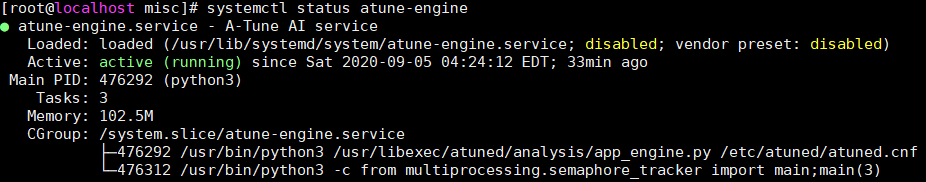

# 安装与部署

本章介绍如何安装和部署A-Tune。

## 软硬件要求

### 硬件要求<a name="section175931749114410"></a>

- 鲲鹏920处理器

## 环境准备

- 安装openEuler系统，安装方法参考 《[安装指南](https://docs.openeuler.openatom.cn/zh/docs/24.03_LTS_SP2/server/installation_upgrade/installation/installation_on_servers.html)》。

- 安装A-Tune需要使用root权限。

## 安装A-Tune

本节介绍A-Tune的安装模式和安装方法。

### 安装模式介绍

A-Tune支持单机模式、分布式模式安装和集群模式安装：

- 单机模式

  client和server安装到同一台机器上。

- 分布式模式

  client和server分别安装在不同的机器上。

- 集群模式

  由一台client机器和大于一台server机器组成。

三种安装模式的简单图示如下：


### 安装操作

安装A-Tune的操作步骤如下：

1. 挂载openEuler的iso文件。

   ```shell
   # mount openEuler-{version}-everything-x86_64-dvd.iso /mnt
   ```

   请安装everything的iso。

2. 配置本地yum源。

   ```shell
   # vim /etc/yum.repos.d/local.repo
   ```

   配置内容如下所示：

   ```shell
   [local]
   name=local
   baseurl=file:///mnt
   gpgcheck=1
   enabled=1
   ```

3. 将RPM数字签名的GPG公钥导入系统。

   ```shell
   # rpm --import /mnt/RPM-GPG-KEY-openEuler
   ```

4. 安装A-Tune服务端。

    > **说明：**
    >本步骤会同时安装服务端和客户端软件包，对于单机部署模式，请跳过**步骤5**。  

    ```shell
    # yum install atune -y
    # yum install atune-engine -y
    ```

5. 若为分布式部署，请安装A-Tune客户端。

    ```shell
    # yum install atune-client -y
    ```

6. 验证是否安装成功。命令和回显如下表示安装成功。

    ```shell
    # rpm -qa | grep atune
    atune-client-xxx
    atune-db-xxx
    atune-xxx
    atune-engine-xxx
    ```

## 部署A-Tune

本节介绍A-Tune的配置部署。

### 配置介绍

A-Tune配置文件/etc/atuned/atuned.cnf的配置项说明如下：

- A-Tune服务启动配置（可根据需要进行修改）。

    - protocol：系统gRPC服务使用的协议，unix或tcp，unix为本地socket通信方式，tcp为socket监听端口方式。默认为unix。
    - address：系统gRPC服务的侦听地址，默认为unix socket，若为分布式部署，需修改为侦听的ip地址。
    - port：系统gRPC服务的侦听端口，范围为0\~65535未使用的端口。如果protocol配置是unix，则不需要配置。
    - connect：若为集群部署时，A-Tune所在节点的ip列表，ip地址以逗号分隔。
    - rest_host：系统rest service的侦听地址，默认为localhost。
    - rest_port：系统rest service的侦听端口，范围为0~65535未使用的端口，默认为8383。
    - engine_host：与系统atune engine service链接的地址。
    - engine_port：与系统atune engine service链接的端口。
    - sample_num：系统执行analysis流程时采集样本的数量，默认为20。
    - interval：系统执行analysis流程时采集样本的间隔时间，默认为5s。
    - grpc_tls：系统gRPC的SSL/TLS证书校验开关，默认不开启。开启grpc_tls后，atune-adm命令在使用前需要设置以下环境变量方可与服务端进行通讯：
        - export ATUNE_TLS=yes
        - export ATUNED_CACERT=\<客户端CA证书路径>
        - export ATUNED_CLIENTCERT=\<客户端证书路径>
        - export ATUNED_CLIENTKEY=\<客户端密钥路径>
        - export ATUNED_SERVERCN=server
    - tlsservercafile：gRPC服务端CA证书路径。
    - tlsservercertfile：gRPC服务端证书路径。
    - tlsserverkeyfile：gRPC服务端密钥路径。
    - rest_tls：系统rest service的SSL/TLS证书校验开关，默认开启。
    - tlsrestcacertfile：系统rest service的服务端CA证书路径。
    - tlsrestservercertfile：系统rest service的服务端证书路径
    - tlsrestserverkeyfile：系统rest service的服务端密钥路径。
    - engine_tls：系统atune engine service的SSL/TLS证书校验开关，默认开启。
    - tlsenginecacertfile：系统atune engine service的客户端CA证书路径。
    - tlsengineclientcertfile：系统atune engine service的客户端证书路径
    - tlsengineclientkeyfile：系统atune engine service的客户端密钥路径

- system信息

    system为系统执行相关的优化需要用到的参数信息，必须根据系统实际情况进行修改。

    - disk：执行analysis流程时需要采集的对应磁盘的信息或执行磁盘相关优化时需要指定的磁盘。
    - network：执行analysis时需要采集的对应的网卡的信息或执行网卡相关优化时需要指定的网卡。

    - user：执行ulimit相关优化时用到的用户名。目前只支持root用户。

- 日志信息

    根据情况修改日志的级别，默认为info级别，日志信息打印在/var/log/messages中。

- monitor信息

    为系统启动时默认采集的系统硬件信息。

- tuning信息

    tuning为系统进行离线调优时需要用到的参数信息。

    - noise：高斯噪声的评估值。
    - sel_feature：控制离线调优参数重要性排名输出的开关，默认关闭。

### 配置示例<a name="section616213774714"></a>

```shell
#################################### server ############################### 
 # atuned config 
 [server] 
 # the protocol grpc server running on 
 # ranges: unix or tcp 
 protocol = unix 

 # the address that the grpc server to bind to
 # default is unix socket /var/run/atuned/atuned.sock
 # ranges: /var/run/atuned/atuned.sock or ip address
 address = /var/run/atuned/atuned.sock 

 # the atune nodes in cluster mode, separated by commas
 # it is valid when protocol is tcp
 # connect = ip01,ip02,ip03

 # the atuned grpc listening port
 # the port can be set between 0 to 65535 which not be used
 # port = 60001

 # the rest service listening port, default is 8383
 # the port can be set between 0 to 65535 which not be used
 rest_host = localhost
 rest_port = 8383

 # the tuning optimizer host and port, start by engine.service
 # if engine_host is same as rest_host, two ports cannot be same
 # the port can be set between 0 to 65535 which not be used
 engine_host = localhost
 engine_port = 3838

 # when run analysis command, the numbers of collected data.
 # default is 20
 sample_num = 20

 # interval for collecting data, default is 5s
 interval = 5

 # enable gRPC authentication SSL/TLS
 # default is false
 # grpc_tls = false
 # tlsservercafile = /etc/atuned/grpc_certs/ca.crt
 # tlsservercertfile = /etc/atuned/grpc_certs/server.crt
 # tlsserverkeyfile = /etc/atuned/grpc_certs/server.key

 # enable rest server authentication SSL/TLS
 # default is true
 rest_tls = true
 tlsrestcacertfile = /etc/atuned/rest_certs/ca.crt
 tlsrestservercertfile = /etc/atuned/rest_certs/server.crt
 tlsrestserverkeyfile = /etc/atuned/rest_certs/server.key

 # enable engine server authentication SSL/TLS
 # default is true
 engine_tls = true
 tlsenginecacertfile = /etc/atuned/engine_certs/ca.crt
 tlsengineclientcertfile = /etc/atuned/engine_certs/client.crt
 tlsengineclientkeyfile = /etc/atuned/engine_certs/client.key


 #################################### log ############################### 
 [log]
 # either "debug", "info", "warn", "error", "critical", default is "info"
 level = info

 #################################### monitor ############################### 
 [monitor]
 # with the module and format of the MPI, the format is {module}_{purpose}
 # the module is Either "mem", "net", "cpu", "storage"
 # the purpose is "topo"
 module = mem_topo, cpu_topo

 #################################### system ############################### 
 # you can add arbitrary key-value here, just like key = value
 # you can use the key in the profile
 [system]
 # the disk to be analysis
 disk = sda

 # the network to be analysis
 network = enp189s0f0

 user = root
 
 #################################### tuning ###############################
 # tuning configs
 [tuning]
 noise = 0.000000001
 sel_feature = false
```

A-Tune engine配置文件/etc/atuned/engine.cnf的配置项说明如下：

- A-Tune engine服务启动配置（可根据需要进行修改）。

    - engine_host：系统atune engine service的侦听地址，默认为localhost。
    - engine_port：系统atune engine service的侦听端口，范围为0~65535未使用的端口，默认为3838。
    - engine_tls：系统atune engine service的SSL/TLS证书校验开关，默认开启。
    - tlsenginecacertfile：系统atune engine service的服务端CA证书路径。
    - tlsengineservercertfile：系统atune engine service的服务端证书路径
    - tlsengineserverkeyfile：系统atune engine service的服务端密钥路径。

- 日志信息

  根据情况修改日志的级别，默认为info级别，日志信息打印在/var/log/messages中。

### 配置示例<a name="section616213774714"></a>

```shell
 #################################### engine ###############################
 [server]
 # the tuning optimizer host and port, start by engine.service
 # if engine_host is same as rest_host, two ports cannot be same
 # the port can be set between 0 to 65535 which not be used
 engine_host = localhost
 engine_port = 3838

 # enable engine server authentication SSL/TLS
 # default is true
 engine_tls = true
 tlsenginecacertfile = /etc/atuned/engine_certs/ca.crt
 tlsengineservercertfile = /etc/atuned/engine_certs/server.crt
 tlsengineserverkeyfile = /etc/atuned/engine_certs/server.key

 #################################### log ###############################
 [log]
 # either "debug", "info", "warn", "error", "critical", default is "info"
 level = info
```

## 启动A-Tune

A-Tune安装完成后，需要配置A-Tune服务，然后启动A-Tune服务。

- 配置A-Tune服务：
    修改atuned.cnf配置文件中网卡和磁盘的信息
    > 说明:
    >
    > 如果通过'make install'安装了atuned服务，网卡和磁盘已经自动更新为当前机器中的默认设备。如果需要从其他设备收集数据，请按照以下步骤配置 atuned 服务。

    通过以下命令可以查找当前需要采集或者执行网卡相关优化时需要指定的网卡，并修改/etc/atuned/atuned.cnf中的network配置选项为对应的指定网卡。

    ```shell
    ip addr
    ```

    通过以下命令可以查找当前需要采集或者执行磁盘相关优化时需要指定的磁盘，并修改/etc/atuned/atuned.cnf中的disk配置选项为对应的指定磁盘。

    ```shell
    fdisk -l | grep dev
    ```

- 关于证书：
  因为A-Tune的引擎和客户端使用了grpc通信协议，所以为了系统安全，需要配置证书。因为信息安全的原因，A-Tune不会提供证书生成方法，请用户自行配置系统证书。
  如果不考虑安全问题，可以将/etc/atuned/atuned.cnf中的rest_tls 和 engine_tls配置选项设置为false，并且将/etc/atuned/engine.cnf中的engine_tls配置选项设为false。
  如果不配置安全证书导致的一切后果与A-Tune无关。

- 启动atuned服务：

  ```shell
  # systemctl start atuned
  ```

- 查询atuned服务状态：

  ```shell
  # systemctl status atuned
  ```

  若回显为如下，则服务启动成功。

  

## 启动A-Tune engine

若需要使用AI相关的功能，需要启动A-Tune engine服务才能使用。

- 启动atune-engine服务：

  ```shell
  # systemctl start atune-engine
  ```

- 查询atune-engine服务状态：

  ```shell
  # systemctl status atune-engine
  ```

  若回显为如下，则服务启动成功。

  

## 分部式部署

### 分部式部署目的

为了实现分布式架构和按需部署的目标，A-Tune支持分部式部署。可以将三个组件分开部署，轻量化组件部署对业务影响小，也避免安装过多依赖软件，减轻系统负担。<br/>

部署方式：本文档只介绍常用的一种部署方式：在同一节点部署客户端和服务端，在另一个节点上部署引擎模块。其他的部署方式请咨询A-Tune开发人员。

**部署关系图：** <br/>


### 配置文件

分部式部署需要修改配置文件，将引擎的ip地址和端口号写入配置文件中，别的组件才能访问该ip地址上的引擎组件。

1. 修改服务端节点上的`/etc/atuned/atuned.cnf`文件：

    - 34行的`engine_host`和`engine_port`修改为引擎节点的ip地址和端口号。如上图，应该修改为`engine_host = 192.168.0.1  engine_port = 3838`。
    - 将49行和55行的 rest_tls 和engine_tls 改为false，否则需要申请和配置证书。在测试环境中可以不用配置ssl证书，但是正式的现网环境需要配置证书，否则会有安全隐患。

2. 修改引擎节点/etc/atuned/engine.cnf文件：

    - 17行和18行的`engine_host`和`engine_port`修改为引擎节点的ip地址和端口号。如上图，应该修改为`engine_host = 192.168.0.1  engine_port = 3838`。
    - 第22行的engine_tls的值改成false。

3. 修改完配置文件后需要重启服务，配置才会生效：

    - 服务端节点输入命令：`systemctl restart atuned`。
    - 引擎端节点输入命令：`systemctl restart atune-engine`。

4. （可选步骤）在`A-Tune/examples/tuning/compress`文件夹下运行tuning命令：

    - 请先参考`A-Tune/examples/tuning/compress/README`的指导进行预处理。
    - 执行`atune-adm tuning --project compress --detail compress_client.yaml`。
    - 本步骤的目的是检验分部式部署是否成功。

### 注意事项

1. 本文档不对认证证书配置方法作详细说明，如有需要也可以将atuned.cnf和engine.cnf中的rest_tls/engine_tls设成false。
2. 修改完配置文件后需要重启服务，否则修改不会生效。
3. 注意使用atune服务时不要同时打开代理。
4. atuned.cnf 文件中的[system]模块的disk和network项需要修改，修改方法见[A-Tune用户指南2.4.1章节](https://gitee.com/gaoruoshu/A-Tune/blob/master/Documentation/UserGuide/A-Tune%E7%94%A8%E6%88%B7%E6%8C%87%E5%8D%97.md)，本文不展开描述。

### 举例

#### atuned.cnf

```bash
# ...前略...

# the tuning optimizer host and port, start by engine.service
# if engine_host is same as rest_host, two ports cannot be same
# the port can be set between 0 to 65535 which not be used
engine_host = 192.168.0.1
engine_port = 3838

# ...后略...
```

#### engine.cnf

```bash
[server]
# the tuning optimizer host and port, start by engine.service
# if engine_host is same as rest_host, two ports cannot be same
# the port can be set between 0 to 65535 which not be used
engine_host = 192.168.0.1
engine_port = 3838
```

## 集群部署

### 集群部署的目的

为了支持多节点场景快速调优，A-Tune支持对多个节点里的参数配置同时进行动态调优，避免用户单独多次对每个节点进行调优，从而提升调优效率。<br/>
集群部署的方式：分为一个主节点和若干个从节点。在主节点部署客户端和服务端，负责接受命令和引擎交互。其他节点接受主节点的指令，对当前节点的参数进行配置。

**部署关系图：** <br/>
 

上图中客户端和服务端部署在ip为192.168.0.0的节点上，项目文件存放在该节点上，其他节点不用放置项目文件。<br/>
主节点和从节点之间通过tcp协议通信，所以需要修改配置文件。

### atuned.cnf配置文件修改

1. protocol 值设置为tcp。
2. address设置为当前节点的ip地址。
3. connect设置为所有节点的ip地址，第一个为主节点，其余为从节点ip，中间用逗号隔开。
4. 在调试时，可以设置rest_tls 和engine_tls 为false。
5. 所有的主从节点的atuned.cnf都按照上方描述修改。

### 注意事项

1. 将engine.cnf中的`engine_host`和`engine_port`设置为服务端atuned.cnf中`engine_host`和`engine_port`一样的ip和端口号。
2. 本文档不对认证证书配置方法作详细说明，如有需要也可以将atuned.cnf和engine.cnf中的rest_tls和engine_tls设置为false。
3. 修改完配置文件后需要重启服务，否则修改不会生效。
4. 注意使用atune服务时不要同时打开代理。

### 举例

#### atuned.cnf

```bash
# ...前略...

[server]
# the protocol grpc server running on
# ranges: unix or tcp
protocol = tcp

# the address that the grpc server to bind to
# default is unix socket /var/run/atuned/atuned.sock
# ranges: /var/run/atuned/atuned.sock or ip address
address = 192.168.0.0

# the atune nodes in cluster mode, separated by commas
# it is valid when protocol is tcp
connect = 192.168.0.0,192.168.0.1,192.168.0.2,192.168.0.3

# the atuned grpc listening port
# the port can be set between 0 to 65535 which not be used
port = 60001

# the rest service listening port, default is 8383
# the port can be set between 0 to 65535 which not be used
rest_host = localhost
rest_port = 8383

# the tuning optimizer host and port, start by engine.service
# if engine_host is same as rest_host, two ports cannot be same
# the port can be set between 0 to 65535 which not be used
engine_host = 192.168.1.1
engine_port = 3838

# ...后略...
```

#### engine.cnf

```bash
[server]
# the tuning optimizer host and port, start by engine.service
# if engine_host is same as rest_host, two ports cannot be same
# the port can be set between 0 to 65535 which not be used
engine_host = 192.168.1.1
engine_port = 3838
```

**备注：** engine.cnf参考分部式部署的配置文件。
