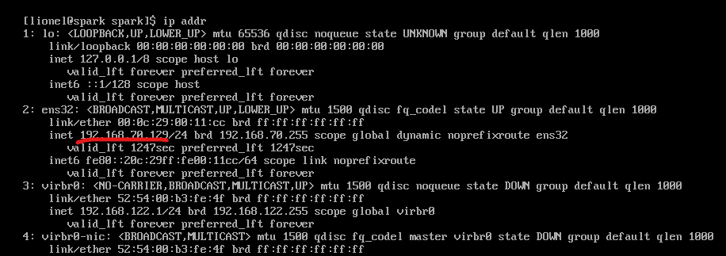
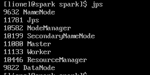

## Spark 自动化部署和HiBench基准性能测试

### **工作流程**

一、**Spark 自动化部署流程**

1. 安装 gcc make curl wget samba git
2. 关闭防火墙并启动nmbd.service
3. 配置本机免密登录
4. 安装Java和配置Java 环境
5. 安装Hadoop并配置Hadoop环境，格式化namenode并启动hdfs和yarn
6. 安装Spark并配置Spark环境，启动Spark master和worker守护进程

二、**HiBench 自动化部署流程**

1. 安装python2
2. 安装Maven并配置Maven环境变量和设置maven仓库国内镜像
3. 为Spark Benchmark下载并编译、配置HiBench

三、**执行 Benchmark**

1. 准备工作
2. 执行测试

## 开始操作

**前提条件**

将本目录及所有文件和子目录放到您的主机所在的目录，然后在`/etc/hosts`中添加`ip hostname`，用`ip addr`查看本机ip，`hostname`命令查看本机名称，例如：




那么`/etc/hosts`中应该添加`192.168.70.129 spark`，相应的在你的机器上添加正确的信息。

在自动化部署的过程中，需要下载大量的文件，如果遇到网络问题导致安装不成功，可以配置代理：

```bash
# 为git配置代理执行：
git config --global http.proxy http://ip:port
git config --global https.proxy http://ip:port

# 为系统设置代理，可以在~/.bashrc中添加如下：
export http_proxy=http://ip:port
export https_proxy=http://ip:port
# 使环境变量立即生效
source ~/.bashrc

#注意上面的ip和port替换为自己的代理地址
```


### **Spark 自动化部署**

切换到脚本所在的目录，执行`chmod u+x ./install_spark.sh`，为脚本添加执行权限，然后执行脚本`./install_spark.sh`，期间可能需要输入管理员密码，等待片刻终端出现`Spark deployment success.`的字样，代表执行成功，执行`source ~/.bashrc`和`jps`命令，可以看到如下几个守护进程正在运行：



如果运行不成功，可以查看本目录的install_spark.log日志文件，可以看到哪一步未成功。

### HiBench 自动化部署

切换到脚本所在的目录，执行`chmod u+x ./install_hibench.sh`，为脚本添加执行权限，然后执行脚本`./install_hibench.sh`，期间可能需要输入管理员密码，等待片刻终端出现`Hibench init success`的字样，代表执行成功。

如果运行不成功，可以查看本目录的install_hibench.log日志文件，可以看到哪一步未成功。

### 执行Benchmark

切换到脚本所在的目录，执行`chmod u+x ./benchmark.sh`，为脚本添加执行权限，然后执行脚本`./benchmark.sh`，等待输出结果。

可以在`HiBench/report/hibench.report`查看基准测试结果，执行`cat HiBench/report/hibench.report`