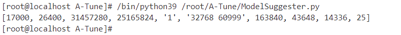
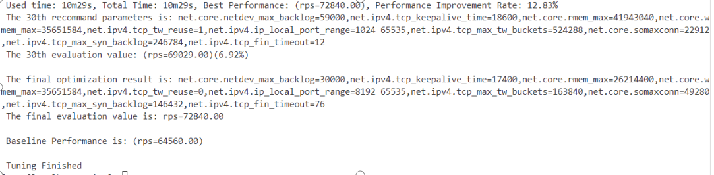
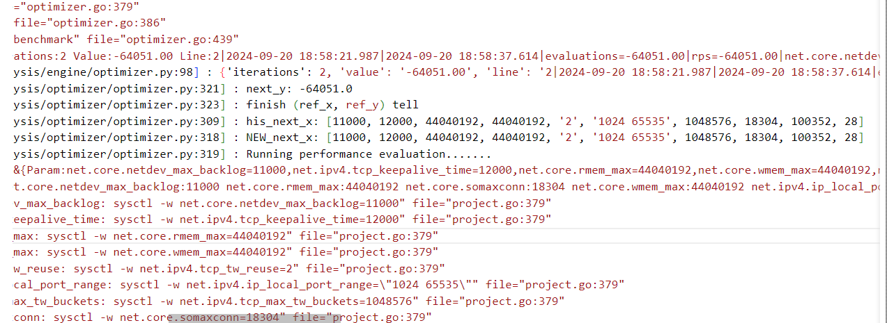
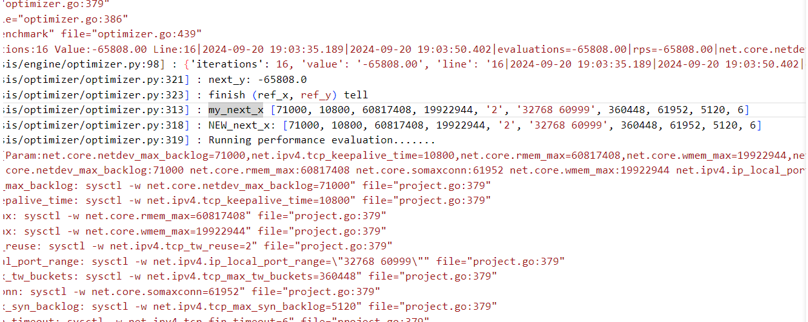
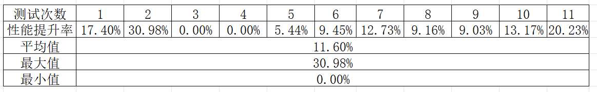
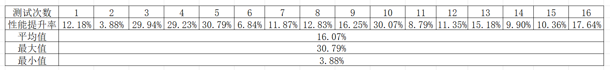
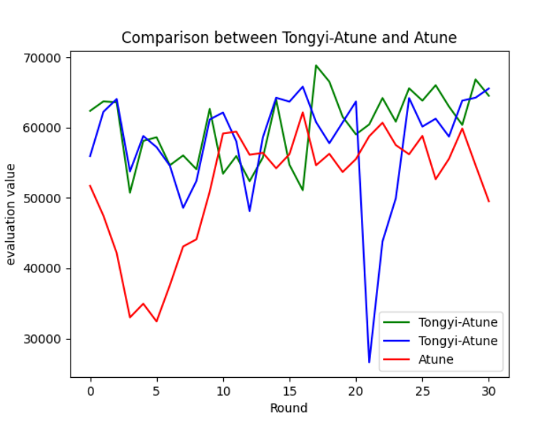

# OSPP开源之夏-Atune调优结合大模型实验
## 一、原理
对于 A-Tune 的调优技术，我们可以进一步引入大模型，利用大模型的自然语言理解
和分析能力对调优过程提出修正建议，达到更加精确的调优效果。具体做法是在A-Tune调优过程中的某些轮的初始阶段，使用大模型分析上一轮的日志结果推理出对调优参数的一系列建议值，然后把这些值作为这一轮的调优初始值。理论上有如下优势：

* 更快收敛：大模型分析日志并推荐参数初始值可以更快地收敛到最优解附近，尤其是在初始阶段。
* 减少探索成本：利用大模型的预测能力减少盲目探索的成本，特别是在参数空间复杂且难以直接搜索的情况下。
* 增强智能性：结合大模型的预测能力和A-Tune的统计特性，可以使优化过程更具智能性和适应性。

## 二、代码介绍
### 2.1 [preknowledge.txt](./preknowledge.txt)
这个文本文件的内容包含了本次调优的背景信息，如系统配置、硬件配置、应用信息以及需调优的参数列表等。这些内容构成了一个简单的知识库，用来告诉大模型本次调优的上下文信息，让大模型对调优内容有更深入的理解。通过提供这些额外信息，大模型可以更有效地理解和分析日志数据，并据此生成更有针对性的参数推荐。这将有助于提高优化过程的效率和效果。
### 2.2 [ModelSuggester.py](./ModelSuggester.py)
本次实验的主要功能都是在这个文件中实现的。这个文件定义了一个名为 ModelBasedParameterSuggestion 的类，其主要功能是从日志文件中提取相关信息，并使用大模型（在这里是 Tongyi 模型）来分析这些信息，进而给出参数调整建议。此外，该类还包含了校验和调整参数值的功能。这里为了便于访问大模型，其中会涉及工具`langchain`的使用，可以参考官方文档[https://python.langchain.com](https://python.langchain.com)。下面依次介绍这个类的各个方法：

* __init__(self, log_file_path)

    初始化类的实例，设置必要的环境变量、加载模型、读取先验知识文件，并初始化日志文件路径。其中环境变量`DASHSCOPE_API_KEY`要设置成自己的APIKEY,如何生成和管理自己的APIKEY可以参考[https://dashscope.console.aliyun.com/apiKey](https://dashscope.console.aliyun.com/apiKey)。`self.format_instructions`用来规范大模型的返回内容的格式。

* extract_log_until_iterations(self)

    A-Tune调优的日志存放在`/var/log/messages`中，这个函数实现从指定的日志文件中提取从最后一个 `'iterations': `开始直到出现第二个` 'iterations': `的文本段落，并在提取的文本达到8000个字符时自动停止。返回符合条件的文本段落，如果没有找到则返回空字符串。这是因为在日志中，这个字符串标志着每一轮信息记录的开始，用这个函数从日志末尾开始扫描就可以摘选出上一轮日志的内容。限制8000个字符是因为大模型传入的内容一般不超过一万个字符，而除了日志内容我们还需要传入一些其他信息。

* get_suggested_parameters(self)

    从日志文件中提取特定的日志片段，构建提示模板并用`self.model.invoke(input)` 调用 `Tongyi` 模型分析摘选出来的每一轮日志内容，给出参数调整建议。但即使已经规范了大模型的输出，但它的返回内容依然是文本，所以最后需要对结果格式化为我们需要的列表形式，也就是A-Tune中用的`next_x`，这里具体的做法是先用`json.loads()`将大模型返回的文本转换为json格式的字典，再取其`values`做成数组作为返回值。

* validate_and_adjust_parameters(self, values)  

    在A-Tune调优的过程中，每个所涉及的参数都有范围、类型、步长的限制，尽管已经在`preknowledge.txt`提前告知大模型，但难免有时候还是会返回不符合规则的参数值，所以就需要对结果进行检验和修正。这个函数就是用来根据在yaml配置文件中预先定义的参数范围、类型和步长等信息，校验和调整模型给出的参数建议。输入参数是已格式化后的模型给出的参数建议。流程为对每个参数进行类型转换、范围校验、步长调整和选项检查，如果参数不符合要求，则使用默认值或最接近的合法值替换。最终返回经过校验和调整后的参数值列表。

### 2.3 [optimizer.py](./optimizer.py)

这个是A-Tune调优过程中使用的部分代码，为了将大模型的结果结合到调优过程中，就不可避免的需要修改其中有关于每一轮初始值设置的代码，主要修改的部分位于从代码的302行开始的`for`循环中。

## 三、实验流程
### 3.1 A-Tune环境准备
首先需要配置好A-Tune的环境，参考[https://gitee.com/openeuler/A-Tune/blob/master/Documentation/UserGuide/A-Tune%E7%94%A8%E6%88%B7%E6%8C%87%E5%8D%97.md](https://gitee.com/openeuler/A-Tune/blob/master/Documentation/UserGuide/A-Tune%E7%94%A8%E6%88%B7%E6%8C%87%E5%8D%97.md)。按照官方文档配置好后可以成功启动`atuned`和`atune engine`。本次介绍使用nginx调优为例，进入源码中的`A-Tune/examples/tuning/nginx`文件夹中尝试调优`nginx_http_long`，若可以成功调优便可继续下一步。

### 3.2 langchain安装
安装langchain可以按顺序输入以下命令：
    
    pip install langchain -i https://mirrors.aliyun.com/pypi/simple

    pip install --upgrade --quiet  dashscope -i https://mirrors.aliyun.com/pypi/simple

    pip install dashscope -i https://mirrors.aliyun.com/pypi/simple

这里要注意的是langchain的安装对python的版本有要求，本次实验使用的是openEuler20.03 LTS，其中系统自带的python版本是3.7.4，安装时会显示版本过低，所以先安装了python3.9.2之后再用更高级的pip来安装langchain。但是系统默认python最好还是用自带的3.7.4，不然A-tune会有新的环境问题，新安装的py39仅用来安装langchain和运行大模型的脚本`ModelSuggester.py`。

如果已经尝试过`nginx_http_long`的调优，在日志文件`/var/log/messages`会有记录。这时可以先单独运行一下`ModelSuggester.py`，大模型会根据日志中记录的最后一轮的信息来生成参数修正建议，经过格式化后返回一个数组。如果正常输出接着就可以进行进一步的测试。

### 3.3 A-Tune结合大模型的实施步骤
在A-Tune的调优过程中，每一轮的初始参数并不是直接取系统的当前值来进行优化，而是经过贝叶斯算法自动生成的，所以为了将大模型的推荐值结合进来，就需要修改调优的代码，让A-Tune拿到这些值。

* 在我的系统中，查看调优日志可以发现，A-Tune每一轮的调优参数是和性能结果是用next_x和next_y表示的，具体文件的路径是`/usr/libexec/atuned/analysis/optimizer/optimizer.py`。

* 为了在A-Tune调优的某些轮开始的时候，将参数的初始值修改成经过大模型分析得出的推荐值，我们需要修改的部分位于`optimizer.py`的第302行的for循环中，主要是涉及`next_x`的设置：

      for i in range(n_calls):
        # 固定一下初始baseline的参数配置
        if i==0:
            next_x=[45000, 19800, 30408704, 24117248, '1', '32768 60999', 458752, 29696, 196608, 100]
            LOGGER.info("initial_next_x: %s", next_x)
        #每隔两轮交换一次参数设置方法
        elif i!=0 and (i%4==2 or i%4==3) : 
            #用原本的优化器自动生成新一轮参数值
            next_x = optimizer.ask()
            LOGGER.info("his_next_x: %s", next_x)
        else:
            #用python3.9运行大模型推荐的脚本，取得打印的结果再转换为列表
            result = subprocess.run(['/bin/python39', '/root/A-Tune/ModelSuggester.py'], capture_output=True, text=True)
            next_x = ast.literal_eval(result.stdout)
            LOGGER.info("my_next_x %s", next_x)

        LOGGER.info("NEW_next_x: %s", next_x)
        LOGGER.info("Running performance evaluation.......")
        #根据next_x的值计算出性能测试结果next_y
        next_y = objective(next_x)
        LOGGER.info("next_y: %s", next_y)
        #将参数值和性能结果都给入优化器
        ret = optimizer.tell(next_x, next_y)
        LOGGER.info("finish (ref_x, ref_y) tell")
* 这里要注意`result = subprocess.run(['/bin/python39', '/root/A-Tune/ModelSuggester.py'], capture_output=True, text=True)`这一行需要修改为自己的python3.9和ModelSuggester.py路径。
* 每次修改`optimizer.py`都需要重新启动`atuned`和`atune engine`才能够生效，可以用命令：

      #重新启动atuned服务：
      systemctl restart atuned
      systemctl restart atune-engine
      #查询atuned服务状态:
      systemctl status atuned
      systemctl status atune-engine
  状态为`active`就可以正式开始调优过程了，修改了代码并重启atune之后再尝试调优`nginx_http_long`，日志中就可以明显看到哪些轮次是用优化器自动生成的参数，哪些轮次是用大模型推荐的参数，以及每一轮的性能结果。

* 这里用的方案是每隔两轮交换一次参数生成方法，因为这样一来大模型就既可以分析自己推荐的参数得到的结果，也可以在另一轮分析优化器自己生成的参数结果。不过实际上也可以有更多的选择，比如每间隔一轮就用大模型推荐一次参数，或者设置前多少轮用大模型推荐后多少轮用优化器生成等等，都可以加以尝试。

### 3.4 其他
因为每一种调优涉及的参数和预备知识库都有差异，所以在尝试别的调优过程的时候，要先修改对应的知识库内容[preknowledge.txt](./preknowledge.txt)以及[ModelSuggester.py](./ModelSuggester.py)中`PARAMETERS`的内容，还有系统中optimizer.py文件305行的初始化baseline的语句（当然也可以不初始化，这里是为了方便测试）。知识库的内容可以根据需要自行添加，让大模型对调优的背景有更深的了解，但是要注意的是大模型的输入一般不超过一万字符，日志内容已经被限制不超过八千字符，所以知识库和提问的内容最好一共不超过两千字符。

## 四、测试结果和分析
在调试好代码后，我对结合大模型的A-Tune和普通的A-Tune做了多次测试，结果中涉及了多项数据，其中终端打印的性能结果包括每次调优的初始值`Baseline Performance`、最终评估值`final evaluation value`和性能提升率`Performance Improvement Rate`，如下图。

除了终端打印的数据，还有存放在日志`/var/log/messages`中每次调优过程中每一轮的具体数据和其他信息，如参数值列表`next_x`和性能评价`next_y`。且在调整了`optimizer.py`代码之后，也能清晰的看到每一轮的参数是大模型推荐的（打印为`my_next_x`）还是优化器自己生成的（打印为`his_next_x`），如下图展示的部分日志内容：

以下是对数据的统计整理后的一些结果：

### 4.1 整体调优的提升率对比
1）普通A-Tune调优（Bayes算法）

2）结合大模型的A-Tune调优

通过测试数据可以看到：
* 结合大模型的A-Tune调优在性能提升率`Performance Improvement Rate`的平均值上表现更佳，效果相对稳定。
* 普通的A-Tune调优算法得到的结果会出现提升率为0.00%的情况，可能是因为有时初始值`Baseline Performance`就比较高，Bayes算法需要更多的轮数和时间才能跳出局部解，收敛到全局最优解，超过初始值。
* 普通的A-Tune调优的最大值很高，查看具体日志之后发现这只是某一轮偶然达到的，其他轮次的结果都远低于这个值，说明单纯用Bayes算法偶尔能在某一轮得到极好的结果，但很少遇到，所以两种方式结合也能兼顾Bayes的随机性。

### 4.2 调优过程中每一轮的结果差异对比
找出了在同一时间段的几次比较典型的调优日志内容，收集其中的数据。为了更好的显示数据差异，做出了下图，其中包括两次结合大模型的A-Tune调优和一次普通的A-Tune调优的调优过程中的每一轮的性能测试结果：

从这张图里可以看出：
* Tongyi-Atune得到的`final evaluation value`经常会略高于普通A-Tune的结果，且调优过程中的的平均性能水平也较高一些。
* 结合了大模型的A-Tune调优往往能在一开始就收敛到最优解附近，而普通的A-Tune需要在初始阶段自己在全局搜索，同时也有陷入局部最优的可能，需要更多的轮次之后才能到找到最优解附近，这说明结合了大模型之后可以在参数空间复杂的情况下减少Bayes盲目探索的成本，收敛更快。
* 图中蓝色线条在第21轮的测试值异常低，在查看了具体日志之后发现这一轮的参数列表正式通过大模型推荐得到的，所以能看出大模型也有它自身的限制，并不是每一次推荐的值都可以在一个较高的性能水平。